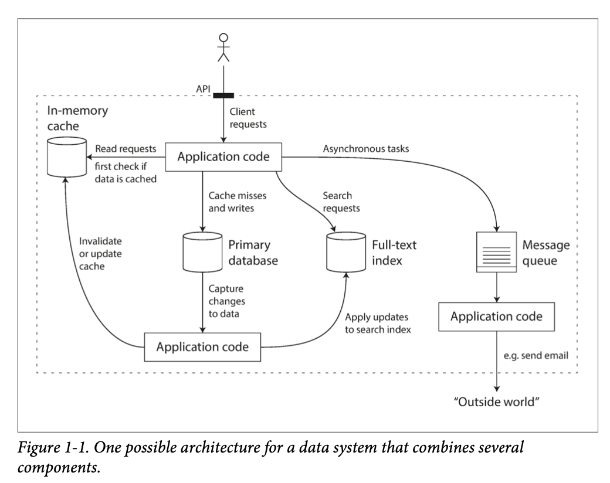
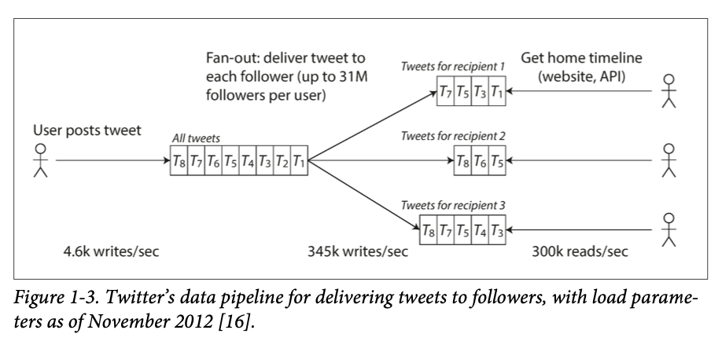
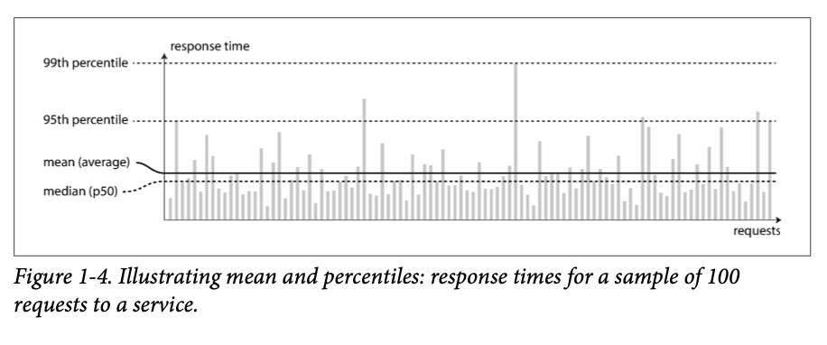
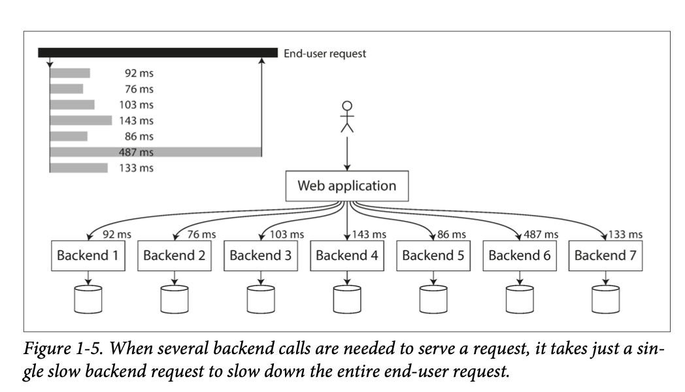

# Part I. Foundations of Data Systems

## Chapter 1. Reliable, Scalable, and Maintainable Applications

Many apps today are _data-intensive_, not _compute-intensive_.

Data-intensive for example needs:

- Databases
- Caches
- Search indexes
- Stream processing
- Batch processing

You need to understand which one is the best for your app.

### Thinking about Data Systems

Example of data system that combines several components:

Those implementations are hided from a client.

Designing of such systems have a lot of questions.

This book focused on 3 most important concerns in software systems:

- **Reliability**

  The system should continue to work correctly (performing the correct function at the desired level of performance)
  even in the face of adversity (hardware or soft‐ ware faults, and even human error)

- **Scalability**

  As the system grows (in data volume, traffic volume, or complexity), there should be reasonable ways of dealing with
  that growth.

- **Maintainability**

  Over time, many people will work on the system, and they should all be able to work on it productively.

Book explores a different techniques that are used to achieve these goals.

### Reliability

Typical expectations of a reliable system:

- The application performs the function that the user expected.
- It can tolerate the user making mistakes or using the system in unexpected ways.
- Its performance is good enough for the required use case, under the expected load and data volume.
- The system prevents any unauthorized access and abuse.

**Faults** -- things that can go wrong in a system.

**Fault-tolerance (Resilient)** -- a system continues to work correctly in the face of faults.

**Failure** -- system stops providing the required service to the user.

#### Hardware Faults

Like, disk failure, RAM failure, etc.

First response to hardware faults is to **replicate** data and components. If one of them fails, we can still continue
to work.

Systems that can tolerate the loss of entire machines, by using software fault-tolerance techniques in preference or in
addition to hardware redundancy.

#### Software Errors

Failing a large number of software components at the same time, bugs, configuration errors, etc.

The bugs that cause these kinds of software faults often lie dormant for a long time until they are triggered by an
unusual set of circumstances.

#### Human Errors

Human errors are the most common cause of failures in production systems.

Best approaches:

- Design systems.
- Decouple the places where people make the most mistakes from the places where they can cause failures.
- Test thoroughly at all levels.
- Allow quick recovery from human errors.
- Detailed and clear monitoring, such as performance metrics and error rates.
- Implement good management practices.

### Scalability

Scalability is the term we use to describe a system’s ability to cope with increased load.

#### Describing Load

**Load parameters** -- metrics that describe the amount of load on the system.

#### Describing Performance

What will happen when we increase the load?

- When you increase a load parameter and keep the system resources unchanged, how is the performance of your system
  affected?
- When you increase a load parameter, how much do you need to increase the resources if you want to keep performance
  unchanged?

**Throughput** -- the number of requests that the system can handle per unit of time.

**Response time** -- the amount of time required to perform a single request.

_Mean_ is not a good metric for response time, because it doesn't show the distribution of response times.

It's better to use _percentiles_.

**Tail latency** -- the response time for a small fraction of the most slow requests.

Percentiles are often used in SLOs (Service Level Objectives) and SLAs (Service Level Agreements), which are contracts
that describe the performance of a service.

Queueing delays are a common cause of the response time at high percentiles.

**Head-of-line blocking** -- when a request is blocked by a previous request that is taking a long time to complete.

Because of this effect it's important to measure response time on the client side.

**Tail latency amplification** -- when a small increase in the average response time causes a much larger increase in
the tail latency.

#### Approaches for Coping with Load

How do we maintain good performance when the load parameter increases?

You need to think about future growth of your system.

**Vertical scaling** -- adding more powerful hardware to the existing machines, also known as _scaling up_.

**Horizontal scaling** -- adding more machines to the system, also known as _scaling out_.

Distributing load across multiple machines is also known as a **shared-nothing architecture**.

**Elastic** -- a system can grow and shrink automatically in response to load.

Elastic systems useful if load is unpredictable, but manual systems are simpler and may have fewer operational
surprises.

While distributing stateless services across multiple machines is easy, distributing stateful services is much harder.
For this reason common wisdom until recently was to keep your stateless services on single node.

There is no silver bullet for coping with load. The problem may be the volume of read, write, of data to store etc.

An architecture that scales well for a particular application is built around assumptions of which operations will be
common and which will be rare — the load parameters.

In an early-stage startup or an unproven product it’s usually more important to be able to iterate quickly on product
features.

### Maintainability

Well known fact that the majority of the cost of software development is in maintaining the software, not in writing it
in the first place.

Unfortunately, many people dislike maintenance of legacy systems.

Three main goals of maintainability:

- **Operability** -- Make it easy for operations teams to keep the system running smoothly.
- **Simplicity** -- Make it easy for new engineers to understand the system, by removing as much complexity as possible.
- **Evolvability**(Extensibility) -- Make it easy for engineers to make changes to the system in the future, adaptin it
  for unanticipated use cases.

#### Operability: Making Life Easier for Operations

Responsibilities of operations team:

- Monitoring the health of the system and quickly restoring service when something goes wrong.
- Tracking down the cause of problems, such as degraded performance or unexpected outages.
- Keeping software up to date with the latest security patches.
- Keeping tabs on how different systems interact with each other.
- Anticipating future problems and solving them before they occur.
- Establishing good practices for deploying, configuring, etc.
- Performing complex maintenance tasks, such as moving an app from one platform to another.
- Maintaining the security of the system as configuration changes are made.
- Defining processes that make operations predictable and help keep the production environment stable.
- Preserving the organization’s knowledge about the system.

Good operability means making routine tasks easy, allowing the operations team to focus their efforts on high-value
activities. Data systems can do various things to make routine tasks easy, including:

- Providing visibility into the runtime behavior of the system, good monitoring.
- Providing good support for automation and integration with standard tools.
- Avoiding dependencies on specific hardware or software platforms.
- Providing good documentation.
- Providing good default behavior, so that the system can be run with minimal configuration.
- Self-healing, so that the system can recover from failures without human intervention.
- Exhibiting predictable behavior, so that the system can be easily monitored and understood.

#### Simplicity: Managing Complexity

Making a system simpler does not necessarily mean reducing its functionality; it can also mean removing accidental
complexity

One of the best tools we have for removing accidental complexity is _abstraction._

Abstraction is a technique for hiding unnecessary details and reducing complexity in a system.

#### Evolvability: Making Changes Easy

It’s extremely unlikely that your system’s requirements will remain unchanged forever.

In terms of organizational processes, Agile working patterns provide a framework for adapting to change.

The ease with which you can modify a data system, and adapt it to changing requirements, is closely linked to its
simplicity and its abstractions: simple and easy to understand systems are usually easier to modify than complex ones.

