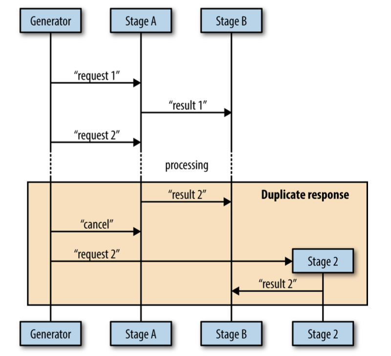
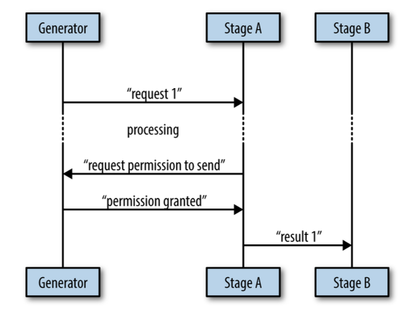

# Chapter 5

## Concurrency at Scale

We've learned some common patterns for utilizing concurrency within Go, let's
turn attention to composing these patterns into a series of practices that will
enable us to write large, composable system that scale.

### Error Propagation

Many developers make the mistake of thinking of error propagation as secondary, to the flow of their system.

Errors indicate that your system has entered a state in which it cannot fulfill an operation that a user either
explicitly or implicitly requested. Because of this, it needs to relay a few pieces of critical information:

- what happened
  > this part contains information about what happened, e.g "socket closed", "credentials expired".

- when and where it occurs
  > Errors should always contain a complete stack trace starting with how the call was initiated and ending with where
  > the error was instantiated. The stack trace should not be contained in the error message
  >
  > Further, the error should contain information regarding the context it's running within. For example, in a
  > distributed system, it should have some way of identifying what machine the error occurred on.

- a friendly user-facing message
  > The message that gets displayed to the user should be customized to suit your system and its users. It should only
  > contain abbreviated and relevant information from the previous two points.

- how the user can get more information
  > Errors that are presented to users should provide an ID that can be cross-referenced to a corresponding log that
  > displays the full information of the error.

By default, no error will contain all of this information without your intervention.

Therefore, you could take the stance that any error that is propagated to the user without this information is a
mistake, and therefore a bug.

It's possible to place all errors into one of two categories:

- bugs
- known edge cases (e.g. broken network connections, failed disk writes, etc.)

Bugs are errors that you have not customized to your system, or raw errors - your known edge cases. Sometimes this is
intentional; you may be OK with letting errors from edge cases reach your users while you get the first few iterations
of your system out the door. Sometimes this is by accident. But if you agree with the approach I've laid out, raw errors
are always bugs.

When our user-facing code receives a well-formed error, we can be confident that at all levels in our code, care was
taken to craft the error message, and we can simply log it and print it out for the user to see. The confidence that we
get from seeing an error with the correct type cannot be understated.

When malformed errors, or bugs, are propagated up to the user, we should also log the error, but then display a friendly
message to the user stating something unexpected has happened. If we support automatic error reporting in our system,
the error should be reported back as a bug. If we don't, we might suggest the user file a bug report.

```go
package main

import (
	"fmt"
	"log"
	"os"
	"os/exec"
	"runtime/debug"
)

type MyError struct {

	// Storing low-level error, we always want to be able to get back
	Inner   error
	Message string

	// taking note of a stack trace, when the error was created
	StackTrace string

	// storage for catch-all miscellaneous information,
	//  e.g a hash of the stack trace
	Misc map[string]interface{}
}

func (e MyError) Error() string {
	return e.Message
}

func wrapError(err error, messagef string, msgArgs ...interface{}) MyError {
	return MyError{
		Inner:      err,
		Message:    fmt.Sprintf(messagef, msgArgs...),
		StackTrace: string(debug.Stack()),
		Misc:       make(map[string]interface{}),
	}
}

type LowLevelErr struct {
	error
}

func isGloballyExec(path string) (bool, error) {
	info, err := os.Stat(path)
	if err != nil {
		// here we wrap the raw error with customized error
		// in that case we ok with message and don't mask it
		return false, LowLevelErr{wrapError(err, err.Error())}
	}

	return info.Mode().Perm()&0100 == 0100, nil
}

type IntermediateErr struct {
	error
}

func runJob(id string) error {
	const jobBinPath = "/bad/job/bin"

	isExecutable, err := isGloballyExec(jobBinPath)
	if err != nil {
		// here we are customizing the error with a crafted message.
		// we want to obfuscate the low-level details of why the job isn't running
		// because we feel it's not important information to consumers of our module.
		return IntermediateErr{wrapError(
			err,
			"can't run job %q: requisite binaries are not available",
			id,
		)}
	}

	if !isExecutable {
		return wrapError(
			nil,
			"can't run job %q: requisite binaries are not executable",
			id,
		)
	}

	return exec.Command(jobBinPath, "--id"+id).Run()
}

func handleError(key int, err error, message string) {
	log.SetPrefix(fmt.Sprintf("[logID: %v", key))

	// log out the full error in case someone needs to dig into what happend
	log.Printf("%#v", err)
	log.Printf("[%v] %v", key, message)
}

func main() {
	// all functions are written in one file,
	//	but they can be broken into separate modules

	log.SetOutput(os.Stdout)
	log.SetFlags(log.Ltime | log.LUTC)

	if err := runJob("1"); err != nil {
		msg := "There was an unexpected issue; please report this as a bug."

		// checking if is there a well-crafted error, and we can pass it to user
		if _, ok := err.(IntermediateErr); ok {
			msg = err.Error()
		}

		// bind the log and the error message together with an ID of 1, can use guid
		handleError(1, err, msg)
	}
}
```

There are error packages, like https://github.com/pkg/errors, that are compatible with this approach, but it will be up
to you to implement this technique using whatever error package you decide to use.

### Timeouts and Cancellation

When working with concurrent code, timeouts and cancellations are going to turn up
frequently.

Why we want _timeouts_:

- system saturation
  > If our system is saturated (if it's ability to process requests is at capacity), we may
  > want to requests at the edges of the system to time out rather than take a long time to field them
  >
  > general guide-lines for when to time out:
  >
  > * if the request is unlikely to be repeated when it is timed out.
  > * if you don't have the resources to store the requests (e.g. disk space for persisted queue)
  > * if the need for the request, or the data it's sending, will go stale

- stale data
  > Sometimes data has a window within which it must be processed before more relevant data is available, or the need to
  > process the data has expired. If a concurrent process takes longer to process the data than this window, we would
  want
  > to time out and cancel the concurrent process.

- attempting to prevent deadlocks
  > In a large system it can sometimes be difficult to understand the way in which data
  > might flow, or what edge cases might turn up. It is not unreasonable, and even recommended, to place timeouts on all
  > of your concurrent operations to guarantee your system won't deadlock.

Reasons why request _canceled_:

- timeouts
  > Implicit cancellation

- user intervention
  > When there are user-facing concurrent operations, it is therefore also sometimes necessary to allow the users to
  > cancel the operation they've started.

- parent cancellation
  > If any kind of parent of a concurrent operation stops, as a child of that parent, we will be canceled.

- replicated requests
  > We may wish to send data to multiple concurrent processes in an attempt to get a faster response from one of them.
  > When the first one comes back, we would want to cancel the rest of the processes.

If you keep your modifications to any shared state within a tight scope, and/or ensure those modifications are easily
rolled back, you can usually handle cancellations pretty well.

Here the surface area we have to worry about rolling back is much smaller:

```go
result := add(1, 2, 3, 1, 2, 3)
writeTallyToState(result)
```

Another issue you need to be concerned with is duplicated messages.



Here that it's possible for stage B to receive duplicate messages if the cancellation message comes in after stage A
has already sent its result to stage B.

There are a few ways to avoid sending duplicate messages:

- to make it vanishingly unlikely that a parent goroutine will send a cancellation signal after a child goroutine has
  already reported a result.
  > This requires bidirectional communication between the stages, and we'll cover this "Heartbeats"

- accept either the first or last result reported
  > If your algorithm allows it, or your concurrent process is idempotent

- poll the parent goroutine for permission
  > can use bidirectional communication with your parent to explicitly request permission to send your message. (simular
  > to heartbeats)
  >
  > 

When designing your concurrent processes, be sure to take into account timeouts and cancellation.

### Heartbeats

Heartbeats are a way for concurrent processes to signal life to outside parties.
Heartbeats have been around since before Go, and remain useful within it.

They allow us insights into our system, and they can make testing the system deterministic when it might otherwise not
be.

A heartbeat is a way to signal to its listeners that everything is well, and that the silence is expected.

There are two different types of heartbeats:

- that occur on a time interval
- that occur at the beginning of a unit of work

By using a heartbeat, we have successfully can avoid a deadlock, and we remain deterministic by not having to rely on a
longer timeout:

```go
package main

import (
	"fmt"
	"time"
)

func main() {
	// Notice that because we might be sending out multiple pulses
	// while we wait for input, or multiple pulses while waiting to send results,
	// all the select statements need to be within for loops.

	doWork := func(
		done <-chan interface{},
		pulseInterval time.Duration,
	) (<-chan interface{}, <-chan time.Time) {

		// set up a channel to send heartbeats on.
		heartbeat := make(chan interface{})
		results := make(chan time.Time)

		go func() {
			// not closing channels to simulate panic at goroutine
			//
			// defer func() {
			//	 close(heartbeat)
			//	 close(results)
			// }()

			// creating channel, which will make a pulse every interval
			pulse := time.Tick(pulseInterval)

			// another ticker to simulate work coming on.
			// interval picked higher so that we can see some heartbeats coming out
			// of goroutine
			workGen := time.Tick(2 * pulseInterval)

			sendPulse := func() {
				select {
				case heartbeat <- struct{}{}:
				// including default clause, because we want guard against fact
				// that no one may be listening to our heartbeat.
				//
				// heartbeat results aren't critical
				default:
				}
			}

			sendResult := func(r time.Time) {
				for {
					select {
					case <-done:
						return
					case <-pulse:
						sendPulse()
					case results <- r:
						return
					}
				}
			}

			// Here is our simulated panic. Instead of infinitely looping until
			// we're asked to stop, as in the previous example, we'll only loop twice.
			for i := 0; i < 2; i++ {
				select {
				case <-done:
					return
				case <-pulse:
					sendPulse()
				case r := <-workGen:
					sendResult(r)
				}
			}
		}()

		return heartbeat, results
	}

	// standard done channel with 10 seconds of work
	done := make(chan interface{})
	time.AfterFunc(10*time.Second, func() { close(done) })

	const timeout = 2 * time.Second
	heartbeat, results := doWork(done, timeout/2)

	for {
		select {
		case _, ok := <-heartbeat:
			if !ok {
				return
			}

			fmt.Println("pulse")
		case r, ok := <-results:
			if !ok {
				return
			}

			fmt.Printf("results %v\n", r.Second())
		case <-time.After(timeout):
			fmt.Println("worker goroutine isn't healthy!")
			return
		}
	}
}
```

Also note that heartbeats help with the opposite case: they let us know that long-running goroutines remain up, but are
just taking a while to produce a value to send on the values channel.

```go
package main

import (
	"fmt"
	"time"
)

func DoWorkLongLiving(
	done <-chan interface{},
	nums ...int,
) (<-chan interface{}, <-chan int) {
	// This ensures that there's always at least one pulse
	// sent out even if no one is listening in time for to send to occur.
	heartbeatStream := make(chan interface{}, 1)
	workStream := make(chan int)

	go func() {
		defer func() {
			close(heartbeatStream)
			close(workStream)
		}()

		// Here we simulate some kind of delay before the goroutine can begin working.
		// In practice this can be all kinds of things and is nondeterministic.
		time.Sleep(2 * time.Second)

		for _, n := range nums {
			// We don't want to include this in the same select
			// block as the send on results because if the receiver
			// isn't ready for the result, they'll receive a pulse instead,
			// and the current value of the result will be lost.
			//
			// We also don't include a case statement for the done channel
			// since we have a default case that will just fall through.
			select {
			case heartbeatStream <- struct{}{}:
			// Once again we guard against the fact that no one may be
			// listening to our heartbeats
			default:
			}

			select {
			case <-done:
				return
			case workStream <- n:
			}
		}
	}()

	return heartbeatStream, workStream
}

func DoWorkLongLivingLabel(
	done <-chan interface{},
	pulseInterval time.Duration,
	nums ...int,
) (<-chan interface{}, <-chan int) {
	heartbeatStream := make(chan interface{}, 1)
	workStream := make(chan int)

	go func() {
		defer func() {
			close(heartbeatStream)
			close(workStream)
		}()

		time.Sleep(2 * time.Second)

		pulse := time.Tick(pulseInterval)

		// we're using a label here to make continuing
		// from the inner loop a little simpler.
	numLoop:
		for _, n := range nums {
			for {
				select {
				case <-done:
					return
				case <-pulse:
					select {
					case heartbeatStream <- struct{}{}:
					default:
					}
				case workStream <- n:
					continue numLoop
				}
			}
		}
	}()

	return heartbeatStream, workStream
}

func main() {
	done := make(chan interface{}, 1)
	defer close(done)

	heartbeat, results := DoWorkLongLiving(done, 1, 2, 3)
	for {
		select {
		case _, ok := <-heartbeat:
			if !ok {
				return
			}

			fmt.Println("pulse")
		case r, ok := <-results:
			if !ok {
				return
			}

			fmt.Printf("results %v\n", r)
		}
	}
}
```

Heartbeats aren't strictly necessary when writing concurrent code, but this section demonstrates their utility. For any
long-running goroutines, or goroutines that need to be tested, heartbeats are recommended.

### Replicated Requests

For some applications, receiving a response as quickly as possible is the top priority.

You can replicate the request to multiple handlers (whether those be goroutines, processes, or servers), and one of them
will return faster than the other ones; you can then immediately return the result. The downside is that you'll have to
utilize resources to keep multiple copies of the handlers running.

> If this replication is done in-memory, it might not be that costly, but if replicating the handlers requires
> replicating processes, servers, or even data centers, this can become quite costly.

```go
package main

import (
	"fmt"
	"math/rand"
	"sync"
	"time"
)

func main() {
	doWork := func(
		done <-chan interface{},
		id int,
		wg *sync.WaitGroup,
		result chan<- int,
	) {
		started := time.Now()
		defer wg.Done()

		simulatedLoadtime := time.Duration(1+rand.Intn(5)) * time.Second
		select {
		case <-done:
		case <-time.After(simulatedLoadtime):
		}

		select {
		case <-done:
		case result <- id:
		}

		took := time.Since(started)

		if took < simulatedLoadtime {
			took = simulatedLoadtime
		}

		fmt.Printf("%v took %v\n", id, took)
	}

	done := make(chan interface{})
	result := make(chan int)

	var wg sync.WaitGroup
	wg.Add(10)

	for i := 0; i < 10; i++ {
		go doWork(done, i, &wg, result)
	}

	firstReturned := <-result
	close(done)
	wg.Wait()

	fmt.Printf("recieved an answer from #%v\n", firstReturned)
}
```

The only caveat to this approach is that all of your handlers need to have equal opportunity to service the request. In
other words, you're not going to have a chance at receiving the fastest time from a handler that can't service the
request.

A different symptom of the same problem is uniformity. If your handlers are too much alike, the chances that any one
will be an outlier is smaller. You should only replicate out requests like this to handlers that have different runtime
conditions: different processes, machines, paths to a data store, or access to different data stores altogether.

Although this is can be expensive to set up and maintain, if speed is your goal, this is a valuable technique. In
addition, this naturally provides fault tolerance and scalability.

### Rate Limiting

Constrains the number of times some kind of resource is accessed to some finite number per unit of time.
> The resource can be anything: API connections, disk reads/writes, network packets, errors.

The point is: if you don't rate limit requests to your system, you cannot easily secure it.

In distributed systems, a legitimate user could degrade the performance of the system for other users if they're
performing operations at a high enough volume, or if the code they're exercising is buggy.

Most rate limiting is done by utilizing an algorithm called the _token bucket_. It's very easy to understand, and
relatively easy to implement as well. Let's take a look at the theory behind it.

> Let's assume that to utilize a resource, you have to have an access token for the resource.
>
> Without the token, your request is denied. Now imagine these tokens are stored in a bucket waiting to be retrieved for
> usage.
>
> The bucket has a depth of `d`, which indicates it can hold d access tokens at a time. For example, if the
> bucket has a depth of five, it can hold five tokens.
>
> Now, every time you need to access a resource, you reach into the bucket and remove a token. If your bucket contains
> five tokens, and you access the resource five times, you'd be able to do so; but on the sixth try, no access token
> would be available.

```go
package main

import (
	"context"
	"golang.org/x/time/rate"
	"log"
	"os"
	"sort"
	"sync"
	"time"
)

type RateLimiter interface {
	Wait(ctx context.Context) error
	Limit() rate.Limit
}

type multiLimiter struct {
	limiters []RateLimiter
}

func (m *multiLimiter) Wait(ctx context.Context) error {
	for _, l := range m.limiters {
		if err := l.Wait(ctx); err != nil {
			return err
		}
	}

	return nil
}

func (m *multiLimiter) Limit() rate.Limit {
	return m.limiters[0].Limit()
}

func newMultiLimiter(limiters ...RateLimiter) *multiLimiter {
	byLimit := func(i, j int) bool {
		return limiters[i].Limit() < limiters[j].Limit()
	}

	sort.Slice(limiters, byLimit)
	return &multiLimiter{limiters: limiters}
}

type apiConnection struct {
	networkLimit,
	diskLimit,
	apiLimit RateLimiter
}

func open() *apiConnection {
	return &apiConnection{
		apiLimit: newMultiLimiter(
			rate.NewLimiter(per(2, time.Second), 1),
			// with a burstiness of 10 to give the users their initial pool.
			rate.NewLimiter(per(10, time.Minute), 10),
		),
		diskLimit: newMultiLimiter(
			rate.NewLimiter(rate.Limit(1), 1),
		),
		networkLimit: newMultiLimiter(
			rate.NewLimiter(per(3, time.Second), 3),
		),
	}
}

func (a *apiConnection) resolveAddress(ctx context.Context) error {
	limiter := newMultiLimiter(a.apiLimit, a.networkLimit)

	if err := limiter.Wait(ctx); err != nil {
		return err
	}

	// work here...

	return nil
}

func (a *apiConnection) readFile(ctx context.Context) error {
	limiter := newMultiLimiter(a.apiLimit, a.diskLimit)

	if err := limiter.Wait(ctx); err != nil {
		return err
	}

	// work here...

	return nil
}

func per(eventCount int, duration time.Duration) rate.Limit {
	return rate.Every(duration / time.Duration(eventCount))
}

func main() {
	defer log.Printf("done")

	log.SetOutput(os.Stdout)
	log.SetFlags(log.Ltime | log.LUTC)

	apiConn := open()

	var wg sync.WaitGroup
	wg.Add(20)

	for i := 0; i < 10; i++ {
		go func() {
			defer wg.Done()

			if err := apiConn.readFile(context.Background()); err != nil {
				log.Printf("can't readfile: %v", err)
			}

			log.Printf("read file")
		}()
	}

	for i := 0; i < 10; i++ {
		go func() {
			defer wg.Done()

			if err := apiConn.resolveAddress(context.Background()); err != nil {
				log.Printf("can't resolve address: %v", err)
			}

			log.Printf("resolve address")
		}()
	}

	wg.Wait()
}
```

### Healing Unhealthy Goroutines

In long-lived processes such as daemons, it's very common to have a set of long-lived goroutines. These goroutines are
usually blocked, waiting on data to come to them through some means, so that they can wake up, do their work, and then
pass the data on. Sometimes the goroutines are dependent on a resource that you don't have very good control of.

In a long-running process, it can be useful to create a mechanism that ensures your goroutines remain healthy and
restarts them if they become unhealthy. We’ll refer to this process of restarting goroutines as "healing."

We’ll call the logic that monitors a goroutine’s health a **steward**, and the goroutine that it monitors a **ward**.

Stewards will also be responsible for restarting a ward’s goroutine should it become unhealthy.

```go
package main

import (
	"log"
	"os"
	"time"
)

func main() {
	var or func(channels ...<-chan interface{}) <-chan interface{}
	or = func(channels ...<-chan interface{}) <-chan interface{} {
		switch len(channels) {
		case 0:
			return nil
		case 1:
			return channels[0]
		}

		orDone := make(chan interface{})

		go func() {
			defer close(orDone)

			switch len(channels) {
			case 2:
				select {
				case <-channels[0]:
				case <-channels[1]:
				}
			default:
				select {
				case <-channels[0]:
				case <-channels[1]:
				case <-channels[2]:
				case <-or(append(channels[3:], orDone)...):
				}
			}
		}()

		return orDone
	}

	// Here we define the signature of a goroutine that can be monitored and
	// restarted.
	// We see the familiar done channel, and pulseInterval and heartbeat from
	// the heartbeat pattern.
	type startGoroutineFn func(
		done <-chan interface{},
		pulseInterval time.Duration,
	) (heartbeat <-chan interface{})

	// On this line we see that a steward takes in a timeout for the goroutine
	// it will be monitoring, and a function, startGoroutine, to start the
	// goroutine it's monitoring.
	// Interestingly, the steward itself returns a startGoroutineFn indicating
	// that the steward itself is also monitorable.
	newSteward := func(
		timeout time.Duration,
		startGoroutine startGoroutineFn,
	) startGoroutineFn {
		return func(
			done <-chan interface{},
			pulseInterval time.Duration,
		) <-chan interface{} {
			heartbeat := make(chan interface{})

			go func() {
				defer close(heartbeat)

				var wardDone chan interface{}
				var wardHeartbeat <-chan interface{}

				// Here we define a closure that encodes a consistent
				// way to start the goroutine we're monitoring.
				startWard := func() {

					// This is where we create a new channel that we'll
					// pass into the ward goroutine in case we need to signal
					// that it should halt.
					wardDone = make(chan interface{})

					// Here we start the goroutine we'll be monitoring.
					// We want the ward goroutine to halt if either the steward
					// is halted, or the steward wants to halt the ward goroutine,
					// so we wrap both done channels in a logical-or.
					wardHeartbeat = startGoroutine(or(wardDone, done), timeout/2)
				}

				startWard()
				pulse := time.Tick(pulseInterval)

			monitorLoop:
				for {
					timeoutSignal := time.After(timeout)

					// This is our inner loop, which ensures that the steward
					// can send out pulses of its own.
					for {
						select {
						case <-pulse:
							select {
							case heartbeat <- struct{}{}:
							default:
							}
						// Here we see that if we receive the ward's pulse,
						// we continue our monitoring loop.
						case <-wardHeartbeat:
							continue monitorLoop
						// This line indicates that if we don't receive a pulse
						// from the ward within our timeout period, we request
						// that the ward halt, and we begin a new ward goroutine.
						case <-timeoutSignal:
							log.Printf("steward: ward unhealthy; restarting")
							close(wardDone)
							startWard()
							continue monitorLoop
						case <-done:
							return
						}
					}
				}
			}()

			return heartbeat
		}
	}

	log.SetOutput(os.Stdout)
	log.SetFlags(log.Ltime | log.LUTC)

	// here we see that this goroutine isn’t doing anything but
	// waiting to be canceled. It’s also not sending out any pulses.
	doWork := func(
		done <-chan interface{},
		_ time.Duration,
	) <-chan interface{} {
		log.Printf("ward: hello, i'm irresponsible")
		go func() {
			<-done
			log.Printf("ward: i'm healing")
		}()

		return nil
	}

	doWorkWithSteward := newSteward(4*time.Second, doWork)

	done := make(chan interface{})
	time.AfterFunc(9*time.Second, func() {
		log.Printf("main: halting steward and ward")
		close(done)
	})

	for range doWorkWithSteward(done, 4*time.Second) {
	}
}
```