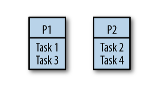
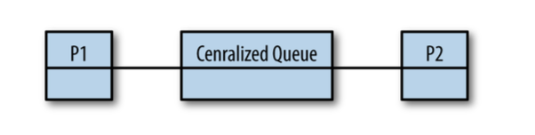
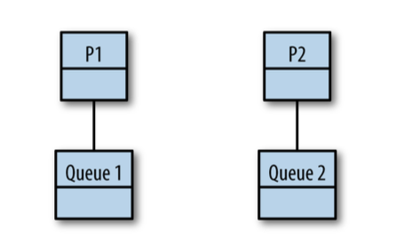
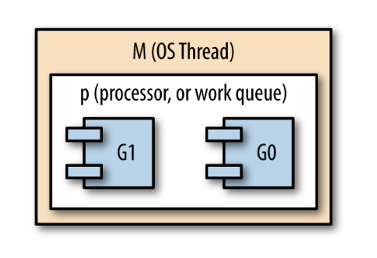

# Chapter 6

## Goroutines and the Go Runtime

Of all the things the Go runtime does for you, spawning and managing goroutines
is probably the most beneficial to you and your software.

### Work Stealing

Go will handle multiplexing goroutines onto OS threads for you.

The algorithm it uses to do this is known as a _work stealing_ strategy.

First, let's look at a naive strategy for sharing work across many processors, something called _fair scheduling_.

> In an effort to ensure all processors were equally utilized, we could
> evenly distribute the load between all available processors.
>
> Imagine there are `n` processors and `x` tasks to perform.
> In the fair scheduling strategy, each processor would get `x/n` tasks

Go models concurrency using a fork-join model. In a fork-join paradigm, tasks are likely dependent on one another, and
it turns out naively splitting them among processors will likely cause one of the processors to be underutilized.

Not only that, but it can also lead to poor cache locality as tasks that require the same data are scheduled on other
processors.



> What would happen if task two took longer to complete than tasks one and three combined?
> \_ idle
>
> What happens if there are interdependencies between tasks - if a task allocated to one processor requires the result
> from a task allocated to another processor?
> \_ idle

Sound like basic load-balancing problems that maybe a FIFO queue can help with, so let's try that:

Work tasks get scheduled into the queue, and our processors dequeue tasks as they have capacity, or block on joins.



> It's better than simply dividing the tasks among the processors because it solves the problem with underutilized
> processors, but we've now introduced a centralized data structure that all the processors must use.
>
> Not only that, but our cache locality problems have only been exacerbated: we're now going to load the centralized
> queue into each processor's cache every time it wants to enqueue or dequeue a task.
>
> Goroutines usually aren't coarse-grained, so a centralized queue probably isn't a great choice for our work scheduling
> algorithm.

We could give each processor its own thread and a deque.



> We've solved our problem with a central data structure under high contention.
>
> And on that topic, if the work begins on P1, and all forked tasks are placed on P1's queue, how does work ever make it
> to P2?
>
> And don't we have a problem with context switching now that tasks are moving between queues?

The work stealing algorithm follows a few basic rules:

- at the fork point, add tasks to the tail of the deque on some random thread
- if the thread is idle, steal work from the head of the deque on some random thread
- at a join point, that can't be realized yet, pop work off the tail of the thread's own deque
- if the thread's deque if empty, either: stall a join | steal work from the head of a random thread's associated deque

### Stealing Tasks or Continuations

One thing we've kind of glossed over is the question of what work we are enqueuing and stealing.

Under a fork-join paradigm, there are two options: tasks (goroutines) and continuations (everything after a goroutine).

```go
doWork := func() <-chan int {
    result := make(chan int)
    
    // task
    go func(){
        // do work
    }()
    
    // continuation
    return result
}
```

In our previous walkthrough of a distributed-queue work-stealing algorithm, we were enqueuing tasks, or goroutines.

Since a goroutine hosts functions that nicely encapsulate a body of work, this is a natural way to think about things;
however, this is not actually how Go's work-stealing algorithm works.

Go's work-stealing algorithm enqueues and steals continuations.

> Under our algorithm, when a thread of execution reaches an unrealized join point,
> the thread must pause execution and go fishing for a task to steal.
>
> This is called a _stalling join_ because it is stalling at the join while
> looking for work to do.
>
> Both task-stealing and continuation-stealing algorithms have stalling joins, but there is a significant difference
> in how often stalls occur.

When creating a goroutine, it is very likely that your program will want the function in that goroutine to execute.

It is also reasonably likely that the continuation from that goroutine will at some point want to join with that
goroutine.

> And it's not uncommon for the continuation to attempt a join before the goroutine has finished completing.
>
> Given these axioms, when scheduling a goroutine, it makes sense to immediately begin working on it.

If we push the continuation onto the tail of the deque, it's least likely to get stolen by another thread that is
popping things from the head of the deque, and therefore it becomes very likely that we'll be able to just pick it back
up when we're finished executing our goroutine, thus avoiding a stall.

This also makes the forked task look a lot like a function call: the thread jumps to executing the goroutine and then
returns to the continuation after it's finished.

The runtime on a single thread using goroutines is the same as if we had just used functions!
This is another benefit of continuation stealing.

So why don't all work-stealing algorithms implement continuation stealing? Well, continuation stealing usually requires
support from the compiler.

Go's scheduler has three main concepts:

- G (goroutine)
- M (OS thread, machine)
- P (context, processor)

In our discussion about work stealing, `M` is equivalent to `T`, and `P` is equivalent to the `work deque`.

The G is a goroutine, but keep in mind it represents the current _state_ of a goroutine, most notably its program
counter. This allows a `G` to represent a continuation so Go can do continuation stealing.

In Go's runtime, `Ms` are started, which then host `Ps`, which then schedule and host `Gs`:



Consider what would happen if any of the goroutines were blocked either by input/ output or by making a system call
outside of Go's runtime. The OS thread that hosts the goroutine would also be blocked and would be unable to make
progress or host any other goroutines.

What Go does in this situation is dissociated the context from the OS thread so that the context can be handed off to
another, unblocked, OS thread.

When the goroutine eventually becomes unblocked, the host OS thread attempts to steal back a context from one of the
other OS threads so that it can continue executing the previously blocked goroutine. However, sometimes this is not
always possible. In this case, the thread will place its goroutine on a _global context_, the thread will go to sleep,
and it will be put into the runtime thread pool for future use.

The global context we just mentioned doesn't fit into our prior discussions of abstract work-stealing algorithms. It's
an implementation detail that is necessitated by how Go is optimizing CPU utilization. To ensure that goroutines placed
into the global context aren't there perpetually, a few extra steps are added into the work-stealing algorithm.
Periodically, a context will check the global context to see if there are any goroutines there, and when a context's
queue is empty, it will first check the global context for work to steal before checking other OS threads contexts.

Other than input/output and system calls, Go also allows goroutines to be preempted during any function call.

### Presenting All of This to the Developer

Slap the word `go` before a function or closure, and you've automatically scheduled a task that will be run in the most
efficient way for the machine it's running on.

As developers, we're still thinking in the primitives we're familiar with: functions.
We don't have to understand a new way of doing things, complicated data structures, or scheduling
algorithms.

Scaling, efficiency, and simplicity. This is what makes goroutines so intriguing.