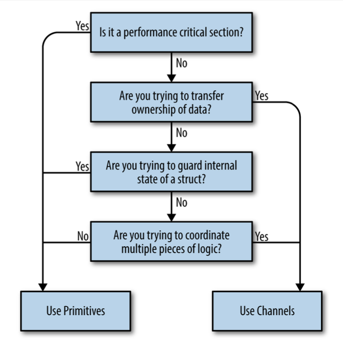

# Chapter 2

## Modeling your code: Communicating sequential processes

### The difference between concurrency and parallelism

Some facts, that I highlighted for myself:

- Concurrency is about dealing with lots of things at once.
- Parallelism is about doing lots of things at once.
- Concurrency is about structure, parallelism is about execution.
- Concurrency may use parallelism, but parallelism doesn't require concurrency.

Parallelism is property of the runtime of our program, not the code.

### What is CSP?

CSP stands for "Communicating Sequential Processes".

Base idea to make input and output a language primitives, modeling communication between processes.

**Process** - any encapsulated portion of logic that requires input to run and produced
output that other processes can consume.

Go is one of the first languages to incorporate principles from CSP in its
core, and bring this style of concurrent programming to the masses.

> Other languages also tried to incorporate CSP, but they are not so popular.
>
> Example: Clojure, Elixir

### How This Helps You 

It's common for languages to end their chain of abstractions at the level of 
the OS thread and memory access synchronization.

Go provides a higher level of abstraction - goroutines and channels.

Goroutines free us from having to think about our problem space in terms of parallelism 
and instead allow us to nodel problems closer to their natural language of concurrency.

You don't need to think about this kind of questions:

- Where should my thread confiment boundaries be?
- What is a number of threads that I need?
- How heavy are my threads?

Also you can choose a framework which hides all parallelism details from you, but
under the hood it may be complex and hard to understand -> more bugs.

In the case of Go, the language was designed around concurrency, so the language is not incongruent with the concurrency primitives it provides.

Go's runtime multiplexes goroutines onto OS threads automatically and manages
their scheduling for us. The Go authors are making improvements behind the scenes
to make this even more efficient.

Go's scheduler can introspect on things like goroutines blocked waiting on I/O
and intelligently reallocate OS threads to goroutines that are ready to run.

Yet another benefit of the more natural mapping between problem spaces and Go code is the likely increased amount of the problem space modeled in a concurrent manner.

Channels, contexts, select statement all help us to model our problem easier.

### Go's Philosophy on Concurrency 

CSP was and is a large part of what Go was designed around; however it also 
supports more traditional means of writing concurrent code through memory access synchronization primitives.

Structs and methods in the `sync` package allows us to perform locks, create pool of resources, 
preempt goroutines, and more.

This ability to choose between CSP primitives and memory access synchronizations is great for you since it gives you a little more control over what style of concurrent code you choose to write to solve problems, but it can also be a little confusing.

> Use whichever is most expressive and/or most simple.

What criteria should you use to decide which style of concurrent code to write?

Go’s philosophy on concurrency can be summed up like this: aim for simplicity, use channels when possible, and treat goroutines like a free resource.

