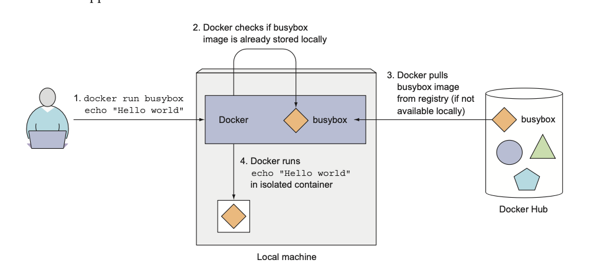
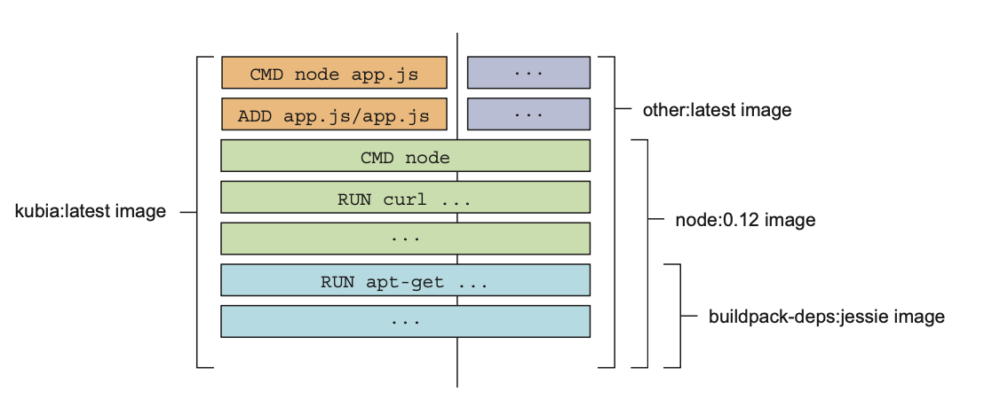
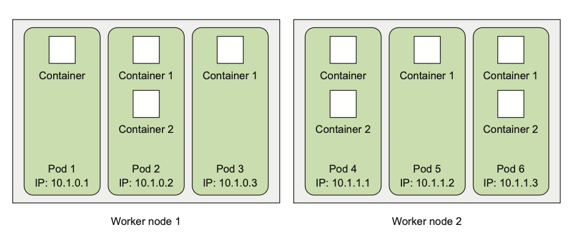
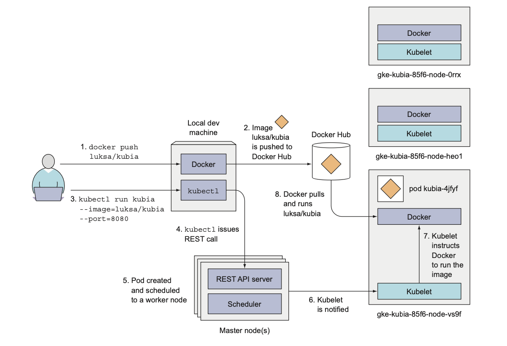
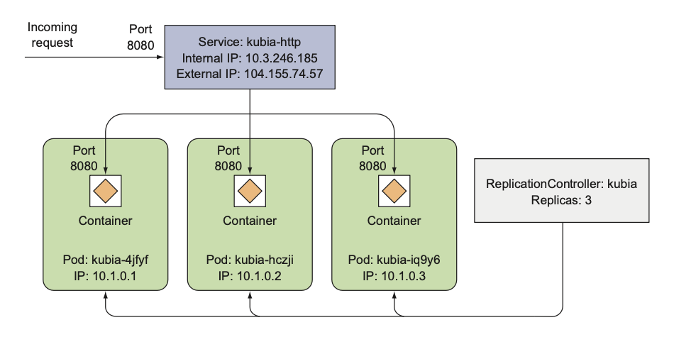

# Chapter 2. First steps with Docker and Kubernetes

## 2.1 Creating, running, and sharing a container image

### 2.1.1 Installing Docker and run Hello World container

#### Running a Hello world container

```bash
docker run busybox echo "Hello world"
```

App was executed inside a container, isolated from another processes.

### Understanding what happens behind the scenes



#### Running other images

```bash
docker run <image-name>
```

#### Versioning container images

All software packages get updated, so more than a single version of a package usually exists. Docker supports having
multiple versions or variants of the same image under the same name. Each variant must have a unique tag.

When referring to images with- out explicitly specifying the tag, Docker will assume you’re referring to the so-called
latest tag.

```bash 
docker run <image-name>:<tag>
```

### 2.1.2 Creating a trivial Node.js app

```js
const http = require('http');
const os = require('os');

console.log("Server starting...");

var handler = function (req, resp) {
    console.log("Received request from " + req.connection.remoteAddress);
    resp.writeHead(200);
    resp.end("You've hit " + os.hostname() + "\n");
};

var www = http.createServer(handler);
www.listen(8080);
```

Run locally with `node app.js`

### 2.1.3 Creating a Dockerfile for the image

To package your app into an image, you first need to create a file called Dockerfile, which will contain a list of
instructions that Docker will perform when building the image.

```Dockerfile
FROM node:7
ADD app.js /app.js
ENTRYPOINT [ "node", "app.js" ]
```

- `FROM` defines the container image you'll use as a starting point.
- `ADD` copies the app.js file from the current directory into the container image.
- `ENTRYPOINT` defines the command that will be executed when the container starts.

### 2.1.4 Building the container Image

```bash
docker build -t kubia .
```

- `-t` flag is used to tag the image with a name.


#### Understanding how an image is built

The build process isn’t performed by the Docker client. Instead, the contents of the whole directory are uploaded to the
Docker daemon and the image is built there.

The client and daemon don't need to be on the same machine at all.

Before actual building Docker will pull all the layers for the base image
from the registry if they don't exist locally.

#### Understanding image layers

An image isn’t a single, big, binary blob, but is composed of multiple layers.

If you create multiple images based on the same base image, all the layers
comprising the base image will be stored only once.

Also, when pulling an image, Docker will download each layer individually. Several layers may already be stored on your
machine, so Docker will only download those that aren’t.



```sh 
docker images kubia
```

#### Comparing building images with Dockerfile vs. manually

Dockerfiles are the usual way of building container images with Docker, but you could also build the image manually by
running a container from an existing image,
executing commands in the container, and then committing the container final state
as a new image.

This is exactly what happens when you build from a Dockerfile, but it’s performed automatically and is repeatable, which
allows you to make changes to
the Dockerfile and rebuild the image any time, without retyping all the commands.

### 2.1.5 Running the container image

```sh 
docker run --name kubia-container -p 8080:8080 -d kubia
```

Telling docker to run the container with name `kubia-container`, map the local
port `8080` to the container port `8080`, and run it in the background (`-d`)
based on the image `kubia`.

#### Accessing your app

```sh 
curl localhost:8080
```

#### Listing all running containers

```sh 
docker ps
```

#### Getting additional information about a container

```sh 
docker inspect <container-name>
```

Will print some low-level container information in JSON format.

### 2.1.6 Exploring the inside of a running container

Because multiple processes can run inside the same container, you can always run an addi- tional process in it to see
what’s inside. You can even run a shell, provided that the shell’s binary executable is available in the image.

#### Running a shell inside an existing container

```sh 
docker exec -it <container-name> bash
```

This will run `bash` inside the container and attach the terminal to it.

The `bash` process will be run in the same Linux namespace as the main container
process.

- `-i` flag tells Docker to keep the stdin stream open, so you can send commands to the shell.
- `-t` flag tells Docker to allocate a pseudo-TTY, which allows you to attach your terminal to the shell running in the
  container.

#### Exploring the container form within

```sh 
ps aux
```

Only three processes - no one from the host system.

#### Understanding that processes in a container run in the host OS

```sh 
ps aux | grep node
```

If you now open another terminal and list the processes on the host OS itself, you will, among all other host processes,
also see the processes running in the container.
> If using Mac or Windows need to login into the VM first.

This proves that processes running in the container are running in the host OS. If you have a keen eye, you may have
noticed that the processes have different IDs inside the container vs. on the host. The container is using its own PID
Linux namespace and has a completely isolated process tree, with its own sequence of numbers.

#### The container's filesystem is also isolated

Like having an isolated process tree, each container also has an isolated filesystem. Listing the contents of the root
directory inside the container will only show the files in the container and will include all the files that are in the
image plus any files that are created while the container is running.

### 2.1.7 Stopping and removing a container

```sh 
docker stop <container-name>
```

To check that the container is stopped, run `docker ps -a`.

```sh 
docker rm <container-name>
```

### 2.1.8 Pushing the image to an image registry

The image you’ve built has so far only been available on your local machine. To allow you to run it on any other
machine, you need to push the image to an external image registry.

Docker Hub will allow you to push an image if the image’s repository name starts with your Docker Hub ID.

Like `<docker-hub-id>/<image-name>`

#### Tagging an image under an additional tag

```sh 
docker tag kubia <docker-hub-id>/kubia
```

This doesn’t rename the tag; it creates an additional tag for the same image.

By `docker images` you can see that the image has two tags.

#### Pushing the image to Docker Hub

```sh 
docker push <docker-hub-id>/kubia
```

> Login to Docker Hub first.

#### Running the image on a different machine

```sh 
docker run -p 8080:8080 -d <docker-hub-id>/kubia
```

After the push to Docker Hub is complete, the image will be available to everyone.

It doesn’t get much simpler than that. And the best thing about this is that your application will have the exact same
environment every time and everywhere it’s run.

## 2.2 Setting up a Kubernetes cluster

Setting up a cluster from a beginning it isn't a simple task.

We can use single-node local cluster or cluster configured by the cloud providers.

### 2.2.1 Running a local single-node Kubernetes cluster with Minikube

Minikube is a tool that sets up a single-node cluster that’s great for both testing Kubernetes and developing apps
locally.

#### Installing Minikube

- https://github.com/kubernetes/minikube
- https://minikube.sigs.k8s.io/docs/start/

#### Installing the Kubernetes client (kubectl)

```sh 
brew install kubectl
```

#### Checking to see the cluster is up and kubectl can talk to it

```sh 
kubectl cluster-info
```

> I'll skip all parts which are related to Google Cloud Platform.

### 2.2.3 Setting up alias for `kubectl`

```sh
alias k=kubectl

# bash completion for tabbing, need to install bash-completion
source <(kubectl completion bash | sed s/kubectl/k/g)
```

> Also, can install `oh-my-zsh` and use `kubectl` plugin.
>
> https://github.com/ohmyzsh/ohmyzsh

## 2.3 Running your first app on Kubernetes

### 2.3.1 Deploying your Node.js app

The simplest way is to run `kubectl run` command without configuration file.

```sh
kubectl run kubia --image=luksa/kubia --port=8080 
```

#### Introducing pods

Kubernetes doesn't deal with individual containers directly.

Instead, it groups containers into logical units called **pods**.

A **pod** is a group of one or more tightly related containers that will always run together on the same worker node and
in the same Linux namespace.

Each pod is like a separate logical machine with its own IP, hostname, processes, and so on, running a single
application.

The application can be a single process, running in to a single container, or it can be a main application process and
additional supporting processes, each running in its own container.

To better understand the relationship between containers, pods, and nodes:



Each pod has its own IP and contains one or more containers, each running an application process.

Pods are spread out across different worker nodes.

#### Listing pods

```sh
kubectl get pods
```

About pod statuses: https://kubernetes.io/docs/concepts/workloads/pods/pod-lifecycle/

Pending (downloading images) -> Running -> Succeeded (finished)

To see more information about a pod, run:

```shell
kubectl describe pod kubia
```

#### Understanding what happened behind the scenes



### 2.3.2 Accessing your web application

Each pod gets its own IP address, but this address is **internal** to the cluster and isn’t accessible from outside of
it.

To make the pod accessible from the outside, you’ll expose it through a `Service` object.

About service types: https://kubernetes.io/docs/concepts/services-networking/service/#publishing-services-service-types

TL;DR: using `LoadBalancer` instead `ClusterIP` because the first one is exposing the service to the outside world.

#### Create a Service object

```sh
kubectl expose pod kubia --type LoadBalancer --name kubia-http
```

#### Listing services

```sh
kubectl get services
```

> It may take a few seconds for the service to be assigned an external IP address.
>
> Minikube doesn't support LoadBalancer type, so it will be `pending` forever.

#### Accessing your service through its external IP

```sh
curl <external-ip>:<port>
```

Accessing in Minikube:

```sh
minikube service kubia-http
```

Pod name = hostname.

### 2.3.3 The logical parts of your system

Worker node = VM + Docker + kubelet + kube-proxy
Master node = API server + scheduler + controller manager + etcd

We don't care about the hosting of master components (split between multiple machines),
because we are only interacting with the API server.

#### Understanding how the RC, the Pod, and the Service fit together


Replication Controller (RC) is a Kubernetes object that ensures that a specified number of pod replicas are running at
any one time.

Pods are ephemeral (can be created, deleted, and moved around at any time) - IP addresses are not stable, so we need
Service to provide a stable IP address and DNS name for a set of pods.

Requests coming to the IP and port of the service will be forwarded to the IP and port of one of the pods belonging to
the service at that moment.

### 2.3.4 Horizontally scaling the application

> In book used previous version of Kubernetes, and `--generator` flag is deprecated now.

Creating `ReplicationController` via spec file:

```yaml
apiVersion: v1
kind: ReplicationController
metadata:
  name: kubia
spec:
  replicas: 3
  selector:
    app: kubia
  template:
    metadata:
      labels:
        app: kubia
    spec:
      containers:
        - name: kubia
          image: luksa/kubia
          ports:
            - containerPort: 8080
```

```shell
kubectl apply -f rc.yaml
```

```shell
kubectl get rc
```

Exposing the RC as a service:

```shell
kubectl expose rc kubia --type=LoadBalancer --name kubia-http-v2
```

#### Increasing the desired replica count

```shell
k scale rc kubia --replicas 5
```

We didn't instruct Kubernetes how to scale the application, we only told it what the desired state is.

This is one of the most fundamental Kubernetes principles. Instead of telling Kubernetes exactly what actions it should
perform, you’re only declaratively changing the desired state of the system and letting Kubernetes examine the current
actual state and reconcile it with the desired state.

#### Seeing the results of the scale-out

```shell
kubectl get pods -o wide
```

Keep in mind that the app itself needs to support being scaled horizontally. Kubernetes doesn't magically make your app
scalable; it only makes it trivial to scale the app up or down.

#### Seeing requests hit all three pods when hitting the service

```shell
URL=$(minikube service kubia-http-v2 --url)

while true; do curl "$URL"; sleep 0.5; done
```

#### Visualizing the new state of your system



### 2.3.5 Examining what nodes your app is running on

You may be wondering what nodes your pods have been scheduled to.

In the k8s world, what node a pod is running on isn't that important, as long as it gets scheduled to a node that can
provide the CPU and memory the pod needs to run properly.

Each pod has its own IP and can talk to any other pod, regardless of whether that other pod is also running on the same
node or on a different one.

#### Displaying the pod IP and the Node when listing pods

```shell
kubectl get pods -o wide
```

#### Inspecting other details of a pod with `kubectl describe`

```shell
kubectl describe pod kubia
```

This shows, among other things, the node the pod has been scheduled to, the time when it was started, the image(s) it's
running, and other useful information.

### 2.3.6 Introducing the Kubernetes Dashboard

The Kubernetes Dashboard is a web-based UI that you can use to inspect your cluster -
another way to interact with your cluster.

```shell
minikube dashboard
```

## 2.4 Summary

After reading this chapter, you should now know how to:

- Pull and run any publicly available container image
- Package your apps into container images and make them available to others
- Entering a running container to inspect its environment
- Alias `kubectl` to `k` and enable bash completion
- List and inspect nodes, pods, services and replication controllers in your cluster
- Have basic sense of how pods, rc and services relate to each other
- Scale up and down your app by changing the desired state of the system
- Access the web-based Kubernetes Dashboard