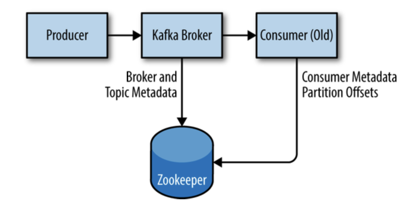
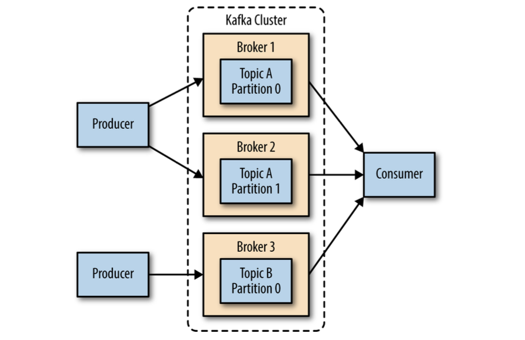

# Chapter 2

## Installing Kafka

Describes how to get started with the Apache Kafka broker, including how to set up Apache Zookeeper, which
is used by Kafka for storing metadata for the brokers.

> All installations will be done in docker containers, not based on the book.

### First Things First

- choosing an OS

> Kafka is a Java app, can run on any OS that supports Java.
>
> However, Kafka is most commonly run on Linux.

- installing Java

> Kafka requires Java 8 or higher.

- installing Zookeeper

> Kafka uses Zookeeper to store metadata about the Kafka cluster, as well as consumer client details.



```shell
make kafka
telnet localhost 2181
srvr
```

#### Zookeeper ensemble

A Zookeeper cluster is called an **ensemble**.
Due to the algorithm used, it is recommended that ensembles contain an odd number of servers as a quorum must be working
in order for Zookeeper to respond to requests.

> Consider running Zookeeper in a five-node ensemble.
>
> It is also not recommended to run more than seven nodes, as performance can start to degrade due to the nature of the
> consensus protocol.

Zookeeper config: https://hub.docker.com/r/bitnami/zookeeper

- installing a Kafka Broker

Kafka config: https://hub.docker.com/r/bitnami/kafka

### Broker configuration

#### General Broker

- `broker.id` - unique ID for each broker
- `port` - port to listen on
- `zookeeper.connect` - Zookeeper connection string, for storing metadata
- `log.dirs` - list of directories to store log files
- `num.recovery.threads.per.data.dir` - number of threads to use for log recovery
  > nested with `log.dirs`, so it is multiplied by the number of directories specified in `log.dirs`
  >
  > when recovering from unclear shutdowns, Kafka will use this number of threads to recover the log files
- `auto.create.topics.enable` - whether to allow auto-creation of topics
  > broker should automatically create a topic when:
  > - a producer starts sending messages to a topic that does not exist
  > - a consumer starts consuming messages from a topic that does not exist
  > - a client requests metadata for a topic that does not exist

#### Topic Defaults

- `num.partitions` - number of partitions to create for a new topic

  > can only be increased, not decreased
  >
  > how to choose the number of partitions:
  > - what is the expected throughput of the topic?
  > - what is the maximum throughput when consuming from a single partition?
  > - what is the maximum throughput when producing to a single partition? (optional)
  > - if sending messages to partitions based on keys, adding partitions later can be challenging, calculate
      the throughput based on your expected future usage
  > - available diskspace and network bandwidth on the broker
  > - avoid overestimating, as each partition uses memory and other resources on the broker and will increase the time
      for leader elections.

- `log.retention.ms` - how long to keep messages in the log
  > use instead of `log.retention.hours` because ms has a higher resolution, when will be conflict, ms will win

- `log.retention.bytes` - how much space to use for the log
  > applied per partition (if you have 3 partitions -> 3x)

- `log.segment.bytes` - how large to make the log segments
  > messages are appended to the current log segment, which can be closed when it reaches the size specified by this
  > configuration and a new segment is created
  >
  > log segment is a file on disk, so this configuration controls the size of the files on disk
  >
  > useful when topic have a low produce rate; when fetching offsets, Kafka uses write timestamps to determine which
  > segments to read from.

- `log.segment.ms` - how long to wait before closing a log segment
  > if the log segment is not full, it will be closed after this amount of time has passed

- `message.max.bytes` - maximum size of a message that can be produced
  > producer will receive an error if the message is larger than this size
  >
  > bigger message -> more threads to process it -> more disk reads and writes -> possible less I/O throughput

### Hardware Selection

Kafka itself has no strict requirement on a specific hardware configuration,
and will run without any issues on any system.

Once performance becomes a concern, however, there are several factors that will contribute to the overall
performance: disk throughput and capacity, memory, networking, and CPU.

#### Disk Throughput

The performance of producer clients will be most directly influenced by the throughput of the broker disk that is used
for storing log segments.

Kafka messages must be committed to local storage when they are produced, and most clients
will wait until at least one broker has confirmed that messages have been committed before considering to send
successful.

This means that faster disk writes will equal lower produce latency.

SSD > HDD.

#### Disk Capacity

The amount of disk capacity that is needed is determined by how many messages need to be retained at any time.

If the broker is expected to receive 1 TB of traffic each day, with 7 days of retention, then the broker will need a
minimum of 7 TB of usable storage for log segments.

You should also factor in at least 10% overhead for other files, in addition to any buffer that you wish to maintain for
fluctuations in traffic or growth over time.

#### Memory

The normal mode of operation for a Kafka consumer is reading from the end of the partitions, where the consumer is
caught up and lagging behind the producers very little, if at all.

In this situation, the messages the consumer is reading are optimally stored in the system’s page cache, resulting in
faster reads than if the broker has to reread the messages from disk.

Therefore, having more memory available to the system for page cache will improve the performance of consumer clients.

Machine for Kafka only, don't share with others significant services.

#### Networking

The available network throughput will specify the maximum amount of traffic that Kafka can handle.

This is often the governing factor, combined with disk storage, for cluster sizing.

#### CPU

Processing power is not as important as disk and memory, but it will affect overall performance of the broker to some
extent.

Ideally, clients should compress messages to optimize network and disk usage, Kafka broker
will need to decompress messages in order to validate and assign offsets, then recompress the messages before writing
them to disk.

### Kafka Clusters

A single Kafka server works well for local development work, or proof-of-concept system.



The biggest benefit is the ability to scale the load across multiple servers;
second is using replication to guard against data loss due to single system failures
(also performing maintenance work on a single broker without downtime).

#### How Many Brokers?

The appropriate size for a Kafka cluster is determined by several factors:

- how much disk capacity is required for retaining messages and how much storage is available on a single
  broker
- capacity of the cluster to handle requests (bursts of traffic, etc.)

#### Broker Configuration

There are only two requirements in the broker configuration to allow multiple Kafka brokers to join a single cluster.

- `zookeeper.connect` - must be the same for all brokers
- `broker.id` - must be unique for each broker
  > if the same brokers attempt to join the same cluster, the second broker will log an error and fail to start.
- replication configs

#### OS Tuning

Some changes can be made for Kafka broker that will improve performance.

> No notes, because not interesting for me right now.

- virtual memory
  > We can make some adjustments to both how swap space is handled, and to dirty memory pages, to tune it for
  > Kafka’s workload.

- disk
- networking
  > kernel is not tuned by default for large, high-speed data transfers

### Production Concerns

Before deploying Kafka to production, there are several things to consider.

#### Garbage Collection Options

Java 7 and the introduction of the Garbage First (or G1) garbage collector.

G1 is designed to automatically adjust to different workloads and provide consistent pause times for garbage collection
over the lifetime of the application.

It also handles large heap sizes with ease by segmenting the heap into smaller zones and not collecting over the entire
heap in each pause.

There are two configuration options for G1 used to adjust its performance:

- `MaxGCPauseMillis` - maximum amount of time to pause the application for garbage collection
- `InitiatingHeapOccupancyPercent` - percentage of the heap that must be filled before G1 will start a concurrent
  garbage collection cycle

#### Datacenter Layout

The best practice is to have each Kafka broker in a cluster installed in a different rack, or at the very least not
share single points of failure for infrastructure services such as power and network.

#### Colocating Applications on Zookeeper

Kafka utilizes Zookeeper for storing metadata information about the brokers, topics, and partitions.
Writes to Zookeeper are only performed on changes to the membership of consumer groups or on changes to the Kafka
cluster itself.

Recommended that consumers using the latest Kafka libraries use Kafka for committing offsets, removing the dependency on
Zookeeper. (offsets can be committed in both)

