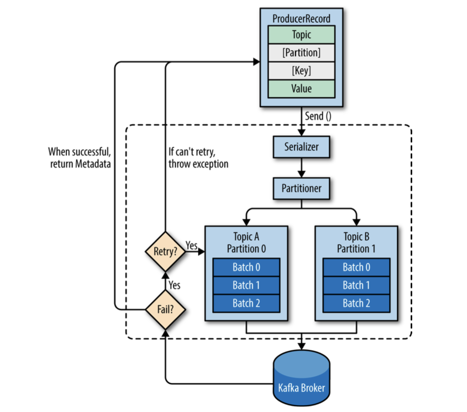
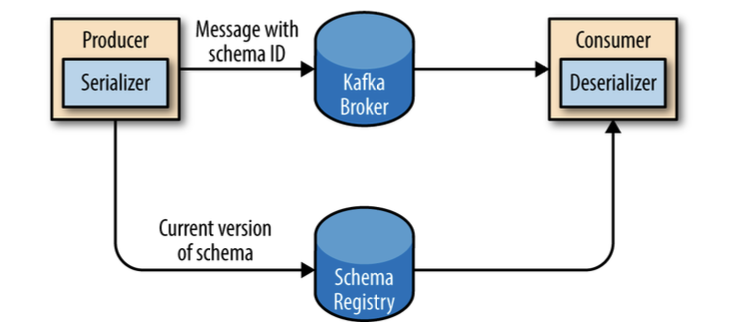

# Chapter 3

## Kafka Producers: Writing Messages to Kafka

Apache Kafka ships with built-in client APIs that developers can use when developing applications that interact with
Kafka.

### Producer Overview

There are many reasons an application might need to write messages to Kafka:

- recording user activities for auditing or analytics
- recording metrics
- storing log messages
- recording information from smart appliances
- communicating asynchronously with other applications
- buffering information before writing to a database

Those diverse use cases also imply diverse requirements:

- Is every message critical, or can we tolerate loss of messages?
- Are we OK with duplicating messages?
- Are there any strict latency or throughput requirements?

The different requirements will influence the way you use the producer API to write messages to Kafka and the
configuration you use.

Producer API are very simple, there is a bit more that goes on under the hood of
the producer when we send data:

Success - RecordMetadata with: topic, partition, offset in the partition.
Error - Error message after retries.

### Constructing a Kafka Producer

> Most of the code will be in Go instead of Java with [sarama](https://github.com/IBM/sarama) library.
>
> Some Java examples are in [java](java) folder, Go examples are in [go](go) folder.

Kafka producer has 3 mandatory properties:

- `bootstrap.servers` - list of host:port pairs of brokers that the producer will use to establish initial connection
- `key.serializer` - name of a class that will be used to serialize keys
- `value.serializer` - name of a class that will be used to serialize values

Three primary methods for sending messages:

- fire-and-forget
  > we send a message to the server and don’t really care if it arrives succesfully or not.

- synchronous send
  > we send a message, the send() method returns a Future object, and we use get() to wait on the future and see if the
  > send() was successful or not.

- asynchronous send
  > we call the send() method with a callback function, which gets triggered when it receives a response from the Kafka
  > broker.
  >
  > useful when we want to make some logic after the message is sent, like logging the error.

### Sending a Message to Kafka

Check [async_producer.go](go/async_producer.go), [sync_producer.go](go/sync_producer.go) for examples.

KafkaProducer has two types of errors:

- **retryable** - errors that may be transient (e.g., a network error, leader election) and may be resolved by
  sending again.
  > producer can be configured to retry automatically.

- **non-retryable** - errors that are not transient (e.g., a message is too large to be handled by the server, an
  invalid message, or authorization failure), and the message will never succeed.
  > producer will return an error immediately.

### Configuring Producers

More useful parameters:

- `acks` - how many partition replicas must receive the record before the producer can consider
  write successful.
  > `acks=0` - producer will not wait for a reply from the broker before assuming the message was sent successfully.
  > `acks=1` - producer will receive a success response from the broker the moment the leader replica received the
  > message.
  > `acks=all` - producer will receive a success response from the broker once all in-sync replicas received the
  message.

- `buffer.memory` - total bytes of memory the producer can use to buffer messages waiting to be sent to the server.
  > if the producer sends messages faster than the broker can take them, the producer will eventually run out of
  > memory.

- `compression.type` - compression algorithm to use when sending messages to the broker.
  > By enabling compression, you reduce network utilization and storage, which is often a bottleneck when sending
  messages to Kafka.
  >
  > Options: `gzip`, `snappy`, `lz4`

- `retries` - number of times the producer will retry sending a message, the error should be retryable.

- `batch.size` - number of bytes the producer will attempt to batch together before sending to Kafka.
  > larger batches improve throughput, but introduce latency.

- `linger.ms` - number of milliseconds the producer will wait before sending a batch for additional messages to
  the same batch.
  > increase latency, but increase throughput.

- `client.id` - an id string to pass to the server when making requests, used to identify the source of requests.
  > useful for monitoring, logging and quota purposes

- `max.in.flight.requests.per.connection` - how many messages the producer will send to the server without receiving
  responses
  > high - increase memory usage, while improving throughput.
  > too high - reduce throughput, batches less effective.
  > 1 - reading messages in sending order, even if retries occur.

- `timeout.ms`, `request.timeout.ms`, `metadata.fetch.timeout.ms` - timeout for replicas ack, request to broker,
  metadata request.
  > if exceeded, producer will retry or fail.

- `max.block.ms` - how long the send method will block the calling thread if the buffer is full.
  > producer send buffer is full, or metadata unavailable.

- `max.request.size` - maximum size of a request in bytes.
  > request can be structured as a single message or a batch of messages.

- `receive.buffer.bytes`, `send.buffer.bytes` - size of the TCP send and receive buffers used by the sockets when
  writing and reading data.
  > -1 - use OS default.
  >
  > good to increase when producers and consumers are on different machines, because
  > it have higher latency and lower bandwidth.

Apache Kafka preserves the order of messages within a partition.

This means that if messages were sent from the producer in a specific order, the broker will write them to a partition
in that order and all consumers will read them in that order.

> For some use cases, order is very important.

### Serializers

Default: string, integers, byte arrays.

#### Custom Serializers

Example with Avro serializer in [producer.go](go/main.go).

Two caveats when using avro:

- the schema for writing the data and the schema expected by reading must be compatible.
- deserializer will need access to the schema that was used when writing the data.

#### Using Avro Records with Kafka

Unlike Avro files, where storing the entire schema in the data file is associated with a fairly reasonable overhead,
storing the entire schema in each record will usually more than double the record size.

However, Avro still requires the entire schema to be present when reading the record, so we need to locate the schema
elsewhere. To achieve this, we follow a common architecture pattern and use a **Schema Registry**.

The idea is to store all the schemas used to write data to Kafka in the registry. Then we simply store the identifier
for the schema in the record we produce to Kafka. The consumers can then use the identifier to pull the record out of
the schema registry and deserialize the data.

The key is that all this work-storing the schema in the registry and pulling it up when required - is done in the
serializers and deserializers.

### Partitions

Kafka messages are key-value pairs and while it is possible to create a `ProducerRecord` with just a topic and a value,
with the key set to `null` by default, most applications produce records with keys.

Keys serve two goals:

- additional information that gets stored with the message
- used to decide which partition to send the message to
  > all messages with the same key goes to the same partition.

When the key is `null`, the default partitioner is used and messages are sent to partitions in a round-robin fashion.

If the key is not `null`, then a partition is assigned based on a hash of the key (Kafka realization).

We use all partitions to calculate the hash, if partition is unavailable, you might get an error.

The mapping of keys to partitions is consistent only as long as the number of partitions in a topic does not change.
> If are adding new partition, previous keys might be assigned to different partitions.

When partitioning keys is important, the easiest solution is to create topics with sufficient partitions and never add
partitions.

#### Implementing a Custom Partitioner

Checkout [custom_partitioner.go](go/main.go)
or [custom_partitioner.java](java/src/main/java/kafka_producer/BananaPartitioner.java).

### Old Producer APIs

Have two old clients written in Scala, that is part of `kafka.producer` package, and the core Kafka module.

Current client support both of SyncProducers and AsyncProducers.

---

After writing code, found some interesting things about sarama library.

#### Why is it not recommended to use a Go sarama client?

The following known problems exist with the Go client that is developed with the Sarama library:

- When a partition is added to a topic, the Go client developed with the Sarama library cannot detect the new partition
  or consume messages from the partition. Only after the client is restarted, it can consume messages from the new
  partition.
- When the client subscribes to more than two topics at the same time, the client may fail to consume messages from some
  partitions.
- If the policy for resetting consumer offsets of the Go client developed with the Sarama library is set to Oldest(
  earliest), the client may start to consume messages from the earliest offset when the client breaks down or the broker
  version is upgraded. This is because the out_of_range class is implemented in the client.

Use [confluent-kafka-go](https://github.com/confluentinc/confluent-kafka-go) instead.