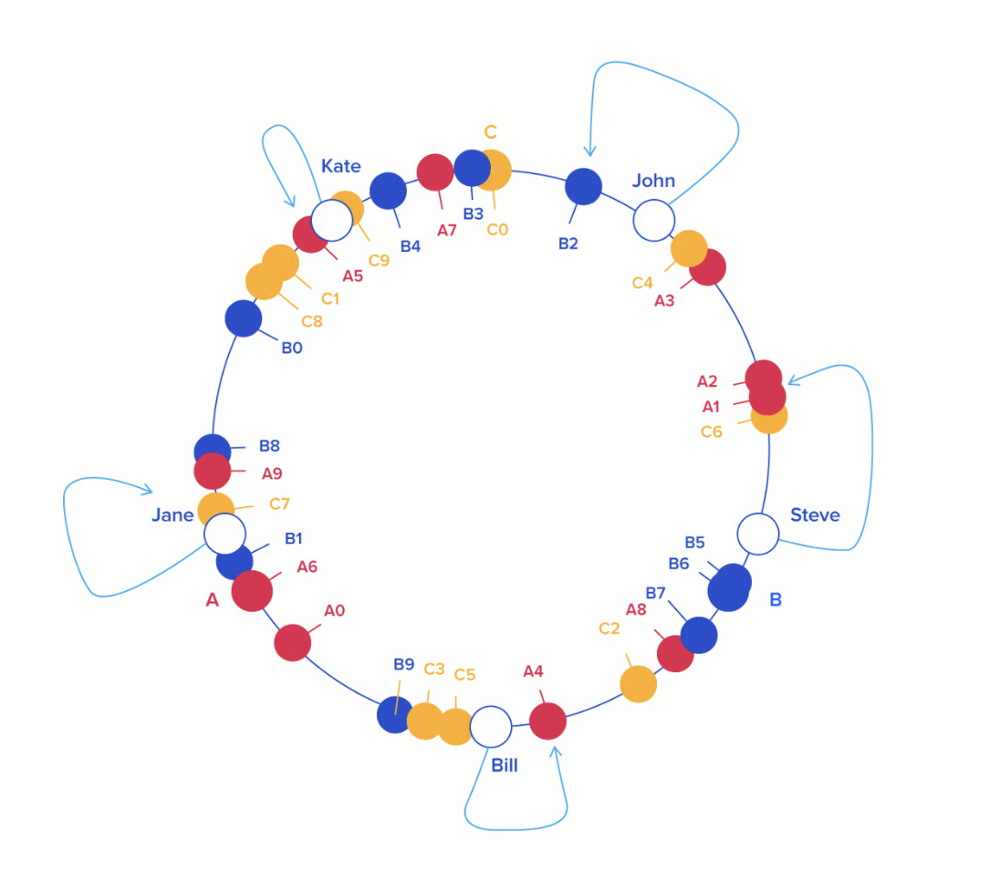

## Consistent hashing

Is a distributed hashing scheme that operates independently of the number of servers/objects
in a distributed hash table. 

Hashing:

- based on some simple fn (hash tables)
- cryptographic hash fn (password security, blockchain)

In some situations, it may be necessary to split a hash table into several parts, hosted on 
different servers. (objects and there keys are distributed across multiple servers)

Motivation: bypass the memory limitations of a single server, or to distribute the load.

Typical use case: distributed cache (memcached, redis)

Such setups consist of a pool of caching servers that host many kv pairs and are used to provide 
fast access to data originally stored elsewhere.

> Reducing the load on a OLTP database and improve performance.
>
> Fetching from cache before fetching from the database, if cache miss, fetch from database and 
> store in cache.

### How to distribute the data across the servers? 

The simplest way is to take the hash % number of servers.

> Works fine until we add/remove a server. Need to redistribute the data across the servers.
>
> This may very well degrade performance severely and possibly crash the origin servers.

We need a distribution scheme that doesn't depend directly on the number of servers, when 
we +/- servers the data should be redistributed minimally.

Consistent hashing is a distributed scheme that operates independently of the number 
of servers or objects in distributed hash table by assigning them a position on an abstract
circle, or hash ring. 

This allows servers and objects to scale without affecting the overall system.

Each object key will belong in the server whose key is closest, in a clockwise direction,
following the object key's position on the ring.

> From a programming perspective, the ring is a sorted list of server values, 
> that means we can use binary search to find the correct server for an object key.

To encure object keys are evenly distributed across the servers, we can add virtual nodes
to the ring. (A -> A0..An)

Benefit:

- when removing some server, the data will be redistributed across the remaining servers
and the load will be balanced, without affecting the previous distribution.

- something similar happens when adding a new server, only some part of the data will be
redistributed to the new server.

## Resources

About consistent hashing:
- https://www.toptal.com/big-data/consistent-hashing

About Amazon DynamoDB replication:
- https://medium.com/omarelgabrys-blog/consistent-hashing-beyond-the-basics-525304a12ba
