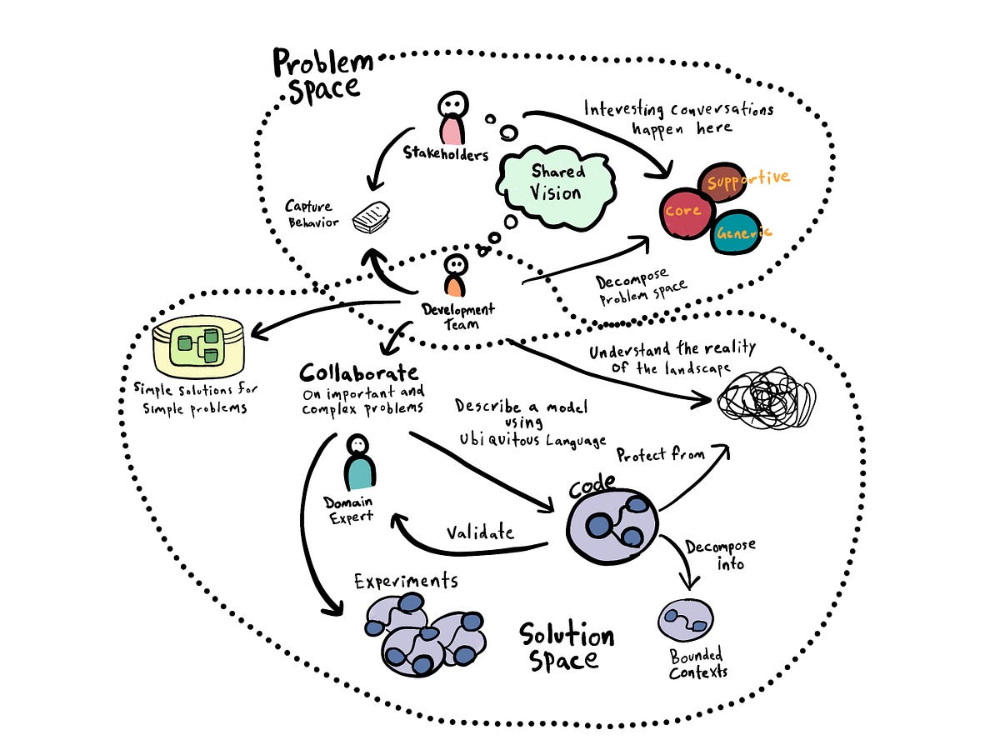
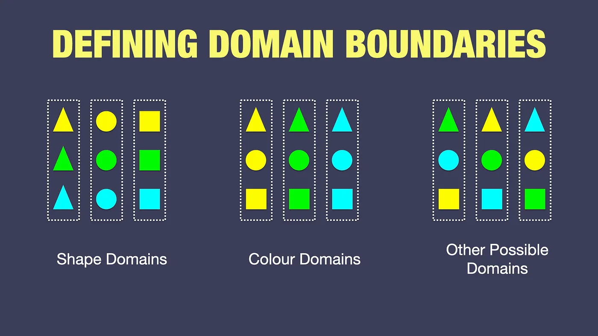
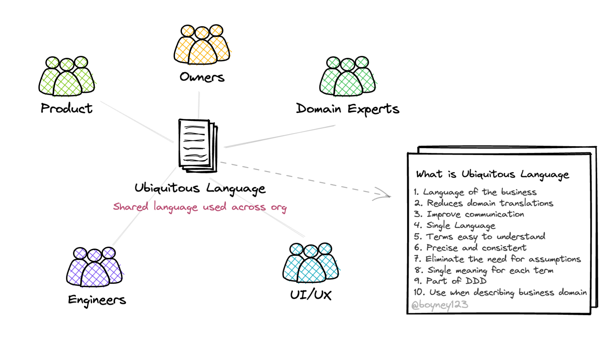
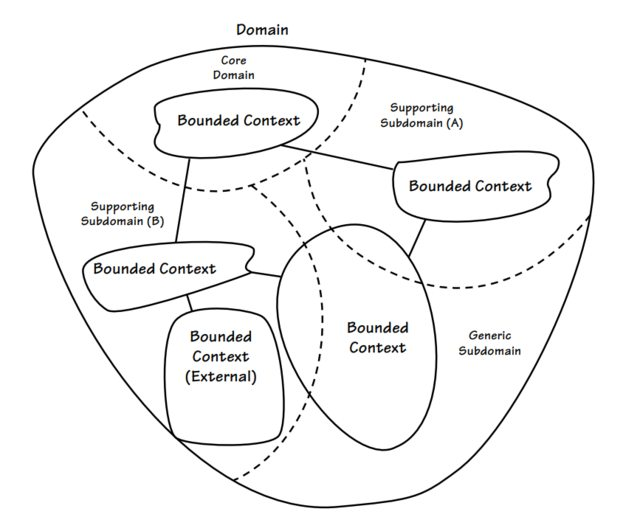

### Domain Driven Design

DDD is an approach to designing systems, usually software, that emphasises creating a common
language between domain experts and system builders.

> It's a way of thinking about software development that focuses on the business
> problem being solved and the domain of the business problem.
>
> It's not a technology or a methodology. It's a way of thinking about how you build and
> design your software.
>
> - Eric Evans

**Domain** - an area of interest or an area over which a person has control.
> A domain is an arbitrary boundary around some subset of concepts in the universe.
>
> They are subjective and aren't mutually exclusive.

When modelling systems we have to choose the most appropriate domain boundaries with which to align our software and
organisational boundaries.

**Subdomain** - a domain within a larger domain.

**Ubitiquitous Language** - a language structured around the domain model and used by
all team members to connect all the activities of the team with the software.

**Bounded Context** - distinct area within a business domain where concepts, language and
rules are clearly defined and consistent.

> Ideal way: when single subdomain matches a single bounded context.
>
> But still can have multiple bounded contexts within a single subdomain.

**Context Map** - a high-level map of the bounded contexts and their relationships.

**Entity** - an object that have an identity, which is independent of its attributes
throughout its lifetime.

> E.g: person, bank account, car.

**Value objects** - something that is immutable, has no identifier and is replaceable
by another value object with the same value type.

> We can think about VO as a complex attribute of an entity.
>
> E.g: address (street, city, country), money (amount, currency).
>
> Again, don't have their own ID, represented in the same table with the entity.

| Property       | Entity          | Value Object    |
|----------------|-----------------|-----------------|
| Identity       | Has an identity | Has no identity |
| Mutability     | Mutable         | Immutable       |
| Lifespan       | +               | -               |
| Replaceability | -               | +               |

