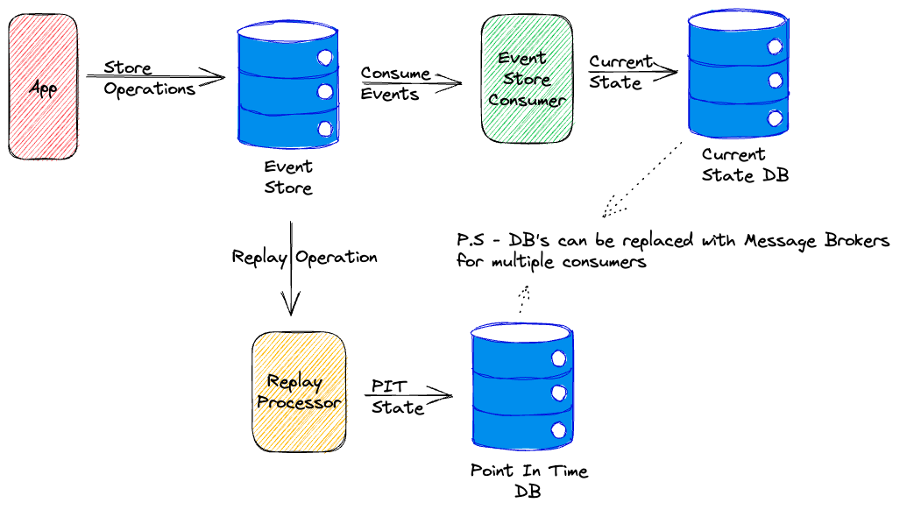
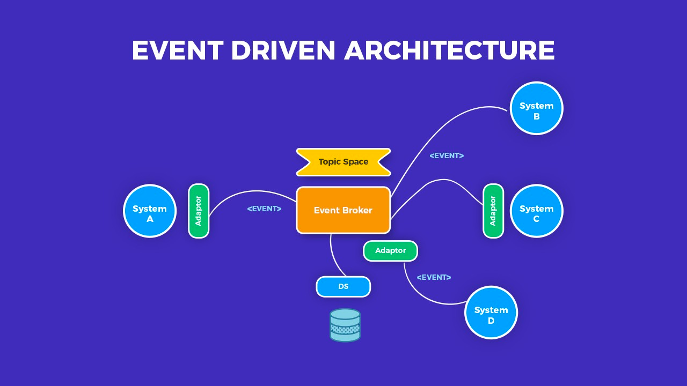

## Event-driven architecture

**Event sourcing** - is a pattern that uses an append-only event log to store the full history of actions taken on data
in a domain.

The application state is derived by replaying the events in the log.
> This allows the state to be rebuilt at any point in time by replaying the events from the event log.

Common example of event sourcing is a Git.

**Event** - is a record of what happened in the domain, carries information
about the state of the domain at the time of their occurrence.

> Event is a subset of the message.
>
> - Event don't have a destination.
> - Event is a named fact that something has happened.
>
> E.g: order created, order shipped, order cancelled.

**Event log** - is a sequence of events that happened in the domain.

**Event driven architecture** - is a pattern that uses events to trigger and communicate between decoupled services.
> Usually implemented using a message broker, such as Kafka or RabbitMQ.

- EDA is asynchronous, which means that the sender and receiver of the message don't need to interact
  instantly, events can be processed at a later time.
- We can have multiple consumers of the same event, each consumer can do something different with it. (pub/sub model)
- Easy to add new services, low coupling between services.
- High system reliability, because if one service is down, the event will be stored in the event log
  and will be processed later.

**CQRS** (Command Query Responsibility Segregation) - is a pattern that separates the read and write operations
for a data store.

> Different services can handle read and write operations separately.

**Command** - is an operation that changes the state of a system, checks its arguments, and enforces invariants.
> imperative, e.g: create order, update order, delete order.
> 
> `command -> change aggregate state -> event`

**Query** - is a search/read operation that returns data from the system.
> e.g: get order, get all orders.

### Resources

- https://aws.amazon.com/ru/event-driven-architecture/
- https://www.linkedin.com/pulse/event-sourcing-pattern-distributed-designpatterns-pratik-pandey/
- https://docs.axoniq.io/reference-guide/architecture-overview/event-sourcing
- https://microservices.io/patterns/data/saga.html