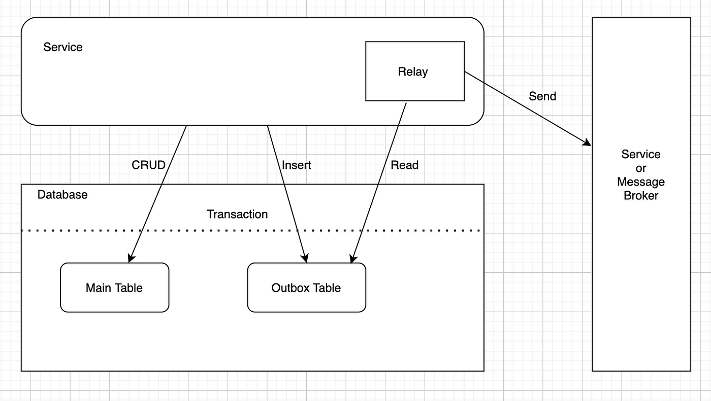

## Transactional Outbox

### Problem

The command must atomically update the database and send messages to a message broker, in order
to avoid data inconsistency in other services.

It's not possible to make reliable atomic updates to a database and send messages to a message broker
in a single transaction, there's no guarantee that the message will be sent.

In addition, messages must be sent in order they were send by the service.

### Solution

The solution is for the service that sends the message to first store the message in the database as part of the
transaction that updates the business entities.

A separate thread then reads the messages from the database and sends them to the message broker.

> Message outbox - if it’s a relational database, this is a table that stores the messages to be sent. Otherwise, if
> it’s a NoSQL database, the outbox is a property of each database record (e.g. document)
>
> Message consumer must be idempotent, because the message can be processed more than once.

### Resources

- https://microservices.io/patterns/data/transactional-outbox.html