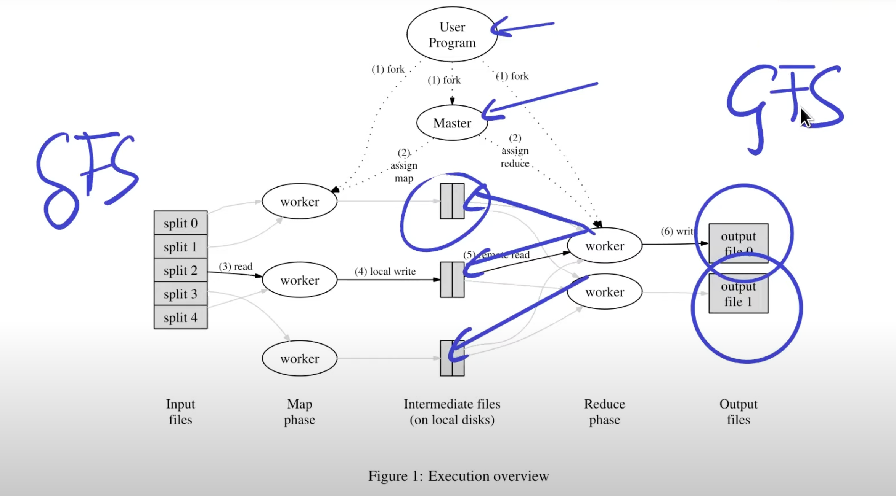

# Plan:

- what is it?
- historical context
- course structure
- main topic 
- mapreduce topic 

### Distributed Systems 

- multiple networked cooperating computers

As a client you don't worry about infrastructure, you just use the service.

#### Why?

- connect physically separate machines
> connecting from different devices to a server, connection
> allows as to share resources, like files, printers, etc. between separate machines

- increase capacity through parallelism

- tolerate faults
> one machine fails, the other one takes over -> high availability

- achieve security through isolation 

#### Historical context 

- started in the same time when local networks started to appear (1980s)
> AFS (Andrew File System) - distributed file System
> 
> DNS + email 

- rise of the datacenters, big websites (1990s)
> Web search, shopping - huge data management, a lot of users 

- cloud computing (2000s)
> users moved there data to the datacenters, instead of running application on the local machines

- Current state; active 

#### Challenges

- many concurrent components
- must be deal with partial failure

split brain - when the network is partitioned, and the two parts of the network can't 
communicate with each other, they both thinking that they are single.

- tricky realize the performance benefits of distributed systems 

#### Focus

infrastructure:
- storage (fs, db)
- computation (mapreduce, frameworks)
- communication (rpc, pub/sub)

#### Main topics 

- Fault-tolerance
> availability(replication), recoverbility(logging, transactions, durable storage)

- Consistency 
> in replication: does the replicas have the same value?

- Performance(throughput, latency) 

Achieving all of these is hard, and there are tradeoffs between them.

- Implementation(how to manage concurrency, how to communicate)

### MapReduce 

Context: 

- Multi-hours, computations of terabytes of data
- Web indexing, crawling 

Goal: make it easy to non-experts to write distributed computations 

Approach:
- map + reduce (stateless functions => sequential code)
- MR framework deals with all distribution (fault-tolerance, communication, etc.)

> Not a general purpose, must fit into the mapreduce model 

#### Abstract view 

Running multiple map functions in parallel on the input data, getting
pairs of key-value pairs. 

Then running the reduce function on the key-value pairs, and getting
the grouped key-value pairs. 

Expensive operation is shuffling of data. 

#### Fault-tolerance 

If worker fails, the master will restart the task on another worker.

Map can run twice (fails, network problems) and this is ok, because result will be 
the same. 

Reduce also can run twice, by the same reasons. 

1 machine basically run 1 task. 

If the coardinator fails, the whole job must rerun. 

