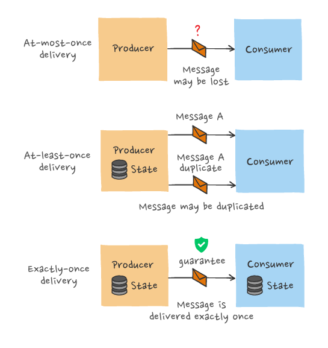

# Threads + RPC (Go context)

## Why Go?

- threads support
- convenient RPC
- type safe 
- GC
- not too complex

## Thread of execution 

- goroutines = threads 

single thread = sequential programming (own PC, stack, registers)

threads share memory with other threads (like heap, global variables)

start using `go` keyword, exit = end of function

### Why threads?

We want to express concurrency

- I/O concurrency
 > Client sends requests to many servers in parallel and waits for replies.
 > Server processes multiple client requests; each request may block.
 > While waiting for the disk to read data for client X, process a request from client Y.

- Multi-core parallelism 
 > Execute code in parallel on several cores.

- Convenience
 > In background, once per second, check whether each worker is still alive.

### Threads challenges 

- race conditions
> avoid sharing, use locks, channels (go have `-race` detector)

- coordination
> channels, condition variables 

- deadlocks
> cycles via locks and/or communication

### Go and challenges

- channels (nosharing) 
- locks + condition variables (shared memory)

### RPC (remote procedure call)

Goal: RPC ~= local procedure call, easy-to-program client/server communication 

Client: `z := fn(x, y)`

Server: `func fn(x, y int) int { ... }`

- hide details of network protocols
- convert data (strings, arrays, maps, &c) to "wire format"
- portability / interoperability

Client -> stub(which function is called, which args) -> marshalling ->
network -> unmarshalling -> server stub -> exection on server -> reverse process to client 

> stubs are automatically generated 

#### RPC semantics under failures 

- At-most-once semantics: send once and forget about it (0/1)
- At-least-once semantics: send until you don't get a reply (1/1+), duplicates
are possible, need to make a request idempotent if want exactly-once semantics 
- Exactly-once semantics: guarantee that each request was processed exactly once (1),
hard to achieve

Go RPC is a simple form of "at-most-once"

RPC != PC (procedure call), because of failures 

