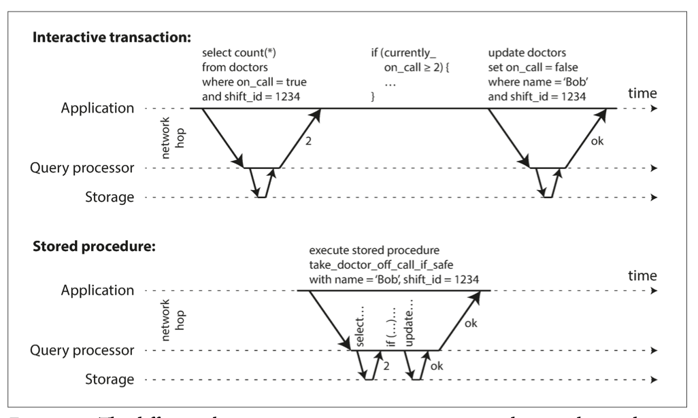

# Part 2. Distributed Data 

## Chapter 7. Transactions

Transaction is the way for an application to group several reads and writes 
together into a logical unit.
> Conceptually, all reads and writes are executed as one operation: either transaction 
succeds (commit) or fails (rollback).

- When fails can be retried
- Error handling is much simpler

Transactions are not the law of nature, they were created with a purpose 
to __simplify the programming model__ for applications to accessing the database.
By using transactions, it's free to ignore some potential problems, because 
database takes care them instead (**safety guarantees**).
> You need to understand where to use transactions and where not to use them.

### The Slippery Concept of a Transaction 

NoSQL hype which aimed to improve scalability and performance,
by abandoning transactions. 

The truth is not that simple: like every other technical design choice, transactions have advantages and limitations.

### The Meaning of ACID

Atomicity, Consistency, Isolation, Durability

Systems which not meet the ACID criteria sometimes called BASE (Basically Available, Soft state, Eventual consistency).

#### Atomicity

In general, atomic refers to something that cannot be broken down into smaller parts.

The word means simular but subtly different things in different branches of computing. 

> In multi-threaded programming, if one thread executes an atomic operation, that 
means there is no way to another thread could see the operation only partially
completed. 

In the context of ACID, atomicity is not about concurrency. It doesn't describe 
what happens if several processes try to access the same data at the same time - 
is covered by **isolation**.

Atomicity describes what happens if a client wants to make several writes, but 
a fault occurs after some of the writes have been processed.

If writes are grouped together into an atomic transaction and she can't be completed,
then the transaction is aborted and the database must discard or undo any writes it has made so far in that transaction.

Without atomicity, if an error occurs partway through making multiple changes, it’s difficult to know which changes have taken effect and which haven’t.

Perhaps **abortability** would have been a better term than atomicity, but we will stick with atomicity since that’s the usual word.

#### Consistency 

This word is terribly overloaded.

- Replica consistency and the issue of eventual consistency that arises in 
async replicated systems.
- Consist hashing is an approach to partitioning that some systems use for rebalancing.
- In CAP theorem, consistency means linearizability.
- In ACID, consistency refers to an application-specific notion of the database being in a “good state”.

If you have certain statements about your data (invariants) that must always be true.

> The database should always change from one valid state to another valid state.

Consistency is a property of the application, when AID is a property of the database.

The letter C doesn't really belong in ACID.

#### Isolation 

Most databases are accessed by several clients at the same time. That is no problem if they are reading and writing different parts of the database, but if they are accessing the same database records, you can run into concurrency problems (race conditions).

Isolation in the sense of ACID means that concurrently executing transactions are isolated from each other: they cannot step on each other’s toes.

Isolation often formalized as a **serilizability**, which means that each transaction 
can pretend that it is the only transaction running on the entire database.

The database ensures that when the transactions have committed, the result is the same as if they had run serially (one after another), even though in reality they may have run concurrently.

#### Durability 

The purpose of a database system is to provide a safe place where data can be stored without fear of losing it. 

Durability is the promise that once a transaction has com‐ mitted successfully, any data it has written will not be forgotten, even if there is a hardware fault or the database crashes.

> In a single-node database, durability typically means that the data has been written to nonvolatile storage such as a hard drive or SSD. 
>
> In a replicated database, durabil‐ ity may mean that the data has been successfully copied to some number of nodes. In order to provide a durability guarantee, a database must wait until these writes or replications are complete before reporting a transaction as successfully committed.

Perfect durability doesn't exist: if all your hard disks and all your backups 
are destroyed at the same time.

### Single-Object and Multi-Object Operations

Recap in ACID:

- Atomicity
> all-or-nothing guarantee

- Isolation
> transactions can run concurrently without messing each other up

Multi-object transactions are often needed if several pieces of data need to be kept in sync.

-  Violating isolation: one transaction reads another transaction's uncommitted writes 
(**dirty read**)

Multi-object transactions require some way of determining which read and write operations belong to the same transaction. In relational databases, that is typically done based on the client’s TCP connection to the database server: on any particular connection, everything between a BEGIN TRANSACTION and a COMMIT statement is considered to be part of the same transaction.

On the other hand, many NoSQL databases don't have such a way of grouping operations together. 

#### Single-object writes 

Atomicity and isolation are also apply when single object is being changed.
> e.g writing a 20 Kb json document to a database, that may failure 
halfway through writing.

Atomicity can be implemented by using a log for crash recovery, and isolation 
can be implemented by using a lock on each object (allowing only one transaction 
to access the object at a time).

Some databases also provide more complex atomic operations, such as incrementing
operation, which removes the need for a read-modify-write cycle.

Simularly popular is a compare-and-set operation, which allows a write to 
happen only if the value has not been concurrently changed by someone else.

These single-object operations are useful, as they can prevent lost updates when sev‐ eral clients try to write to the same object concurrently.

However, they are not transactions in the usual sense of the word. Compare-and-set and other single-object operations have been dubbed “light‐ weight transactions”.

A transaction is usually understood as a mechanism for grouping multiple operations on multiple objects into one unit of execution.

#### The need for multi-object transactions 

Not implemented in multiple databases, because it's hard to implement it across 
partitions and in some cases high availability or performance is more important.

There are some use cases in which single-object inserts, updates, and deletes are sufficient:

- Row of one table have a reference to a row in another table.
> Multi-object transactions allow you to ensure that these refer‐ ences remain valid: when inserting several records that refer to one another, the foreign keys have to be correct and up to date, or the data becomes nonsensical.

- Updating a denormalized information (update several objects in one go)

- Maintaining indexes
> Update of column triggers an update of secondary index.

Such applications can still be implemented without transactions. However, error han‐ dling becomes much more complicated without atomicity, and the lack of isolation can cause concurrency problems.

#### Handling errors and aborts

A key feature - abort of a transaction.

Not all systems follow that phlosophy, e.g datastores with leaderless replication work 
much more on a "best effort" basis - "database will do much as it can, and if it 
runs into an error, it won't undo something it has already done". So that's an 
application responsibility to recover from errors.

Errors will inevitably happen, but many software developers prefer to think only about the happy path rather than the intricacies of error handling. 

Retrying an aborted transaction is a simple and effective error handling mechanism, it isn’t perfect:

- If the transaction actually succeeded, but the network failed while the server tried to acknowledge the successful commit to the client (so the client thinks it failed), then retrying the transaction causes it to be performed twice—unless you have an additional application-level deduplication mechanism in place.

- If the error is due to overload, retrying the transaction will make the problem worse, not better. To avoid such feedback cycles, you can limit the number of retries, use exponential backoff, and handle overload-related errors differently from other errors (if possible).

-  It is only worth retrying after transient errors (for example due to deadlock, 
isolation violation); after a permanent error (such as constraint violation) a 
retry will simply fail again.

- If the transaction also has side effects outside of the database, those side effects may happen even if the transaction is aborted.

- If the client process fails while retrying, any data it was trying to write to the database is lost.

### Weak Isolation Levels

If two transactions don't touch the same data, they can safety execute in parallel.

Concurrency is hard and databases a trying to hide concurrency issues from application 
developers by providing __transaction isolation__.

**Serializable isolation** means that the databases guarantees that transactions 
have the same effect as if the run serially (one after another) without any
concurrency.

In practice, isolation is unfortunately not that simple. Serializable isolation has a 
performance cost, and many databases don’t want to pay that price.

#### Read Committed 

- No dirty reads
> When reading you will only see data that has been committed.
- No dirty writes
> When writing you will only overwrite data that has been committed.

##### No dirty reads

Can another transation see data of another transaction that has not been committed yet?
If yes, then it's called **dirty read**.

When to prevent dirty reads?

- If a transaction needs to update several objects
- If a transaction aborts, any writes it has made need to be rolled back 

##### No dirty writes

What happens if two transactions concurrently try to update the same object in a database? We don’t know in which order the writes will happen, but we normally assume that the later write overwrites the earlier write.

By preventing dirty writes, this isolation level avoids some kinds of concurrency problems:

- If transactions update multiple objects, dirty writes can lead to a bad outcome.

- However, read committed does not prevent the race condition between two counter increments

##### Implementing read committed 

Most commonly, databases prevent dirty writes by using row-level locks: when a transaction wants to modify a particular object (row or document), it must first acquire a lock on that object.

How do we prevent dirty reads? One option would be to use the same lock, and to require any transaction that wants to read an object to briefly acquire the lock and then release it again immediately after reading.

However, the approach of requiring read locks does not work well in practice, because one long-running write transaction can force many read-only transactions to wait until the long-running transaction has completed.

Better solution: for every object that is written, the database remembers both the old com‐ mitted value and the new value set by the transaction that currently holds the write lock. 

#### Snapshot Isolation and Repeatable Read 

**Nonrepeatable read** or **read skew** is when a transaction reads the same 
item several times and sees different results each time.

Read skew is considered acceptable under read committed isolation.

However, some situations cannot tolerate such temporary inconsistency:
- Backups 
> Taking a backup requires making a copy of the entire database, which may take hours on a large database. During the time that the backup process is running, writes will continue to be made to the database.

- Analytic queries and integrity checks
> Sometimes, you may want to run a query that scans over large parts of the database. 

**Snapshot isolation** is the most common solution to this problem. 

The idea is that each transaction reads from a consistent snapshot of the database—that is, the trans‐ action sees all the data that was committed in the database at the start of the transaction.
> Even if the data is subsequently changed by another transaction, each transaction sees only the old data from that particular point in time.

##### Implementing snapshot isolation 

Like read committed isolation, implementations of snapshot isolation typically use write locks to prevent dirty writes.

However, reads do not require any locks. From a performance point of view, a key principle of snapshot isolation is readers never block writers, and writers never block readers.

This allows a database to handle long-running read queries on a consistent snapshot at the same time as processing writes normally, without any lock contention between the two.

The database must potentially keep several different committed versions of an object, because various in-progress trans‐ actions may need to see the state of the database at different points in time. Because it maintains several versions of an object side by side, this technique is known as **multiversion concurrency control (MVCC)**.

However, storage engines that support snapshot isolation typically use MVCC for their read committed isolation level as well. A typical approach is that read committed uses a separate snapshot for each query, while snapshot isolation uses the same snapshot for an entire transaction.

##### Visibility rules for observing a consistent snapshot 

When a transaction reads from the database, transaction IDs are used to decide which objects it can see and which are invisible.

- At the start of each transaction, , the database makes a list of all the other 
transactions that are in progress. Any writes that those transactions have made are ignored.

- Any writes made by aborted transactions are ignored.

- Any writes made by transactions with a later transaction ID

- All other writes are visible to the application’s queries.

These rules apply to both creation and deletion of objects.

##### Indexes and snapshot isolation 

How do indexes work in a multi-version database? One option is to have the index simply point to all versions of an object and require an index query to filter out any object versions that are not visible to the current transaction.

In practice, many implementation details determine the performance of multi-version concurrency control.
> Postgres avoiding indexes update if different versions of the same object can fit 
> on the same page. 

Another approach is to use **append-only/copy-on-write B-tree** indexes, 
which not overwrite pages of the tree when they are updated, but instead 
creates a new copy of the page with the updated data.

Parent pages, up to the root of the tree, are copied and updated to point to the new versions of their child pages. Any pages that are not affected by a write do not need to be copied, and remain immutable.

With append-only B-trees, every write transaction (or batch of transactions) creates a new B-tree root, and a particular root is a consistent snapshot of the database at the point in time when it was created. There is no need to filter out objects based on transaction IDs because subsequent writes cannot modify an existing B-tree.
> It also requires a garbage-collection process to clean up old B-tree roots that are no longer needed.

##### Repeatable read and naming confusion

Several databases implement repeatable read, there are big differ‐ ences in the guarantees they actually provide, despite being ostensibly standardized.

As a result, nobody really knows what repeatable read means.

### Preventing Lost Updates 

The read committed and snapshot isolation levels we’ve discussed so far have been primarily about the guarantees of what a read-only transaction can see in the pres‐ ence of concurrent writes.

We have mostly ignored the issue of two transactions writing concurrently - we have only 
discussed dirty writes.

**Lost update** can occur if an application reads some value from the database, 
modifies it, and writes back the modified value. If two transactions do it concurrently,
one of the modifications can be lost, because the second doesn't include info about first 
modification. 

Some scenarios:

- Incrementing a counter or updating (reading, calculating, writing back)
- Editing the same document by two users concurrently

#### Atomic write operations 

Many databases provide atomic update operations, which remove the need to imple‐ ment read-modify-write cycles in application code.

```sql 
UPDATE counters SET value = value + 1 WHERE key = 'foo';
```

This query is concurrent-safe in most databases.

Atomic operations are usually implemented by taking an exclusive lock on the object when it is read.

Another option is to simply force all atomic operations to be executed on a single thread.

#### Explicit locking 

Another option for preventing lost updates, if the database’s built-in atomic opera‐ tions don’t provide the necessary functionality, is for the application to explicitly lock objects that are going to be updated.

```sql 

BEGIN TRANSACTION;
SELECT * FROM figures
WHERE name = 'robot' AND game_id = 222 FOR UPDATE;
-- Check whether move is valid, then update the position -- of the piece that was returned by the previous SELECT. UPDATE figures SET position = 'c4' WHERE id = 1234;
COMMIT;
```

> The `FOR UPDATE` clause indicates that the database should take a lock on all rows
returned by this query.

This works, but to get it right, you need to carefully think about your application logic. It’s easy to forget to add a necessary lock somewhere in the code, and thus introduce a race condition.

#### Automatically detecting lost updates 

An alternative is to allow them to execute in parallel and, if the transaction manager detects a lost update, abort the transaction and force it to retry its read-modify-write cycle.

An advantage of this approach is that databases can perform this check efficiently in conjunction with snapshot isolation.

Lost update detection is a great feature, because it doesn’t require application code to use any special database features.

#### Compare-and-set 

The purpose of this operation is to avoid lost updates by allowing an update to happen only if the value has not changed since you last read it.

```sql 
-- This may or may not be safe, depending on the database implementation
UPDATE wiki_pages SET content = 'new content'
    WHERE id = 1234 AND content = 'old content';
```

However, if the database allows the WHERE clause to read from an old snapshot, this statement may not prevent lost updates, because the condition may be true even though another concurrent write is occurring.

#### Conflict resolution and replication 

Locks and compare-and-set operations assume that there is a single up-to-date copy of the data. However, databases with multi-leader or leaderless replication usually allow several writes to happen concurrently and replicate them asynchronously.

Common approach in such replicated databases is to allow concurrent writes to create several conflicting versions of a value (also known as siblings), and to use application code or special data structures to resolve and merge these versions after the fact.

### Write Skew and Phantoms

With **dirty writes** and **lost updates** may occurs **write skew**. 

#### Characterizing write skew 

You can think about write skew as a generalization of the lost update problem. 
Write skew can occur when two transations read the same object, and them updates 
some of those objects (different transactions may update different objects).
In special cases where different transactions update the same object, you get a dirty 
write or lost update anomaly. 
> Opportunity to make an update for some true statement, that will return false 
> if operations are done in subsequent way. 


Options for fixing the write skew:

- Atomic single-object operations don't help, as multiple objects are involved. 

- Automatic detection of lost updates, which can be found in some implementations 
of snapshot isolation, unfortunately doesn't help either. 
> Automatically preventing write skew requires true serializable isolation. 

- Some databases allow you to configure constraint, which are then enforced by the database.

- If you can't use a serializable isolation level, the second best option to explicitly 
lock the rows that the transaction depends on. 

```sql 
BEGIN TRANSACTION;

SELECT * FROM doctors
WHERE on_call = true
AND shift_id = 1234 FOR UPDATE;

UPDATE doctors
SET on_call = false WHERE name = 'Alice' AND shift_id = 1234;

COMMIT;
```

#### More examples of write skew 

- Meeting room booking system 
> Can't be 2 bookings for the same meeting room at the same time. 
> Before making reservation we check first. 

```sql 
BEGIN TRANSACTION 

-- Check for any existing bookings that overlap with the period of noon-1pm
SELECT COUNT(*) FROM bookings 
    WHERE room_id = 123 AND 
     end_time > '2015-01-01 12:00' AND star_time < '2015-01-01 13:00';

-- If the previous query returned zero:
INSERT INTO bookings
    (room_id, start_time, end_time, user_id)
    VALUES (123, '2015-01-01 12:00', '2015-01-01 13:00', 666);

COMMIT;
```

Unfortunately, snapshot isolation does not prevent another user from concurrently inserting a conflicting meeting. In order to guarantee you won’t get sched‐ uling conflicts, you once again need serializable isolation.

- Multiplayer game 
> Lock won't help you 

- Claiming a username 
> Unique constraint is a simple solution here 

- Preventing double-spending 

#### Phantoms causing write skew 

Where a write in one transaction changes the result of a search query in another transaction, is called a phantom.

Snapshot isolation avoids phantoms in read-only queries, but in read-write transactions like the examples we discussed, phantoms can lead to particularly tricky cases of write skew.

#### Materializing conflicts 

If the problem of phantoms is that there is no object to which we can attach the locks, perhaps we can artificially introduce a lock object into the database?

Addition tables

### Serilizability

Still some race conditions are not prevented. 

- Isolation levels are hard to understand and inconsistently implemented in different 
databases.

- Difficult to tell whether application code is safe to run at a particular 
isolation level.

- No good tools to help us detect race conditions.

**Serializable isolation** is usually regarded as a strongest isolation level.

It guarantees that even though transactions may execute in parallel, the end result is the same as if they had executed one at a time, serially, without any concurrency.

The database prevents all possible race conditions.

But if serializable isolation is so much better than the mess of weak isolation levels, then why isn’t everyone using it? To answer this question, we need to look at the options for implementing serializability, and how they perform.

- Literally executing transactions in a serial order 
- Two-phase locking 
- Optimistic concurrency control techniques such as serializable snapshot isolation

### Actual Serial Execution

The simplest way of avoiding concurrency problems is to remove the concurrency entirely: to execute only one transaction at a time, in serial order, on a single thread.

By doing so, we completely sidestep the problem of detecting and preventing con‐ flicts between transactions: the resulting isolation is by definition serializable.

If multi-threaded concurrency was considered essential for getting good performance during the previous 30 years, what changed to make single-threaded execution possible?

- RAM became cheap enough that for many use cases is now feasible to keep the entire 
active dataset in memory.

- Database designers realized that OLTP transactions are typically short and make a small 
number of reads and writes. 

#### Encapsulating transactions in stored procedures 

At the begining designers thought that all user flow must be done with one transaction:
searching, input some form data - all in one transaction.
But waiting for user input is a long process and it's not good to keep transaction open.

Solution: new HTTP request starts a new transaction. 

Even though the human has been taken out of the critical path, transactions have 
continued to be executed in an interactive client/server style. 
> App makes a query, reads the result, perhaps makes another query and so on.

In this interactive style of transaction a lot of time is spent in network communication
between the application and the database.
> If you were to disallow concurrency in the database and only process one transaction at a time, the throughput would be dreadful because the database would spend most of its time waiting for the application.

For this reason, systems with single-threaded serial transaction processing don’t allow interactive multi-statement transactions.

Instead, the app must submit the entire transaction code to the database ahead of time,
as a **stored procedure**.



#### Pros and cons of stored procedures

Stored procedures have existed for some time in relational databases, and they have been part of the SQL standard, 
but later they have gained a bad reputation, reasons:

- Each database vendor has its own language for stored procedures (PL/pgSQL in PostgreSQL, PL/SQL in Oracle).

- Code running in a database is difficult to manage. 

- A database is often much more performance-sensitive than an app server. 

> PL/Rust - https://github.com/tcdi/plrust

Modern implementations of stored procedures are using programming languages 
instead of SQL (e.g Redis Lua scripts).

With stored procedures and in-memory data, executing all transactions on a single thread becomes feasible.
As they don’t need to wait for I/O and they avoid the overhead of other concurrency control mechanisms, they can achieve quite good throughput on a single thread.

#### Partitioning 

Single-threaded transaction processor can become a serious bottleneck for 
application with high write throughput.

In order to scale to multiple CPU cores, and multiple nodes, you can potentially partition yout data.

Each partition can have its own transaction processing thread running independently from the others.

However, for any transaction that needs to access multiple partitions, the database must coordinate the transaction across all the partitions that it touches.
The stored procedure needs to be performed in lock-step across all partitions to ensure serializability
accross the whole system. 

Whether transactions can be single-partition depends very much on the structure of the data used by the application.

#### Summary of serial execution 

- Every transaction must be small and fast.
- It is limited to use cases where the active dataset can fit in memory.
- Write throughput must be low enough to be handled on a single CPU core.
- Cross-partition transactions are possible, but it's not easy to implement.

### Two-Phase Locking (2PL) 

Locks are often used to prevent dirty writes. If two transacions concurrently 
try to write to the same object, the lock encures that the second writer must wait 
until the first one has finished its transaction before it may continue.

2PL is simular, but makes requirements much stronger. 

Several transactions are allowed to concurrently read the same object as long 
as nobody is writing to it. 

In 2PL, writerts don't just block writers, they also block readers and vice versa.

> In snapshot isolation, readers don't block writers and writers don't block readers.

#### Implementation of two-phase locking 

The blocking of readers and writers is implemented by a having a lock on each 
object in the database. The lock can be in **shared mode** or in **exclusive mode**.

- If want to read, must first acquire the lock in shared mode. 
> Several transactions allowed to hold the lock in shared mode, but if another 
transation have exclusive lock, these transactions must wait. 

- If want to write, must first acquire the lock in exclusive mode.
> Transactions may hold the lock, must wait until any lock exists. 

- If transaction first read and then writes, must upgrade shared to exclusive.

- After a transaction has acquired the lock, must continue hold the lock until 
commit/abort of transaction.

Deadlocks may happen, database automatically detect them. 

#### Performance of two-phase locking 

Transaction throughput and response times of queries are significantly worse under two-phase locking than under weak isolation.

Traditional relational databases don’t limit the duration of a transaction, because they are designed for interactive applications that wait for human input.

Although deadlocks can happen with the lock-based read committed isolation level, they occur much more frequently under 2PL serializable isolation.

#### Predicate locks 

**Predicate lock** works the same as a shared/exclusive lock, but belongs not to a 
particular object, it belongs to all objects that match some search condition.

Restricts access as follows:

- If wants to read objects match some condition, it must acquire a shared-mode lock on the 
conditions of the query.
> If another have lock, must wait. 

- If wants to insert/update/delete, must check for any predicate lock.
> If another have lock, must wait. 

The key idea here is that a predicate lock applies even to objects that do not yet exist in the database, but which might be added in the future (phantoms).

If two-phase locking includes predicate locks, the database prevents all forms of write skew and other race conditions, and so its isolation becomes serializable.

#### Index-range locks 

Unfortunately, predicate locks do not perform well: if there are many locks by active transactions, checking for matching locks becomes time-consuming. 

For that reason, most databases with 2PL actually implement index-range locking.

It's safe to simplify a predicate by making it match greater set of objects.

### Serializable Snapshot Isolation (SSI) 


