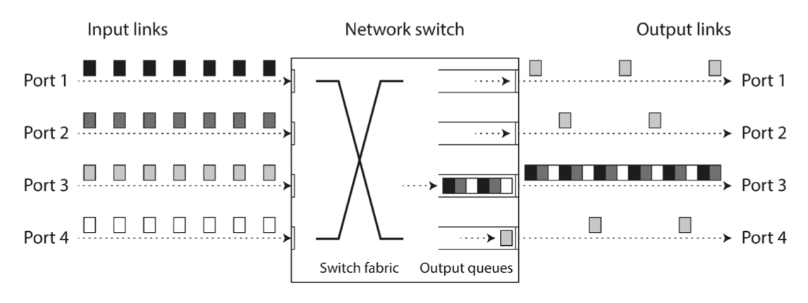

# Part 2. Distributed Data

## Chapter 8. The Trouble with Distributed Systems

Anything that can go wrong will go wrong.

### Faults and Partial Failures

Single computer: if an internal error occurs, we prefer to crush completely
rather that running in an inconsistent state.

Distributed systems: we prefer to keep running in a partially working state
rather than crashing completely.

Nondeterminism and possibility of partial failures is what makes distributed
systems hard to work with.

### Cloud Computations and Supercomputing

Philosophies on how to build large-scale computing systems:

- High-performance computing (HPC)
  > Supercomputers with thousands of CPUs used for computationally intensive
  > scientific tasks

- Cloud computing
  > Multi-tenant datacenters, commodity computers connected with an IP network, elastic/on-demand
  > resource allocation, and metered billing.

- Traditional enterprise datacenters

Depending on the selected philosophy, handling of the faults will be different.

In a supercomputers, a job typically checkpoints the state of its computation to
durable storage from time to time. Supercomputer is more like single-node computer.
> Node fails -> stopping entire cluster -> repair the node -> restart the job from the last checkpoint.

If we want to make distributed systems work, we must accept the possibility of partial failure and build fault-tolerance
mechanisms into the software.
> We need to build a reliable system from unreliable components.

### Unreliable Networks

**Shared-nothing** systems - a bunch of machines connected by a network,
is the only way to communicate, each has its memory and disk and
can't access the memory or disk of another.

Is not the only way of building systems, but it has become the dominant
approach for building internet services, for several reasons:

- cheap, because it doesn't require specialized hardware
- can use commoditized cloud computing services
- can achieve high reliability by replicating data across multiple DC

The internet and most internal networks in datacenters are **asynchronous
packet networks**.
> One node can send a message to another, but it has no guarantee of when
> or whether the message will be delivered.

Usual way to of handling network issues is **timeout**: after some time you
give up waiting and assume that the response isn't going to arrive.
> We still don't know whether the remote node received the message and is
> processing it, or whether the remote node is down and the message was lost.

### Network Faults in Practice

TLDR: network faults are common and unavoidable.

### Detecting Faults

Examples:

- load balancer needs to stop sending requests to a node that is dead
- a database needs to elect a new leader if the current leader fails

Unfortunately, the uncertainty about the network makes it difficult to tell whether a node is working or not.

In some specific circumstances you might get some feedback to explicitly tell you that something is not working:

- can reach the machine o which the node is running, but no process is listening on the expected port,
  the OS will close or refuse the TCP connection be sending RST or FIN packet in reply.
- node process crashed but the node's OS is still running, a script can notify other nodes about the crash, and
  they can take appropriate action.
- access to the management interface of a network switches in your datacenter, you can query them to detect link failures 
  at the hardware level.

Conversely, if something has gone wrong, you may get an error response at some level of the stack, but in general you
have to assume that you will get no response at all.

You can retry a few times, wait for a timeout to elapse, and eventually declare the node dead.

### Timeouts and Unbounded Delays

How long timeout should be?

Long timeout -> slow response time; Short timeout -> false positives

When a node is declared dead, its responsibilities need to be transferred to other nodes, which places additional load
on other nodes and the network.
> If the system is already struggling with a high load, declaring nodes dead prematurely can make the problem worse.

Asynchronous networks have **unbounded delays** (no upper limit on how long it can take for a message to be delivered).

#### Network congestion and queueing

Simular to the car traffic, the network can get congested and packets can get stuck in queues:

- several nodes simultaneously sending packets to a single destination. On a busy network link, a packet may have to wait 
  until it can't get a slot (network congestion). queue is full -> packet is dropped, and retransmission is required.
- if all machine CPU cores are busy, the incoming request is queued by the OS until a core is available to process it.
- in virtualized environments, a running OS is often paused for tens of milliseconds while another VM is using the CPU core.
  packets are buffered by the virtual machine monitor (hypervisor).
- TCP performs flow control (congestion avoidance, backpressure) in which a node limits its own rate of sending in order to avoid 
  overloading network link or the receiving node. (additional queueing before the data enters the network).

> UDP is a good choice in situations where delayed data is worthless. The retry happens at the "human" layer instead.

In public clouds and multi-tenant datacenters, the network is shared among many customers: the network links, switches,
machine network interfaces and CPU (when VM) are shared resources. As you have no control over other customer's resource 
usage of the shared resources, network delays can be highly variable if some near you (a noisy neighbor) is using a lot of
resources.

Use jitter (variation in delay) over the constant timeouts.i

### Synchronous Versus Asynchronous Networks 

