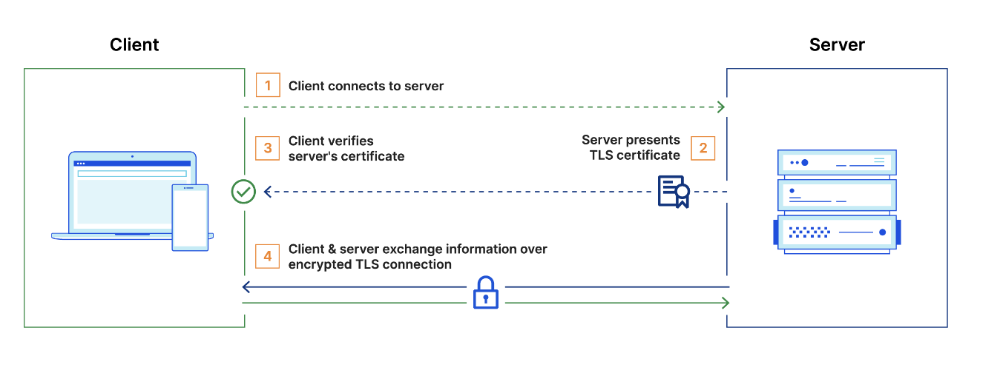
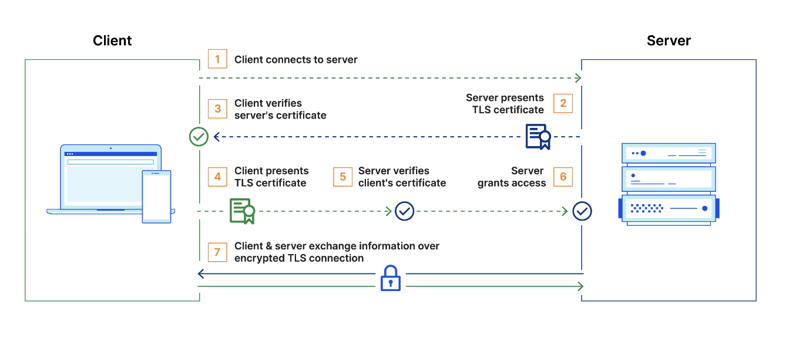

## Cryptographic protocols

A cryptographic protocol is required to authenticate connection and establish encrypted communication between the two
ends, preventing the data from unauthorized access.

SSL and TLS are cryptographic protocols that provide secure communication over a computer network.

- TLS is a successor of SSL, and it is recommended to use TLS over SSL.
- mTLS it's not a different protocol, it's just an extension of TLS.

### What is SSL?

SSL, or Secure Sockets Layer, was the first cryptographic protocol to be developed to transfer sensitive data securely
over a network.

Originally, data on the web was transmitted in plaintext that anyone could read if they intercepted the message. SSL was
created to correct this problem and protect user privacy. By encrypting any data that goes between the user and a web
server, SSL also stops certain kinds of cyberattacks by preventing attackers from tampering with data in transit.

### What is TLS?

Transport Layer Security, or TLS, is a widely adopted security protocol designed to facilitate privacy and data security
for communications over the internet.

TLS evolved from a previous encryption protocol called Secure Sockets Layer (SSL).
A primary use case of TLS is encrypting the communication between web applications and servers.

There are three main components to what the TLS protocol accomplishes:

- **Encryption**: protects the data being transmitted from interception by an unauthorized party.
- **Authentication**: proves that your users communicate with the intended website.
- **Data integrity**: verifies that the messages that are transmitted haven't been altered.

#### How TLS works

- **Public and private keys**: TLS uses a combination of public and private keys, which are known as an asymmetric
  cryptography. The public key is used to encrypt information and the private key is used to decrypt it.

- **Digital certificates**: TLS uses digital certificates to verify the identity of the server. These certificates are
  issued by a certificate authority (CA), which is a trusted third party that has verified that the server belongs to
  the organization it claims to belong to.

- **Handshake**: the process for verifying the TLS certificate and the server's possession of the private key. The TLS
  handshake also establishes how encryption will take place once the handshake is finished.

### What is mTLS?

Mutual TLS, or mTLS, is a method for mutual authentication.

mTLS ensures that the parties at each end of a network connection are who they claim to be by verifying that they both
have the correct private key. The information within their respective TLS certificates provides additional verification.

mTLS helps ensure that the traffic is secure and trusted in both directions between a client and server. This provides
an additional layer of security for users who log in to an organization's network or applications. It also verifies
connections with client devices that do not follow a login process, such as Internet of Things (IoT) devices.

### Resources

- https://dev.to/karanpratapsingh/system-design-ssl-tls-mtls-3nak
- https://www.cloudflare.com/learning/access-management/what-is-mutual-tls/