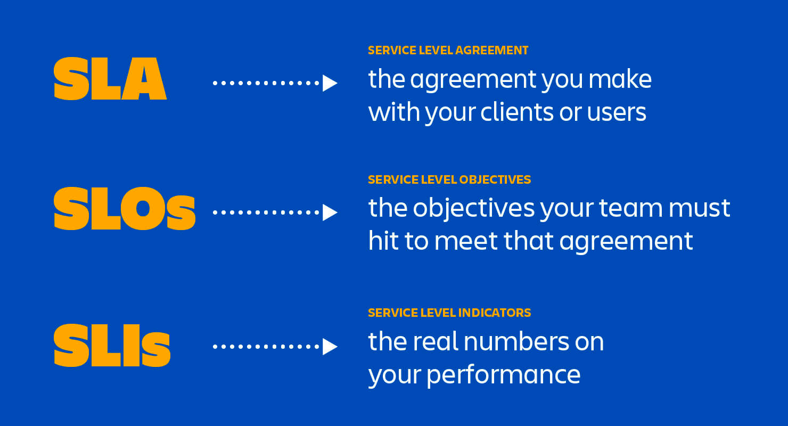
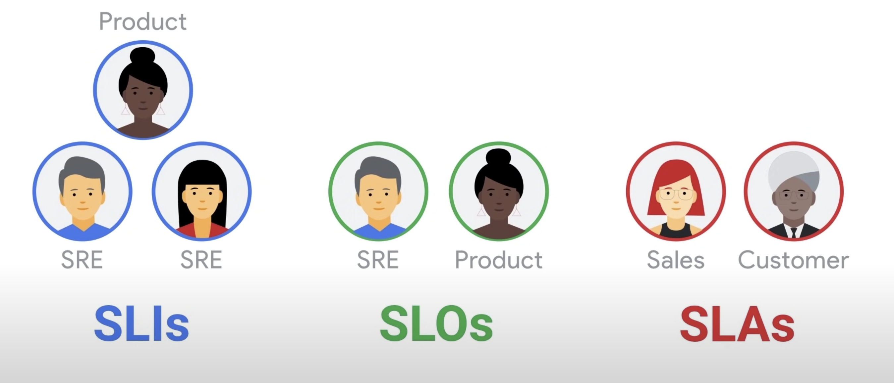

## Service levels

Nowadays, the term "service level" is used to describe the quality of a service.

For companies, it is important to provide a high-quality service to their customers. To achieve this, they need to
define the quality of the service they want to provide. This is called a service level.

The goal of all three things is to get everybody - vendor and client alike - on the same page about system performance.

- How often will your systems be available?
- How quickly will your team respond if the system goes down?
- What kind of promises are you making about speed and functionality?

Users want to know - and so you need SLAs, SLOs, and SLIs.

### SLI: Service Level Indicators

An SLI is a carefully defined quantitative measure of some aspect of the level of service that is provided.

> Example: request latency, error rate, system throughput, availability, etc.

So, for example, if your SLA specifies that your systems will be available 99.95% of the time, your SLO is likely 99.95%
uptime and your SLI is the actual measurement of your uptime. Maybe it's 99.96%. Maybe 99.99%. To stay in compliance
with your SLA, the SLI will need to meet or exceed the promises made in that document.

As with SLOs, the challenge of SLIs is keeping them simple, choosing the right metrics to track, and not
overcomplicating IT's job by tracking too many metrics that don't actually matter to clients.

Any company measuring their performance against SLOs needs SLIs in order to make those measurements. You can’t really
have SLOs without SLIs.

### SLO: Service Level Objectives

An SLO is a target value or range of values for a service level that is measured by an SLI.

> A natural structure for SLOs is thus SLI ≤ target, or lower bound ≤ SLI ≤ upper bound.

So, if the SLA is the formal agreement between you and your customer, SLOs are the individual promises you're making to
that customer.

SLOs get less hate than SLAs, but they can create just as many problems if they're vague, overly complicated, or
impossible to measure. The key to SLOs that don't make your engineers want to tear their hair out is simplicity and
clarity. Only the most important metrics should qualify for SLO status, the objectives should be spelled out in plain
language, and, as with SLAs, they should always account for issues such as client-side delays.

Where SLAs are only relevant in the case of paying customers, SLOs can be useful for both paid and unpaid accounts, as
well as internal and external customers.

### SLA: Service Level Agreement

SLAs an explicit or implicit contract with your users that includes consequences of meeting (or missing) the SLOs they
contain.

> An easy way to tell the difference between an SLO and an SLA is to ask "what happens if the SLOs aren’t met?": if
> there is no explicit consequence, then you are almost certainly looking at an SLO.

SRE doesn't typically get involved in constructing SLAs, because SLAs are closely tied to business and product
decisions.

These agreements are typically drawn up by a company's new business and legal teams, and they represent the promises
you're making to customers - and the consequences if you fail to live up to those promises.

> Typically, consequences include financial penalties, service credits, or license extensions.

SLAs are notoriously difficult to measure, report on, and meet.

These agreements - generally written by people who aren't in the tech trenches themselves - often make promises that are
difficult for teams to measure, don't always align with current and ever-evolving business priorities, and don't account
for nuance.

> For example, an SLA may promise that teams will resolve reported issues with Product X within 24 hours.
>
> But that same SLA doesn't spell out what happens if the client takes 24 hours to send answers or screenshots to help
> your team diagnose the problem.

An SLA is an agreement between a vendor and a paying customer. Companies providing a service to users for free are
unlikely to want or need an SLA for those free users.

#### TL;DR

SLI drive SLO which inform SLA

- SLI: Service Level Indicators - specific, measurable metrics used to assess the performance of a service, such as
  response time or availability.
- SLO: Service Level Objectives - a target level of performance defined in an SLA, indicating the desired reliability or
  quality of a service over a specific period.
- SLA: Service Level Agreement - a formal agreement between a service provider and its clients that defines the level
  of service expected from the service provider.

### Resources

- https://www.atlassian.com/incident-management/kpis/sla-vs-slo-vs-sli
- https://sre.google/sre-book/service-level-objectives/
- https://bshayr29.medium.com/sli-slo-and-sla-in-simple-words-bc320e624f8c
- https://www.youtube.com/watch?v=tEylFyxbDLE