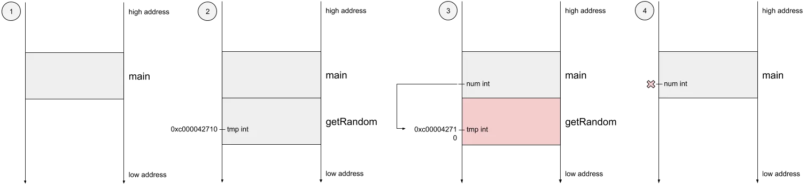

## Escape analysis

Is a method of determining the scope of pointers, where in the program the pointer can be accessed.

Go compiler analyses the source code and determines what variables should be allocated on the stack and which ones
should escape to the heap.

### Memory layout

Memory in a program is divided into two areas, one for the stack and one for the heap.

The stack area has a specific structure and addressing method, and is very fast to address with little overhead.

The heap, on the other hand, is an area of memory that has no specific structure and no fixed size and can be adjusted
as needed.

Global variables, local variables with a large memory footprint, and local variables that cannot be reclaimed
immediately after a function call are all stored inside the heap. Variables are allocated and reclaimed on the heap with
much more overhead than on the stack.

### Outline

Go statically defines what should be heaped or stack-allocated during the compilation phase.

Available via the flag `-gcflags="-m"`.

If the value survives the stack frame, then it goes on the heap

Cases when the value escapes to the heap:

- Any returned value outlives the function since the called function does not know the value.
- Variables declared outside a loop outlive the assignment within the loop.
- Variables declared outside a closure outlive the assignment within the closure.

### Benefits

- After escape analysis, it can be confirmed whether specific variables are allocated in heap memory or stack memory,
  which improves program performance.
- Reduce GC pressure, and variables that do not escape can be recycled in time.

### Summary

- For small data, pass by value is more efficient than pass by reference.
- Avoid slice of indeterminate size.
- Avoid passing parameters to `interface{}`, try to use explicit types.

#### Sources

- [Go introduction to escape analysis](https://medium.com/a-journey-with-go/go-introduction-to-the-escape-analysis-f7610174e890)
- [In depth analysis of golang memory escape](https://blog.devgenius.io/in-depth-analysis-of-golang-memory-escape-edfbfb856913)
