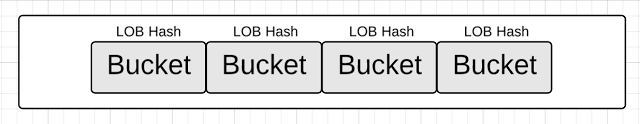
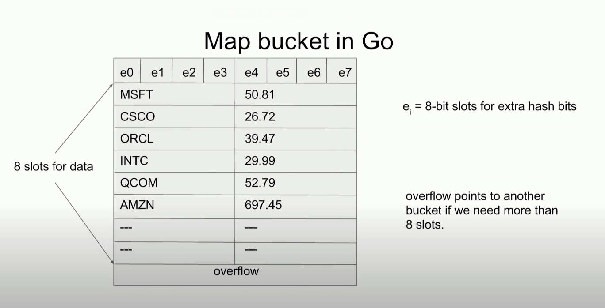

## Maps internals

### Structure

Maps are implemented as a hash table.

The hash table for Golang is structured as an array of buckets.

> The number of buckets is always equal to a 2^n number.

When operation is performed as `m[key] = value`, a hash key is generated from the `key`.
Then the low order of bits are used to select a bucket.

> LOB is a bits that are located on the left side of the number.
>
> For example, 12 = 1100, LOB are 1, 1, ...



Once a bucket is selected, the (key, value) pair needs to be stored/removed/looked up, depending on the context.

If we look inside the bucket, we will find two datastructures:

- array with 8 slots of (key, value) pairs
- overflow pointer, which points to another bucket if we need more than 8 slots



Now when we are iterating through a map, the iterator walks through the array of buckets and then return
the (key, value) pairs in order they are laid out in the byte array. This is why maps are unordered collections.

### Generic types without generics

Go don't use generics for maps, don't use `interface{}`, don't use code generation.

Instead, Go uses a `maptype` struct.

Compiler creates maptype during compilation and uses the value when calling into the
runtime's map functions.

```go
type maptype struct {
	typ    _type
	key    *_type
	elem   *_type
	bucket *_type // internal type representing a hash bucket
	// function for hashing keys (ptr to key, seed) -> hash
	hasher     func(unsafe.Pointer, uintptr) uintptr
	keysize    uint8  // size of key slot
	elemsize   uint8  // size of elem slot
	bucketsize uint16 // size of bucket
	flags      uint32
}
```

Each maptype contains details about properties of the map.

```go
type _type struct {
	size       uintptr
	ptrdata    uintptr // size of memory prefix holding all pointers
	hash       uint32
	tflag      tflag
	align      uint8
	fieldAlign uint8
	kind       uint8
	// function for comparing objects of this type
	// (ptr to object A, ptr to object B) -> ==?
	equal func(unsafe.Pointer, unsafe.Pointer) bool
	// gcdata stores the GC type data for the garbage collector.
	// If the KindGCProg bit is set in kind, gcdata is a GC program.
	// Otherwise it is a ptrmask bitmap. See mbitmap.go for details.
	gcdata    *byte
	str       nameOff
	ptrToThis typeOff
}
```

### Growing the map, evacuation

When buckets get too full, we need to grow the map.

> "too full" = avg 6.5 entries per bucket

Workflow:

- allocate a new array of buckets of double size
- copy all the (key, value) pairs from the old buckets to the new buckets
- use the new buckets

The process of copying is done incrementally, a little bit during each insert/delete.

During copying, operations on the map are more expensive.

### Runtime representation

In runtime, maps are represented as a pointer to `hmap` struct.

```go
type hmap struct {
	count     int // # live cells == size of map.  Must be first (used by len() builtin)
	flags     uint8
	B         uint8  // log_2 of # of buckets (can hold up to loadFactor * 2^B items)
	noverflow uint16 // approximate number of overflow buckets; see incrnoverflow for details
	hash0     uint32 // hash seed

	buckets    unsafe.Pointer // array of 2^B Buckets. may be nil if count==0.
	oldbuckets unsafe.Pointer // previous bucket array of half the size, non-nil only when growing
	nevacuate  uintptr        // progress counter for evacuation (buckets less than this have been evacuated)

	extra *mapextra // optional fields
}
```

### Other languages comparison

|                                 | `C++` | `Java` | `Python` | `Go` |
|---------------------------------|-------|--------|----------|------|
| `&m[k] allowed`                 | +     | -      | -        | -    |
| `Modify during iteration`       | -     | -      | -        | +    |
| `Provide your own equals, hash` | +     | +      | +        | -    |
| `Adversare safe`                | -     | +?     | -?       | +    |

#### Sources:

- [GopherCon 2016: Keith Randall - Inside the Map Implementation](https://www.youtube.com/watch?v=Tl7mi9QmLns)
- [Golang maps in action](https://blog.golang.org/maps)
- [Macro-view of map internals](https://www.ardanlabs.com/blog/2013/12/macro-view-of-map-internals-in-go.html)
- [Go maps without generics](https://dave.cheney.net/2018/05/29/how-the-go-runtime-implements-maps-efficiently-without-generics)