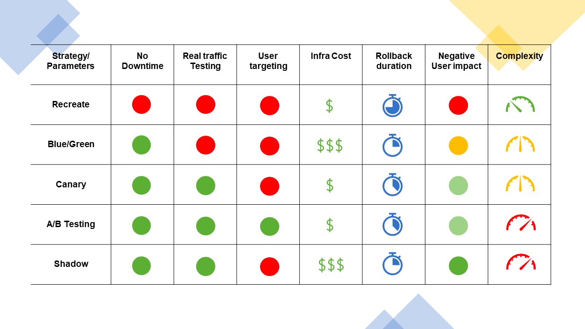

### Deployment types

A deployment strategy defines how to create, upgrade or downgrade a different versions
of applications running in a Kubernetes cluster.

Common deployment strategies (not only in Kubernetes) are:



#### Rolling deployment

Rolling deployment is the default deployment strategy in Kubernetes.

It replaces the existing version of pods with a new version, updating pods slowly one by one, without cluster downtime.

The rolling update uses a readiness probe to check if a new pod is ready, before starting to scale down pods with the
old version.

- `MaxSurge` - the maximum number of pods that can be created over the desired number of pods. (default: 25%)
- `MaxUnavailable` - the maximum number of pods that can be unavailable during the update process.

```yaml
spec:
  replicas: 10
  strategy:
    type: RollingUpdate
    rollingUpdate:
      maxSurge: 1
      maxUnavailable: 1
```

#### Recreate deployment

Recreate deployment is the simplest deployment strategy.

It deletes all pods with the old version and creates new pods with the new version.

It is not recommended for production environments, because it causes downtime.

```yaml
spec:
  replicas: 10
  strategy:
    type: Recreate
```

#### Blue/Green deployment

A Blue/Green deployment involves deploying the new application version (green) alongside the old one (blue).

A load balancer in the form of the service selector object is used to direct traffic to the new version of the
application.

Blue/Green deployments can prove costly as twice the amount of application resources need to be stood up during the
deployment period.

```yaml
kind: Service
metadata:
  name: web-app-01
  labels:
    app: web-app
selector:
  app: web-app
  version: v1.0.0
```

Blue web-app deployment:

```yaml
kind: Deployment
metadata:
  name: web-app-01
spec:
  template:
    metadata:
      labels:
        app: web-app
        version: "v1.0.0"
```

When we want to direct traffic to the new version of the application, we can change the selector of the service to
point to the new version of the application:

```yaml
kind: Service
metadata:
  name: web-app-02
  labels:
    app: web-app
selector:
    app: web-app
    version: v2.0.0
```

Green web-app deployment:

```yaml
kind: Deployment
metadata:
  name: web-app-02
spec:
  template:
    metadata:
      labels:
        app: web-app
        version: "v2.0.0"
```

#### Canary deployment

A Canary deployment can be used to let a subset of the users test a new version of the application or when you are not
fully confident about the new version’s functionality.

This involves deploying a new version of the application alongside the old one, with the old version of the application
serving most users and the newer version serving a small pool of test users. The new deployment is rolled out to more
users if it is successful.

For example, in a K8s cluster with 100 running pods, 95 could be running v1.0.0 of the application, with 5 running the
new v2.0.0 of the application.

Old:

```yaml
spec:
  replicas: 95
```

New:

```yaml
spec:
  replicas: 5
```

In the example above, it might be impractical and costly to run 100 pods. A better way to achieve this is to use a load
balancer.

#### A/B deployment

Similar to a Canary deployment, using an A/B deployment, you can target a given subsection of users based on some target
parameters (usually the HTTP headers or a cookie), as well as distribute traffic amongst versions based on weight. This
technique is widely used to test the conversion of a given feature, and then the version that converts the most is
rolled out.

This approach is usually taken based on data collected on user behavior and can be used to make better business
decisions. Users are usually uninformed of the new features during the A/B testing period, so true testing can be done,
and experiences between the users using the old version and those using the new version can be compared.

#### Canary vs A/B deployment

- Canary deployment is focused on minimizing risk and ensuring the stability and reliability of a new release.
- A/B deployment (A/B testing) is primarily about experimenting with different variations to optimize user experience
  and achieve specific business goals.

#### Shadow deployment

In Shadow deployments, releasing a new version alongside the old version. Incoming traffic will be mirrored to a new
version and doesn't impact the application traffic.

It helps to test production traffic on a new version and can be rolled out based on the application
performance/stability.

#### Resources

- https://spacelift.io/blog/kubernetes-deployment-strategies
- https://spot.io/resources/kubernetes-autoscaling/5-kubernetes-deployment-strategies-roll-out-like-the-pros/
- https://auth0.com/blog/deployment-strategies-in-kubernetes/
- https://medium.com/nerd-for-tech/kubernetes-k8s-deployment-strategies-1ef4c1dc1c6c