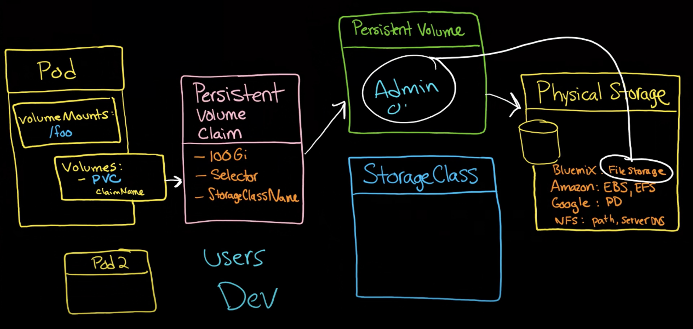

# Volumes

## Requirements

- Storage doesn't depend on pod lifecycle.
- Storage must be available on all nodes
- Storage needs to survive even if cluster crashes

## Types

Persistent Volume (PV)

- cluster resource
- need actual physical storage (local disk, cloud storage, etc.)
- physical storage needs to be pre-configured, PV is just a reference to it
- attributes are different depending on storage type
- PV are not namespaced, they are cluster-wide
- admin provides PV

Persistent Volume Claim (PVC)

- request for storage by user
- consists of some criteria (size, access mode, etc.)
- claim tries to find PV that matches criteria
- PVC are namespaced

We need PVC to use PV, because we don't want to know where PV is located, we just want to use it.

Storage Class

- SC provides dynamic provisioning of PV
- when PVC claims storage, SC creates PV for it
- requested in PVC, SC creates PV, PVC binds to PV

## Provisioning

Provisioning is the process of creating storage, it can be done statically or dynamically.

Static means, that admin creates PV manually, and then user can use it.

Dynamic means, that user creates PVC, and then PV is created automatically, via Storage Class.

## Summary

- Volume is a directory, possibly with some data in it, which is accessible to the containers in a pod.
- How made available, backed by which storage medium - depends on the volume type.
- Can't bind 2 PVC to 1 PV, but can bind 2 pods to 1 PVC.

### Resources

- https://www.youtube.com/watch?v=0swOh5C3OVM
- https://www.youtube.com/watch?v=OulmwTYTauI