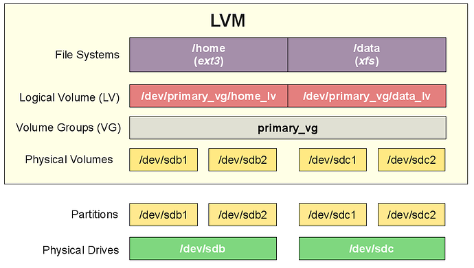

## Volume Management

Volumes are a way to abstract the physical storage devices on a system. They are used to create 
and manage storage that can be resized, moved, and snapshotted.

### Physical Volumes

The physically blocks devices or other disk-like devices (e.g. RAID arrays) that are used as
a raw build material for higher level abstractions. 

Common examples are: `/dev/sda`, `/dev/sdb`, `/dev/sdc`, etc.

### Volume Groups

Volume Groups are a collection of Physical Volumes. They are combined to create a pool of storage
that can be divided into Logical Volumes.

### Logical Volumes

Logical Volumes are the final abstraction that is presented to the user. They are created from
Volume Groups and can be resized, moved, and snapshotted.

Common reasons to use LVM include:

- The ability to resize filesystems on the fly 
- The ability to take snapshots of filesystems
- Mirroring and striping of data across multiple disks for redundancy and performance
- The ability to move data between physical disks without downtime

