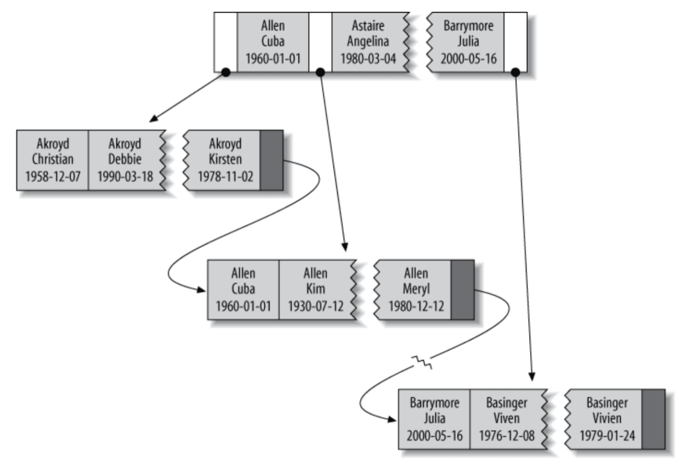
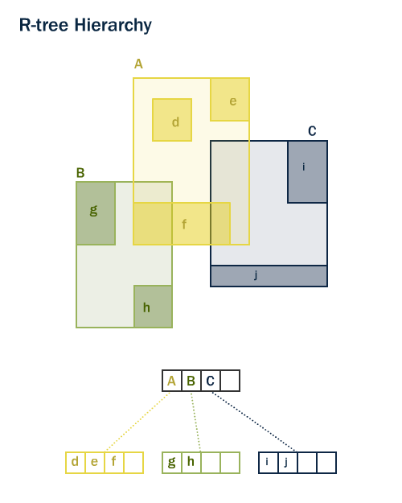
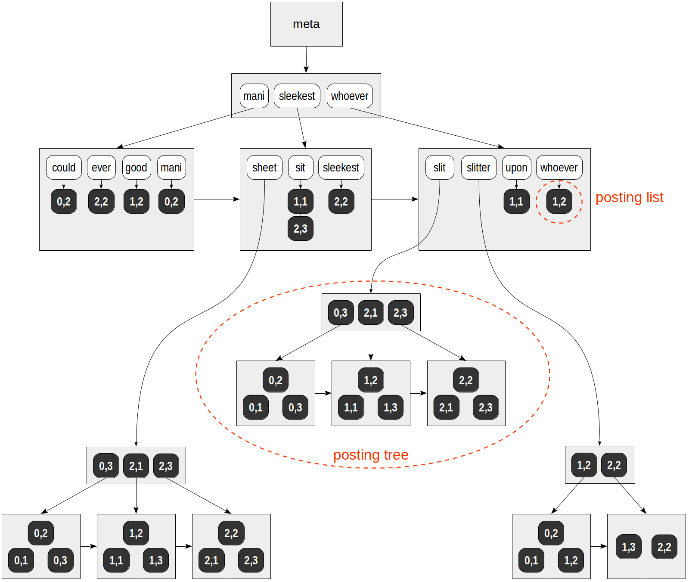

## Tracking statistics

`pg_stat_statements` - track execution statistics of all SQL statements executed by a server.

`pgbadger` - a fast PostgreSQL log analysis report.

`pg_stats` - track statistics about tables and indexes.

> `n_distinct` - number of distinct nonnull values in the column.
>
> `correlation` - correlation between physical row ordering and logical ordering of the column values. This ranges from -1 to +1. When the value is near -1 or +1, an index scan on the column will be estimated to be cheaper than when it is near zero, due to reduction of random access to the disk.
>
> `null_frac` - fraction of rows that are null in this column.
>
> `most_common_vals` - a list of most common values in the column.
>
> `most_common_freqs` - a list of the frequencies of the most common values.

## Indexes types

- `btree` - default index type.
> each value is a node (consists of index fields and pointer to row), with 2 children.
>
> left child is less than parent, right child is greater than parent.
>
> Useful in:
> - finding by full value (equality)
> - finding by left prefix
> - finding by column prefix 
> - finding by range 
> - finding only by index (when requested columns are in index)
> 
> Bad at:
> - finding when missing left prefix 
> - when columns are missed
> - optimisation after range search 
>
> 

- `hash` - in PostgreSQL is useless, btree are faster. No sorting
> Counting hash by key, and then referencing to row.
>
> In PostgreSQL hash index is not WAL-logged, so it is not crash-safe.
>
> Database uses hash indexes as a temporary solution for performing joins.
>
> Peculiarities:
> - can't use data in index and not read the table 
> - can't use index for sorting, because hash is random
> - can't make search by part of key
> - can't use index for range search 
> - fast for equality search, if not many collisions (need to reduce number of collisions with additional work)
>
> 

- `gist` - Generalized Search Tree. 
> extensions: `pg_trgm` - trigram matching for text (with regex), `btree_gist` - hard constraints with intervals
>
> Indexing values which can overlay each other.
>
> Good for storing geometric data.
>
> Gist tree is also a balanced by height tree, consisting of nodes. Each node 
> is a indexing value. Each node have a predicate and reference to row, children 
> if needed. (Predicate of inner nodes includes predicates of children).
>
> TLDR: like btree, but with custom predicate which have more than comparison.
>
> 

- `sp_gist` - space-partitioned GiST. More flexible gist, better for scientific problems.
- `gin` - Generalized Inverted Index. For full-text search, can slow down writes.
> good for searching in json fields, `json_ops`, `json_path_ops`
> 
> Actively used for full text and json searching.
>
> gin is a btree, each node have sorted list of references to rows, which contains 
> value of node.
>
> If list is too long, it stored as a separate btree.
>
> 

- `brin` - Block Range Index. For very large tables, can slow down writes.

### Comparing 

When deleting from table without indexes, most time is used for checking fk constraints.

> Create index for fk will speed up results.
>
> We can reduce index size by using `where` clause, for example `where fk_id is not null`. (partial index)
>
> Time: faster in 2055 times.
> 
> Size: less in 14 times.

Order of fields when creating index is important! Tree will have more nodes,
which will be more efficient.

`explain analyze` - show query plan and execution time.

> tells nothing when query have nested triggers or custom functions.

Each index have usage stats, which can be used to determine if index is useful.

**Partial index** - index which is created only for part of table. For example `where fk_id is not null`.

**Functional index** - index which is created for function result. For example `lower(name)`.

**Clustered index** - index which is created for table, and table is sorted by index. (Will be used only once, when creating index).

Based on index data we can't make new query to the table, that will speed up results.

### Sources

- [Indexes in PostgreSQL, RU](https://www.youtube.com/watch?v=ju9F8OvnL4E)
- [Databases. Indexes, performance RU](https://www.youtube.com/watch?v=4Tgvd6NPufs)
