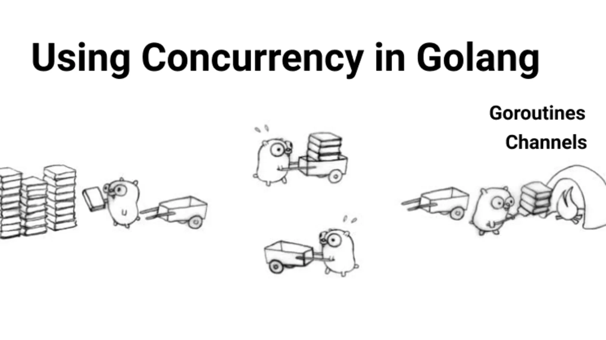

# Concurrency in Go

This is a book summary of [Concurrency in Go](https://www.oreilly.com/library/view/concurrency-in-go/9781491941294/) by
Katherine Cox-Buday.

## Table of Contents

- [An introduction to Concurrency](concurrency-intro/concurrency-introduction.md)
- [Modeling your code: Communicating sequential processes](modeling-your-code/modeling-your-code.md)
- [Go's Concurrency Building Blocks](./go-concurrency-building-blocks/go-concurrency-building-blocks.md)
- [Concurrency Patterns in Go](./concurrency-patterns/concurrency-patterns.md)
- [Concurrency at Scale](./concurrency-at-scale/concurrency-at-scale.md)
- [Goroutines and the Go Runtime](./goroutines-and-runtime/goroutines-and-runtime.md)
