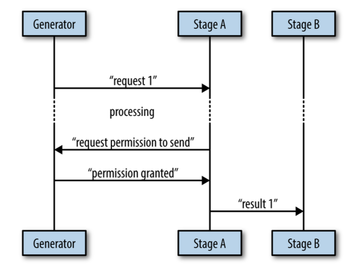

# Chapter 5

## Concurrency at Scale

We've learned some common patterns for utilizing concurrency within Go, let's
turn attention to composing these patterns into a series of practices that will
enable us to write large, composable system that scale.

### Error Propagation

Many developers make the mistake of thinking of error propagation as secondary, to the flow of their system.

Errors indicate that your system has entered a state in which it cannot fulfill an operation that a user either
explicitly or implicitly requested. Because of this, it needs to relay a few pieces of critical information:

- what happened
  > this part contains information about what happened, e.g "socket closed", "credentials expired".

- when and where it occurs
  > Errors should always contain a complete stack trace starting with how the call was initiated and ending with where
  > the error was instantiated. The stack trace should not be contained in the error message
  >
  > Further, the error should contain information regarding the context it's running within. For example, in a
  > distributed system, it should have some way of identifying what machine the error occurred on.

- a friendly user-facing message
  > The message that gets displayed to the user should be customized to suit your system and its users. It should only
  > contain abbreviated and relevant information from the previous two points.

- how the user can get more information
  > Errors that are presented to users should provide an ID that can be cross-referenced to a corresponding log that
  > displays the full information of the error.

By default, no error will contain all of this information without your intervention.

Therefore, you could take the stance that any error that is propagated to the user without this information is a
mistake, and therefore a bug.

It's possible to place all errors into one of two categories:

- bugs
- known edge cases (e.g. broken network connections, failed disk writes, etc.)

Bugs are errors that you have not customized to your system, or raw errors - your known edge cases. Sometimes this is
intentional; you may be OK with letting errors from edge cases reach your users while you get the first few iterations
of your system out the door. Sometimes this is by accident. But if you agree with the approach I've laid out, raw errors
are always bugs.

When our user-facing code receives a well-formed error, we can be confident that at all levels in our code, care was
taken to craft the error message, and we can simply log it and print it out for the user to see. The confidence that we
get from seeing an error with the correct type cannot be understated.

When malformed errors, or bugs, are propagated up to the user, we should also log the error, but then display a friendly
message to the user stating something unexpected has happened. If we support automatic error reporting in our system,
the error should be reported back as a bug. If we don't, we might suggest the user file a bug report.

```go
package main

import (
	"fmt"
	"log"
	"os"
	"os/exec"
	"runtime/debug"
)

type MyError struct {

	// Storing low-level error, we always want to be able to get back
	Inner   error
	Message string

	// taking note of a stack trace, when the error was created
	StackTrace string

	// storage for catch-all miscellaneous information,
	//  e.g a hash of the stack trace
	Misc map[string]interface{}
}

func (e MyError) Error() string {
	return e.Message
}

func wrapError(err error, messagef string, msgArgs ...interface{}) MyError {
	return MyError{
		Inner:      err,
		Message:    fmt.Sprintf(messagef, msgArgs...),
		StackTrace: string(debug.Stack()),
		Misc:       make(map[string]interface{}),
	}
}

type LowLevelErr struct {
	error
}

func isGloballyExec(path string) (bool, error) {
	info, err := os.Stat(path)
	if err != nil {
		// here we wrap the raw error with customized error
		// in that case we ok with message and don't mask it
		return false, LowLevelErr{wrapError(err, err.Error())}
	}

	return info.Mode().Perm()&0100 == 0100, nil
}

type IntermediateErr struct {
	error
}

func runJob(id string) error {
	const jobBinPath = "/bad/job/bin"

	isExecutable, err := isGloballyExec(jobBinPath)
	if err != nil {
		// here we are customizing the error with a crafted message.
		// we want to obfuscate the low-level details of why the job isn’t running
		// because we feel it’s not important information to consumers of our module.
		return IntermediateErr{wrapError(
			err,
			"can't run job %q: requisite binaries are not available",
			id,
		)}
	}

	if !isExecutable {
		return wrapError(
			nil,
			"can't run job %q: requisite binaries are not executable",
			id,
		)
	}

	return exec.Command(jobBinPath, "--id"+id).Run()
}

func handleError(key int, err error, message string) {
	log.SetPrefix(fmt.Sprintf("[logID: %v", key))

	// log out the full error in case someone needs to dig into what happend
	log.Printf("%#v", err)
	log.Printf("[%v] %v", key, message)
}

func main() {
	// all functions are written in one file,
	//	but they can be broken into separate modules

	log.SetOutput(os.Stdout)
	log.SetFlags(log.Ltime | log.LUTC)

	if err := runJob("1"); err != nil {
		msg := "There was an unexpected issue; please report this as a bug."

		// checking if is there a well-crafted error, and we can pass it to user
		if _, ok := err.(IntermediateErr); ok {
			msg = err.Error()
		}

		// bind the log and the error message together with an ID of 1, can use guid
		handleError(1, err, msg)
	}
}
```

There are error packages, like https://github.com/pkg/errors, that are compatible with this approach, but it will be up
to you to implement this technique using whatever error package you decide to use.

### Timeouts and Cancellation

When working with concurrent code, timeouts and cancellations are going to turn up
frequently.

Why we want _timeouts_:

- system saturation
  > If our system is saturated (if it's ability to process requests is at capacity), we may
  > want to requests at the edges of the system to time out rather than take a long time to field them
  >
  > general guide-lines for when to time out:
  >
  > * if the request is unlikely to be repeated when it is timed out.
  > * if you don't have the resources to store the requests (e.g. disk space for persisted queue)
  > * if the need for the request, or the data it's sending, will go stale

- stale data
  > Sometimes data has a window within which it must be processed before more relevant data is available, or the need to
  > process the data has expired. If a concurrent process takes longer to process the data than this window, we would
  want
  > to time out and cancel the concurrent process.

- attempting to prevent deadlocks
  > In a large system it can sometimes be difficult to understand the way in which data
  > might flow, or what edge cases might turn up. It is not unreasonable, and even recommended, to place timeouts on all
  > of your concurrent operations to guarantee your system won’t deadlock.

Reasons why request _canceled_:

- timeouts
  > Implicit cancellation

- user intervention
  > When there are user-facing concurrent operations, it is therefore also sometimes necessary to allow the users to
  > cancel the operation they've started.

- parent cancellation
  > If any kind of parent of a concurrent operation stops, as a child of that parent, we will be canceled.

- replicated requests
  > We may wish to send data to multiple concurrent processes in an attempt to get a faster response from one of them.
  > When the first one comes back, we would want to cancel the rest of the processes.

If you keep your modifications to any shared state within a tight scope, and/or ensure those modifications are easily
rolled back, you can usually handle cancellations pretty well.

Here the surface area we have to worry about rolling back is much smaller:

```go
result := add(1, 2, 3, 1, 2, 3)
writeTallyToState(result)
```

Another issue you need to be concerned with is duplicated messages.


Here that it’s possible for stage B to receive duplicate messages if the cancellation message comes in after stage A
has already sent its result to stage B.

There are a few ways to avoid sending duplicate messages:

- to make it vanishingly unlikely that a parent goroutine will send a cancellation signal after a child goroutine has
  already reported a result.
  > This requires bidirectional communication between the stages, and we’ll cover this "Heartbeats"

- accept either the first or last result reported
  > If your algorithm allows it, or your concurrent process is idempotent

- poll the parent goroutine for permission

  > can use bidirectional communication with your parent to explicitly request permission to send your message. (simular
  > to heartbeats)
  >
  > 

When designing your concurrent processes, be sure to take into account timeouts and cancellation.

### Heartbeats
