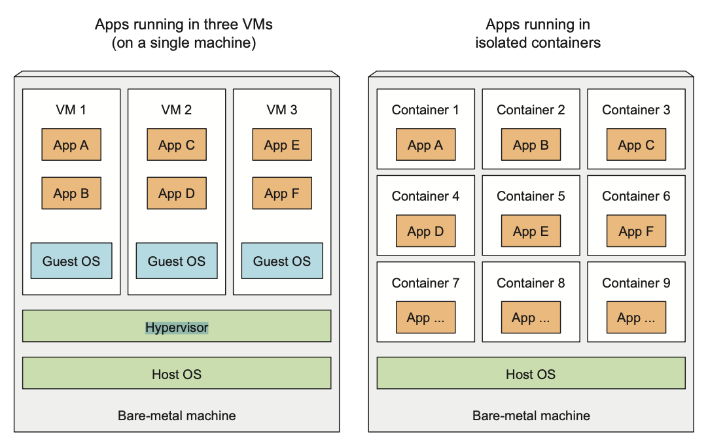

# Chapter 1. Introducing Kubernetes

- Migrating from monoliths to microservices.
- Bigger number of components make it harder to configure and manage them.
- Kubernetes allows developers to deploy there apps as often as they want, without
  requiring any assistance from the ops team.
- Helps to monitoring and rescheduling apps in case of failures.
- It's becoming a standard way of running distributed apps in the cloud.

## 1.1 Understanding the need for a system like Kubernetes

### 1.1.1 Moving from monolithic apps to microservices

- If any part of a monolithic application isn’t scalable, the whole application becomes unscalable, unless you can split
  up the monolith somehow.
- Simple communication between components.
- Separate component development.
- Easier to scale.
- Growing number of components makes it harder to make deployment-related decisions.
- Microservices make harder to debug and trace execution calls. (Zipkin, Jaeger, etc.)
- Opportunity to have different versions of the same libraries, tools used for
  development, etc.

### 1.1.2 Providing a consistent environment to applications

It's better to have the same team that develops the application also take part 
in deploying and taking care of it over its whole lifecycle.

This means the developer, QA and operations team now need to colaborate thorought the whole process 
- DevOps.

We want to make releases more often and give a developers the ability to make it fast and simple without
the need of the operations team.

With k8s we allows to sysadmin to focus on keeping underlying infrastructure up and running,
while not having to worry about the applications running on top of it.

> All do they own job, but they do it together and in a coordinated way.

## 1.2 Introducing container technologies 

K8S uses Linux container technologies to provide isolution of running applications.

### 1.2.1 Understanding what containers are 

When application is composed of only smaller numbers of large components, it's 
completely acceptable to give a dedicated VM to each component and isolate their
environment by providing each of them with their own OS. 

But when these components start getting smaller and their numbers start to grow, you can’t give each of them their own VM if you don’t want to waste hardware resources and keep your hardware costs down. But it’s not only about wasting hardware resources. Because each VM usually needs to be configured and managed individually, rising numbers of VMs also lead to wasting human resources, because they increase the system administrators’ workload considerably.

#### Isolating components with Linux container technologies

They allow you to run multiple services on the same host machine, while not only exposing a different environment to each of them, but also isolating them from each other, similarly to VMs, but with much less overhead.

A process running in a container runs inside the host’s operating system, like all the other processes.

But the process in the container is still isolated from other processes. To the process itself, it looks like it’s the only one running on the machine and in its oper- ating system.

#### Comparing virtual machines to containers 

Containers are more lightweight and allows you to run higher number of software components 
on the same hardware, mainly because VM needs to run its system components on the same hardware 
which requires additional compute resources in addition to the application itself.

A container, on the other hand, is nothing more than a single isolated process running in the host OS, consuming only the resources that the app consumes and without the overhead of any additional processes.

Also with VM you often group up multiple components into a single VM, while
with containers you can run each component in a separate container. 

3 completely separate OS running and sharing the same hardware resources, which 
devided by the hypervisor of the host OS. All calls to the kernel are handled 
by the hypervisor.

Containers perform all system calls on the exact same kernel running the host OS.

The main benefit of virtual machines is the full isolation they provide, because each VM runs its own Linux kernel, while containers all call out to the same kernel, which can clearly pose a security risk. 

Limited amount of hardware -> VMs, run a greater number of components on the same hardware -> containers.

VMs runs its own set of system services, while container not and they can start
immediately.

#### Intorducing the mechanisms that make container isolation possible

- Linux namespaces
> Each process sees its own personal view of the system (files, process, network interfaces etc.)

- Control groups (cgroups)
> Limit the amount of resources the process can consume (CPU, memory, disk I/O, network bandwidth etc.)

#### Isolating processes with Linux namespaces

By default each system have one namespace. 
All system resources, such as filesystems, process IDs, user IDs, network interfaces, and others, belong to the single namespace. But you can create additional namespaces and organize resources across them. When running a process, you run it inside one of those namespaces. The process will only see resources that are inside the same namespace.

Process doesn't belong to one namespace, but to one namespace of each kinds:

- Mount (mnt)
- Process ID (pid)
- Network (net)
- Interprocess communication (ipc)
- User ID (user)
- Hostname (uts)

Each kind of namespaces used to isolate a certain group of resources. 

#### Limiting resources available to process 

The other half of container isolation deals with limiting the amount of system resources a container can consume.
This achieved with cgroups, a Linux kernel feature that limits the resource usage for a
process (or group).

This way, processes cannot hog resources reserved for other processes,
which is similar to when each process runs on a separate machine.

