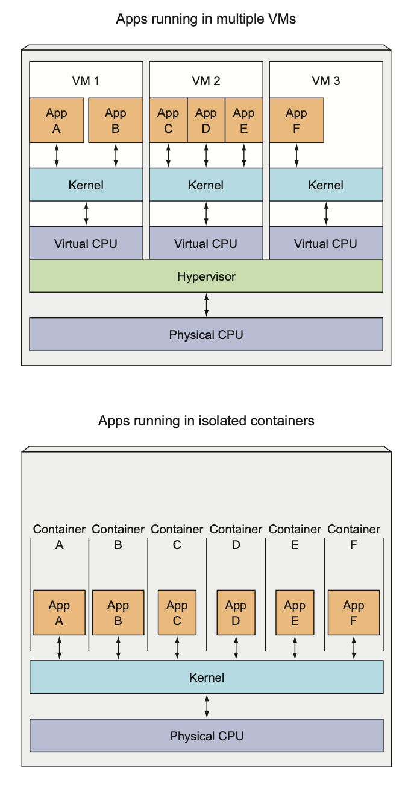
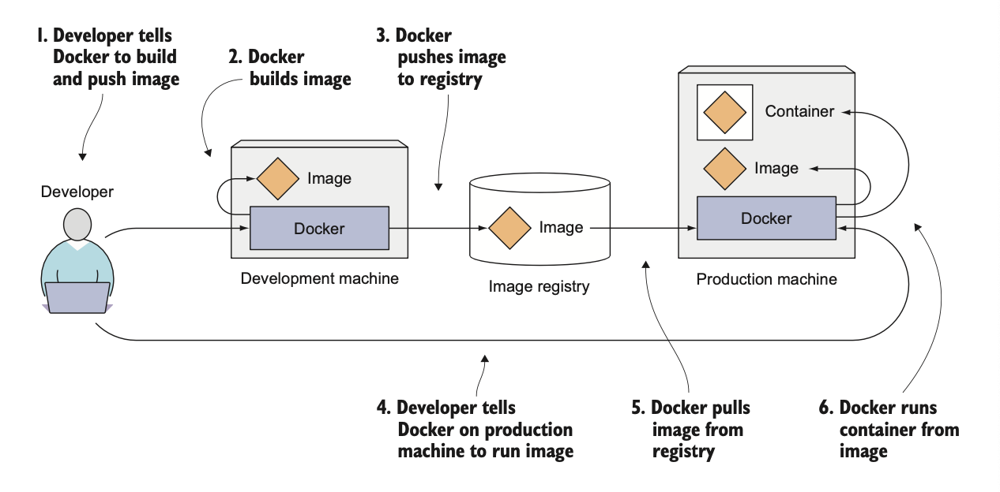
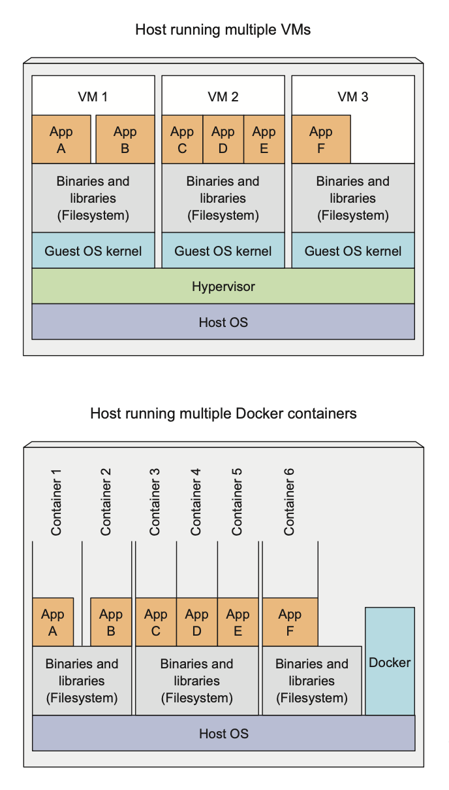
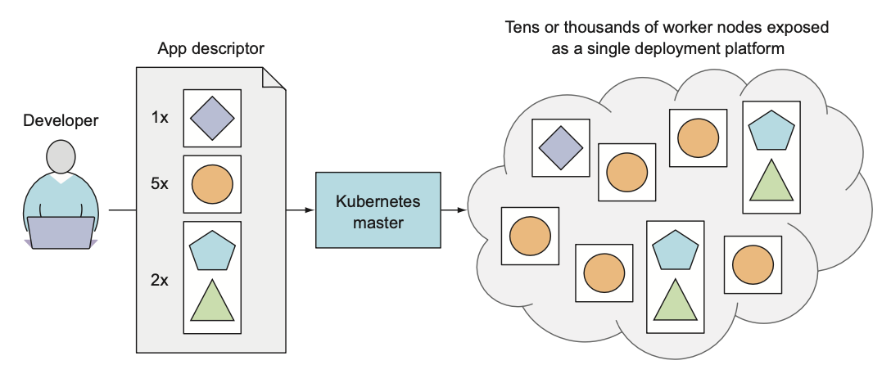
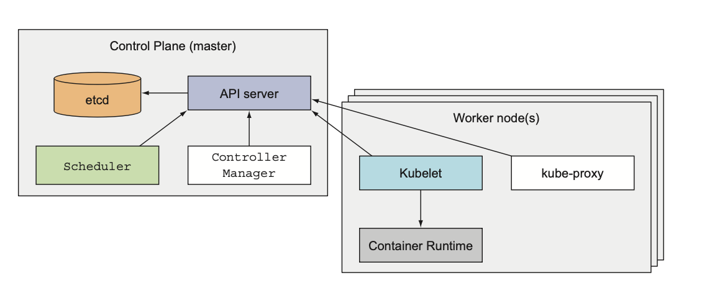
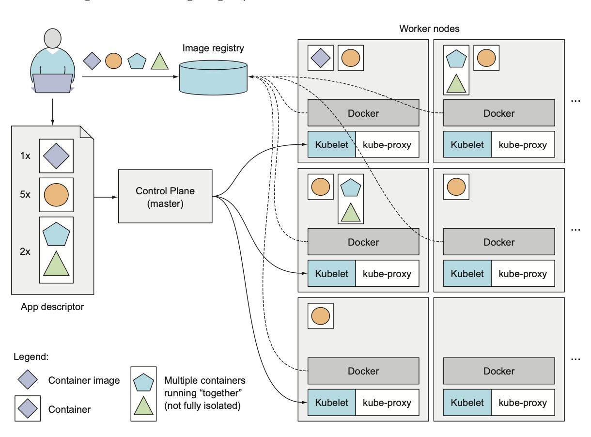

# Chapter 1. Introducing Kubernetes

- Migrating from monoliths to microservices.
- Bigger number of components make it harder to configure and manage them.
- Kubernetes allows developers to deploy there apps as often as they want, without
  requiring any assistance from the ops team.
- Helps to monitoring and rescheduling apps in case of failures.
- It's becoming a standard way of running distributed apps in the cloud.

## 1.1 Understanding the need for a system like Kubernetes

### 1.1.1 Moving from monolithic apps to microservices

- If any part of a monolithic application isn’t scalable, the whole application becomes unscalable, unless you can split
  up the monolith somehow.
- Simple communication between components.
- Separate component development.
- Easier to scale.
- Growing number of components makes it harder to make deployment-related decisions.
- Microservices make harder to debug and trace execution calls. (Zipkin, Jaeger, etc.)
- Opportunity to have different versions of the same libraries, tools used for
  development, etc.

### 1.1.2 Providing a consistent environment to applications

It's better to have the same team that develops the application also take part 
in deploying and taking care of it over its whole lifecycle.

This means the developer, QA and operations team now need to colaborate thorought the whole process 
- DevOps.

We want to make releases more often and give a developers the ability to make it fast and simple without
the need of the operations team.

With k8s we allows to sysadmin to focus on keeping underlying infrastructure up and running,
while not having to worry about the applications running on top of it.

> All do they own job, but they do it together and in a coordinated way.

## 1.2 Introducing container technologies 

K8S uses Linux container technologies to provide isolution of running applications.

### 1.2.1 Understanding what containers are 

When application is composed of only smaller numbers of large components, it's 
completely acceptable to give a dedicated VM to each component and isolate their
environment by providing each of them with their own OS. 

But when these components start getting smaller and their numbers start to grow, you can’t give each of them their own VM if you don’t want to waste hardware resources and keep your hardware costs down. But it’s not only about wasting hardware resources. Because each VM usually needs to be configured and managed individually, rising numbers of VMs also lead to wasting human resources, because they increase the system administrators’ workload considerably.

#### Isolating components with Linux container technologies

They allow you to run multiple services on the same host machine, while not only exposing a different environment to each of them, but also isolating them from each other, similarly to VMs, but with much less overhead.

A process running in a container runs inside the host’s operating system, like all the other processes.

But the process in the container is still isolated from other processes. To the process itself, it looks like it’s the only one running on the machine and in its oper- ating system.

#### Comparing virtual machines to containers 

Containers are more lightweight and allows you to run higher number of software components 
on the same hardware, mainly because VM needs to run its system components on the same hardware 
which requires additional compute resources in addition to the application itself.

A container, on the other hand, is nothing more than a single isolated process running in the host OS, consuming only the resources that the app consumes and without the overhead of any additional processes.

Also with VM you often group up multiple components into a single VM, while
with containers you can run each component in a separate container. 

3 completely separate OS running and sharing the same hardware resources, which 
devided by the hypervisor of the host OS. All calls to the kernel are handled 
by the hypervisor.

Containers perform all system calls on the exact same kernel running the host OS.

The main benefit of virtual machines is the full isolation they provide, because each VM runs its own Linux kernel, while containers all call out to the same kernel, which can clearly pose a security risk. 

Limited amount of hardware -> VMs, run a greater number of components on the same hardware -> containers.

VMs runs its own set of system services, while container not and they can start
immediately.

#### Intorducing the mechanisms that make container isolation possible

- Linux namespaces
> Each process sees its own personal view of the system (files, process, network interfaces etc.)

- Control groups (cgroups)
> Limit the amount of resources the process can consume (CPU, memory, disk I/O, network bandwidth etc.)

#### Isolating processes with Linux namespaces

By default each system have one namespace. 
All system resources, such as filesystems, process IDs, user IDs, network interfaces, and others, belong to the single namespace. But you can create additional namespaces and organize resources across them. When running a process, you run it inside one of those namespaces. The process will only see resources that are inside the same namespace.

Process doesn't belong to one namespace, but to one namespace of each kinds:

- Mount (mnt)
- Process ID (pid)
- Network (net)
- Interprocess communication (ipc)
- User ID (user)
- Hostname (uts)

Each kind of namespaces used to isolate a certain group of resources. 

#### Limiting resources available to process 

The other half of container isolation deals with limiting the amount of system resources a container can consume.
This achieved with cgroups, a Linux kernel feature that limits the resource usage for a
process (or group).

This way, processes cannot hog resources reserved for other processes,
which is similar to when each process runs on a separate machine.

### 1.2.2 Introducing the Docker container platform 

Docker was the first container system that made containers easily portable across different machines. It simplified the process of packaging up not only the application but also all its libraries and other dependencies, even the whole OS file system, into a simple, por- table package that can be used to provision the application to any other machine running Docker.

When you run an application packaged with Docker, it sees the exact filesystem contents that you’ve bundled with it. It sees the same files whether it’s running on your development machine or a production machine, even if it the production server is running a completely different Linux OS.

This is similar to creating a VM image by installing an operating system into a VM, installing the app inside it, and then distributing the whole VM image around and running it. Docker achieves the same effect, but instead of using VMs to achieve app isolation, it uses Linux container technologies mentioned in the previous section to provide (almost) the same level of isolation that VMs do. Instead of using big mono- lithic VM images, it uses container images, which are usually smaller.

Docker-based container images are composed to layers, which can be shared and reused across multiple 
images. Only certain layers of an image need to be downloaded if the other layers 
are already downloaded previously.

#### Understanding Docker concepts 

Docker is a platform for packaging, distributing, and running applications.

Docker makes it possible to transfer this package to a central repository from which it can then be transferred to any computer running Docker and executed there

Main concepts:

- Images
>  container image is something you package your appli- cation and its environment into. It contains the filesystem that will be available to the application and other metadata, such as the path to the executable that should be executed when the image is run.

- Registries 
> repository that stores your Docker images and facilitates easy sharing of those images between different people and computers.
> Allows to push (upload) and pull (download) images to and from the registry.
> Certain registries are public, such as Docker Hub, while others are private and are usually hosted inside your organization.

- Containers 
> regular Linux container created from a Docker-based container image. A running container is a process running on the host running Docker, but it’s completely isolated from both the host and all other processes running on it. 

#### Building, distributing, and running a Docker image 

#### Comparing Virtual Machines and Docker containers 

Apps A and B have access to same binaries and libraries both when running in VM and 
when running in separate Docker containers. Why?

#### Understanding image layers

Different images can con- tain the exact same layers because every Docker image is built on top of another image and two different images can both use the same parent image as their base. This speeds up the distribution of images across the network, because layers that have already been transferred as part of the first image don’t need to be transferred again when transferring the other image.

Also help reduce the storage footprint of images.

Each layer is only stored once. Two containers created from two images based on the same base layers can therefore read the same files, but if one of them writes over those files, the other one doesn’t see those changes.

When the process in the container writes to a file located in one of the underlying layers, a copy of the whole file is created in the top-most layer and the process writes to the copy.

#### Understanding the portability limitations of container images 

In theory, a container image can be run on any Linux machine running Docker, but one small caveat exists—one related to the fact that all containers running on a host use the host’s Linux kernel.

> If a containerized application requires a specific kernel version, it may not work on every machine. If a machine runs a different version of the Linux kernel or doesn’t have the same kernel modules available, the app can’t run on it.
> You can’t containerize an application built for the x86 architec- ture and expect it to run on an ARM-based machine because it also runs Docker.

### 1.2.3 Introducing rkt - an alternative to Docker 

> Archived on Github :( 

The actual isolation of containers is done at the Linux kernel level using kernel features such as Linux Namespaces and cgroups. Docker only makes it easy to use those features.

Like Docker, rkt is a platform for running containers. It puts a strong emphasis on security, composability, and conforming to open standards. It uses the OCI container image format and can even run regular Docker container images.

Don’t make the mistake of thinking Kubernetes is a container orchestration system made specifically for Docker-based containers.

## 1.3 Introducing Kubernetes 

It's becomes harder to manage all containers. 

### 1.3.1 Understanding its origins

Through the years, Google developed an internal system called Borg (and later a new system called Omega), that helped both application developers and system administra- tors manage those thousands of applications and services.

In addition to simplifying the development and management, it also helped them achieve a much higher utiliza- tion of their infrastructure, which is important when your organization is that large.

When you run hundreds of thousands of machines, even tiny improvements in utiliza- tion mean savings in the millions of dollars, so the incentives for developing such a system are clear.

In 2014 Google introduced Kubernetes, an open-source system based on the experience gained through Borg, Omega, and other internal Google systems.

### 1.3.2 Looking at Kubernetes from the top of a mountain

Kubernetes is a software system that allows you to easily deploy and manage containerized applications on top of it. It relies on the features of Linux containers to run het- erogeneous applications without having to know any internal details of these applications and without having to manually deploy these applications on each host.

Because these apps run in containers, they don’t affect other apps running on the 
same server, which is critical when you run applications for completely different organizations on the same hardware.

Kubernetes enables you to run your software applications on thousands of computer nodes as if all those nodes were a single, enormous computer. It abstracts away the underlying infrastructure and, by doing so, simplifies development, deployment, and management for both development and the operations teams.

#### Understanding the core of what Kubernetes does 

When the developer sub- mits a list of apps to the master, Kubernetes deploys them to the cluster of worker nodes. What node a component lands on doesn’t (and shouldn’t) matter—neither to the developer nor to the system administrator.

The developer can specify that certain apps must run together and Kubernetes will deploy them on the same worker node. Others will be spread around the cluster, but they can talk to each other in the same way, regardless of where they’re deployed.

#### Helping developers focus on the core app features 

Kubernetes can be thought of as an operating system for the cluster. It relieves appli- cation developers from having to implement certain infrastructure-related services into their apps; instead they rely on Kubernetes to provide these services. This includes things such as service discovery, scaling, load-balancing, self-healing, and even leader 
election. 

Application developers can therefore focus on implementing the actual fea- tures of the applications and not waste time figuring out how to integrate them with the infrastructure.

#### Helping ops teams achieve better resource utilization

Kubernetes will run your containerized app somewhere in the cluster, provide infor- mation to its components on how to find each other, and keep all of them running. Because your application doesn’t care which node it’s running on, Kubernetes can relocate the app at any time, and by mixing and matching apps, achieve far better resource utilization than is possible with manual scheduling.

### 1.3.3 Understanding the architecture of a Kubernetes cluster

At the hardware level k8s cluster is composed of many nodes, which can split into two types:

- master node (also called the control plane)
> controls and manages the whole k8s system 

- worker nodes 
> runs the actual applications 

#### The control plane 

The Control Plane is what controls the cluster and makes it function. It consists of multiple components that can run on a single master node or be split across multiple nodes and replicated to ensure high availability.

- API server
> which I (using the kubectl command) and others Control Plane components 
> communicate with. 

- Scheduler
> schedules your apps (assigns a worker node to each deployable component of your app)

- Controller manager
> performing cluster level functions, such as replication, tracking of worker nodes,
> and handling node failures.

- etcd
> distributed key-value store that stores the cluster state (configuration data)

The components of the Control Plane hold and control the state of the cluster, but they don’t run your applications. This is done by the (worker) nodes.

#### The nodes 

The worker nodes are the machines that run your containerized applications. The task of running, monitoring, and providing services to your applications is done by the following components:

- Container runtime (docker for example)
> responsible for running containers 

- kubelet
> talks to the API server and manages containers on its node 

- kube-proxy
> responsible for load-balancing network traffic between application components

### 1.3.4 Running an application in Kubernetes

To run an application in Kubernetes, you first need to package it up into one or more container images, push those images to an image registry, and then post a description of your app to the Kubernetes API server.

The description includes information such as the container image or images that contain your application components, how those components are related to each other, and which ones need to be run co-located (together on the same node) and which don’t. For each component, you can also specify how many copies (or replicas) you want to run. Additionally, the description also includes which of those compo- nents provide a service to either internal or external clients and should be exposed through a single IP address and made discoverable to the other components.

#### Understanding how the description results in a running container 

API server processes app description -> Scheduler schedules the specified groups of containers 
onto available worker nodes based on computation resources -> Kubelet on each node 
starts the instructs the Container runtime to pull the required image and start 
the container -> Kube-proxy on each node configures the network to allow the 
containers to communicate with each other and with the outside world.

#### Keeping the containers running 

Kubernetes continuously monitors the state of the deployed application 
based on the description you provided. 

If a container fails, Kubernetes will restart it.
If a node fails, Kubernetes will start the containers that were running on that node on a different node. 

#### Scaling the number of copies 

You can also scale the number of copies of your application components up or down.

#### Hitting a moving target 

To allow clients to easily find containers that provide a specific service, you can tell Kubernetes which containers provide the same service and Kubernetes will expose all of them at a single static IP address and expose that address to all applications run- ning in the cluster.

The kube-proxy will make sure connec- tions to the service are load balanced across all the containers that provide the service. The IP address of the service stays constant, so clients can always connect to its con- tainers, even when they’re moved around the cluster.

### 1.3.5 Understanding the benefits of using Kubernetes

If you have Kubernetes deployed on all your servers, the ops team doesn’t need to deal with deploying your apps anymore. Because a containerized application already contains all it needs to run, the system administrators don’t need to install anything to deploy and run the app. On any node where Kubernetes is deployed, Kubernetes can run the app immediately without any help from the sysadmins.

#### Simplifying application deployment 

Because Kubernetes exposes all its worker nodes as a single deployment platform, application developers can start deploying applications on their own and don’t need to know anything about the servers that make up the cluster.

#### Achieving better utilization of hardware 

By setting up Kubernetes on your servers and using it to run your apps instead of run- ning them manually, you’ve decoupled your app from the infrastructure.

By using containers and not tying the app down to a specific node in your cluster, you’re allowing the app to freely move around the cluster at any time, so the different app components running on the cluster can be mixed and matched to be packed tightly onto the cluster nodes. This ensures the node’s hardware resources are utilized as best as possible.

The ability to move applications around the cluster at any time allows Kubernetes to utilize the infrastructure much better than what you can achieve manually.

#### Health checking and self-healing

Kubernetes monitors your app components and the nodes they run on and auto- matically reschedules them to other nodes in the event of a node failure. This frees the ops team from having to migrate app components manually and allows the team to immediately focus on fixing the node itself and returning it to the pool of available hardware resources instead of focusing on relocating the app.

#### Automatic scaling 

Using Kubernetes to manage your deployed applications also means the ops team doesn’t need to constantly monitor the load of individual applications to react to sud- den load spikes. As previously mentioned, Kubernetes can be told to monitor the resources used by each application and to keep adjusting the number of running instances of each application.

#### Simplifying application development

If you turn back to the fact that apps run in the same environment both during development and in production, this has a big effect on when bugs are discovered.

Then there’s the fact that developers don’t need to implement features that they would usually implement. This includes discovery of services and/or peers in a clustered application.

As a final example of what Kubernetes brings to the table, you also need to con- sider the increase in confidence developers will feel knowing that when a new version of their app is going to be rolled out, Kubernetes can automatically detect if the new version is bad and stop its rollout immediately. This increase in confidence usually accelerates the continuous delivery of apps, which benefits the whole organization.

## 1.4 Summary 

- Monolithic apps are easier to deploy, but harder to maintain over time and sometimes impossible to scale.

- Microservices-based application architectures allow easier development of each component, but are harder to deploy and configure to work as a single system.

- Linux containers provide much the same benefits as virtual machines, but are far more lightweight and allow for much better hardware utilization.

- Docker improved on existing Linux container technologies by allowing easier and faster provisioning of containerized apps together with their OS environments.

- Kubernetes exposes the whole datacenter as a single computational resource for running applications.

- Developers can deploy apps through Kubernetes without assistance from sysadmins.

- Sysadmins can sleep better by having Kubernetes deal with failed nodes auto- matically.

