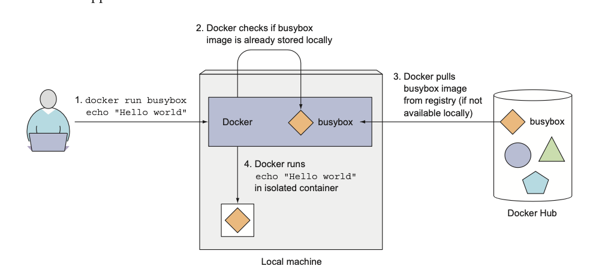
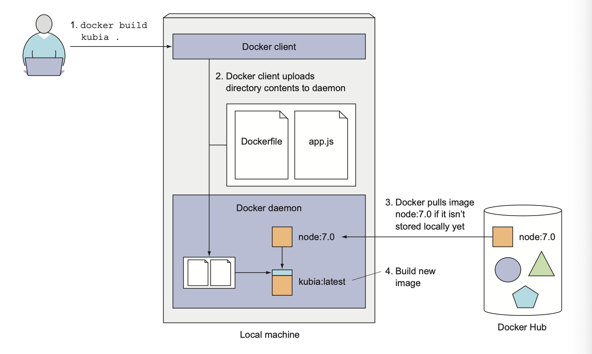
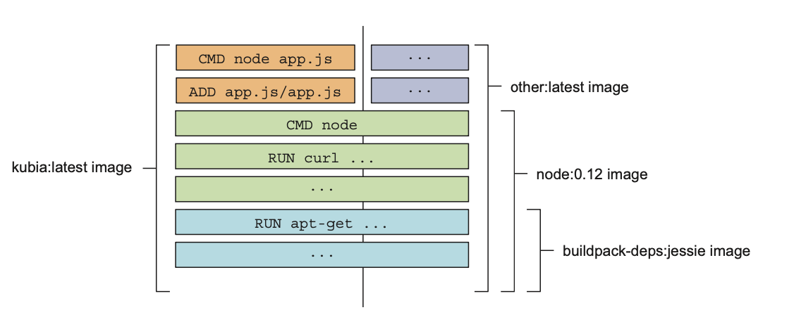

# Chapter 2. First steps with Docker and Kubernetes 

## 2.1 Creating, running, and sharing a container image 

### 2.1.1 Installing Docker and run Hello World container 

#### Running a Hello world container 

```bash
docker run busybox echo "Hello world"
```

App was executed inside a container, isolated from another processes. 

### Understanding what happens behind the scenes



#### Running other images 

```bash
docker run <image-name>
```

#### Versioning container images 

All software packages get updated, so more than a single version of a package usually exists. Docker supports having multiple versions or variants of the same image under the same name. Each variant must have a unique tag.

When referring to images with- out explicitly specifying the tag, Docker will assume you’re referring to the so-called latest tag.

```bash 
docker run <image-name>:<tag>
```

### 2.1.2 Creating a trivial Node.js app 

```js
const http = require('http');
const os = require('os');

console.log("Server starting...");

var handler = function (req, resp) {
    console.log("Received request from " + req.connection.remoteAddress);
    resp.writeHead(200);
    resp.end("You've hit " + os.hostname() + "\n");
};

var www = http.createServer(handler);
www.listen(8080);
```

Run locally with `node app.js`

### 2.1.3 Creating a Dockerfile for the image 

To package your app into an image, you first need to create a file called Dockerfile, which will contain a list of instructions that Docker will perform when building the image.

```Dockerfile
FROM node:7
ADD app.js /app.js
ENTRYPOINT [ "node", "app.js" ]
```

- `FROM` defines the container image you'll use as a starting point.
- `ADD` copies the app.js file from the current directory into the container image.
- `ENTRYPOINT` defines the command that will be executed when the container starts.

### 2.1.4 Building the container Image 

```bash
docker build -t kubia .
```

- `-t` flag is used to tag the image with a name.



#### Understanding how an image is built 

The build process isn’t performed by the Docker client. Instead, the contents of the whole directory are uploaded to the Docker daemon and the image is built there.

The client and daemon don't need to be on the same machine at all.

Before actual building Docker will pull all the layers for the base image 
from the registry if they don't exist locally.

#### Understanding image layers 

An image isn’t a single, big, binary blob, but is composed of multiple layers.

If you create multiple images based on the same base image, all the layers 
comprising the base image will be stored only once.

Also, when pulling an image, Docker will download each layer individually. Several layers may already be stored on your machine, so Docker will only download those that aren’t.



```sh 
docker images kubia
```

#### Comparing building images with Dockerfile vs. manually

Dockerfiles are the usual way of building container images with Docker, but you could also build the image manually by running a container from an existing image,
executing commands in the container, and then committing the container final state 
as a new image. 

This is exactly what happens when you build from a Dockerfile, but it’s performed automatically and is repeatable, which allows you to make changes to
the Dockerfile and rebuild the image any time, without retyping all the commands.

### 2.1.5 Running the container image 

```sh 
docker run --name kubia-container -p 8080:8080 -d kubia
```

Telling docker to run the container with name `kubia-container`, map the local 
port `8080` to the container port `8080`, and run it in the background (`-d`) 
based on the image `kubia`.

#### Accessing your app 

```sh 
curl localhost:8080
```

#### Listing all running containers 

```sh 
docker ps
```

#### Getting additional information about a container 

```sh 
docker inspect <container-name>
```

Will print some low-level container information in JSON format.

### 2.1.6 Exploring the inside of a running container 

Because multiple processes can run inside the same container, you can always run an addi- tional process in it to see what’s inside. You can even run a shell, provided that the shell’s binary executable is available in the image.

#### Running a shell inside an existing container 

```sh 
docker exec -it <container-name> bash
```

This will run `bash` inside the container and attach the terminal to it.

The `bash` process will be run in the same Linux namespace as the main container 
process. 

- `-i` flag tells Docker to keep the stdin stream open, so you can send commands to the shell.
- `-t` flag tells Docker to allocate a pseudo-TTY, which allows you to attach your terminal to the shell running in the container.

#### Exploring the container form within 

```sh 
ps aux
```

Only three processes - no one from the host system.

#### Understanding that processes in a container run in the host OS 

```sh 
ps aux | grep node
```

If you now open another terminal and list the processes on the host OS itself, you will, among all other host processes, also see the processes running in the container. 
> If using Mac or Windows need to login into the VM first. 

This proves that processes running in the container are running in the host OS. If you have a keen eye, you may have noticed that the processes have different IDs inside the container vs. on the host. The container is using its own PID Linux namespace and has a completely isolated process tree, with its own sequence of numbers.

#### The container's filesystem is also isolated 

Like having an isolated process tree, each container also has an isolated filesystem. Listing the contents of the root directory inside the container will only show the files in the container and will include all the files that are in the image plus any files that are created while the container is running.

### 2.1.7 Stopping and removing a container 

```sh 
docker stop <container-name>
```

To check that the container is stopped, run `docker ps -a`.

```sh 
docker rm <container-name>
```

### 2.1.8 Pushing the image to an image registry 

The image you’ve built has so far only been available on your local machine. To allow you to run it on any other machine, you need to push the image to an external image registry.

Docker Hub will allow you to push an image if the image’s repository name starts with your Docker Hub ID.

Like `<docker-hub-id>/<image-name>`

#### Tagging an image under an additional tag 

```sh 
docker tag kubia <docker-hub-id>/kubia
```

This doesn’t rename the tag; it creates an additional tag for the same image.

By `docker images` you can see that the image has two tags.

#### Pushing the image to Docker Hub 

```sh 
docker push <docker-hub-id>/kubia
```

> Login to Docker Hub first.

#### Running the image on a different machine 

```sh 
docker run -p 8080:8080 -d <docker-hub-id>/kubia
```

After the push to Docker Hub is complete, the image will be available to everyone.

It doesn’t get much simpler than that. And the best thing about this is that your appli- cation will have the exact same environment every time and everywhere it’s run.


