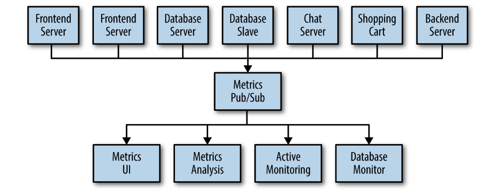
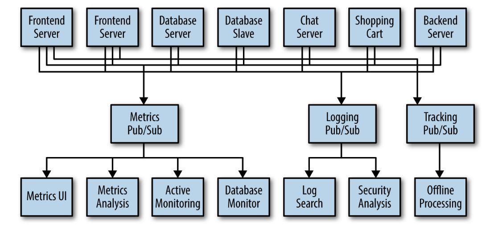
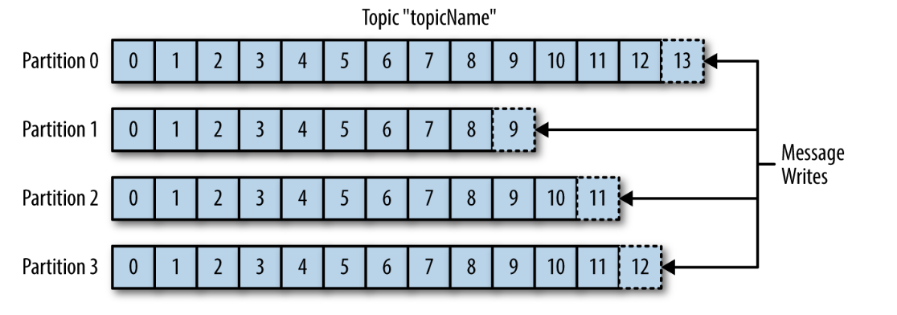
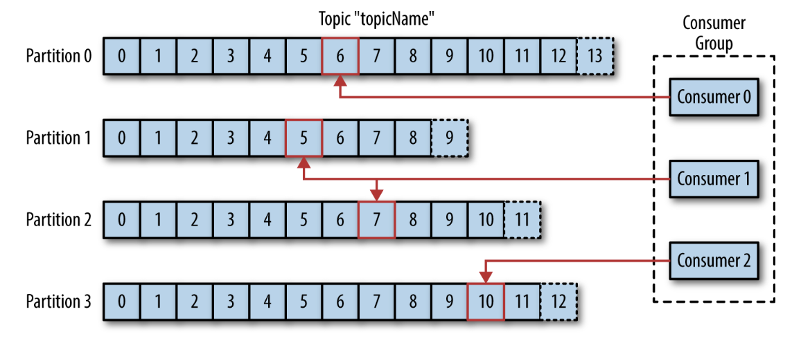
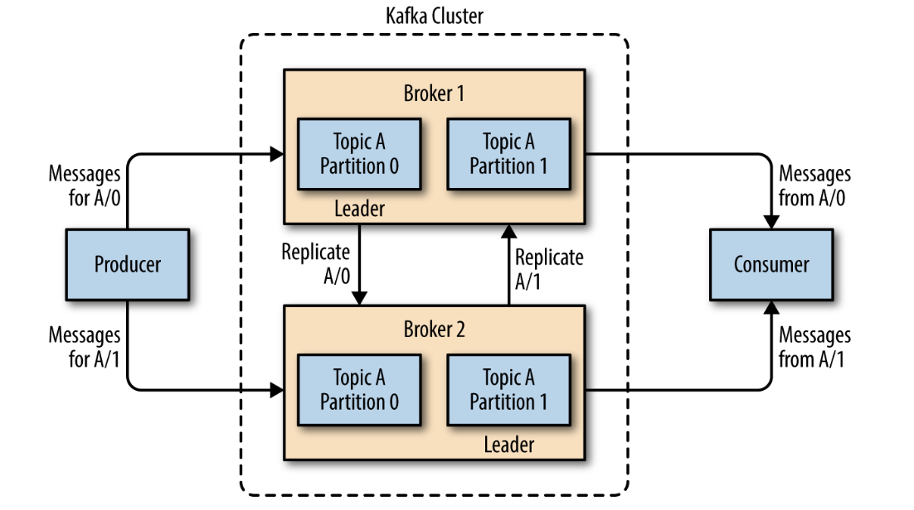

# Chapter 1

## Meet Kafka 

### Publish/Subscribe Messaging

Publish/subscibe messaging is a pattern that is characterized be the sender
(publisher) of a piece of data (message) not specifically directing 
it to a reciever.
Instead, the publisher classifies the message somehow, and that reciever (subsciber)
subscibes to recieve certain classes of messages. 

> Pub/sub systems often have a broker, a central point where messages are published, to facilitate this.

#### How It Starts 

Many use cases for publish/subscribe start out the same way: with a simple 
message queue or interprocess communication channel.

You set up a single application that receives metrics from all the applications out there, and provide a server to query those metrics for any system that needs them.

#### Individual Queue Systems 

Maintaining multiple systems for queueing data. 

This is certainly is a lot better than utilizing point-to-point connections, but 
there is a lot of duplication.

You also know that there will be more use cases for messaging coming soon.
What you would like to have is a single centralized system that allows for publishing generic types of data, which will grow as your business grows.

### Enter Kafka

Apache Kafka is a publish/subscribe messaging system designed to solve this problem. 

It's often described as a "distributed commit log" or more recently as a "distributing 
streaming platform".

A filesystem or database commit log is designed to provide a durable record of all 
transactions so that they can be replayed to consistently build the state of 
a system.

In addition, the data can be distributed within the system to provide additional 
protections against failures, as well as significant opportunities for scaling
performance.

#### Messages and Batches 

The unit of data within Kafka is called a **message**. (simular to row, record in the DB context)

> A message is simply an array of bytes as far as Kafka is concerned, so the data contained within it does not have a specific format or meaning to Kafka.

A message can have an optional bit of metadata, which is referred to as a **key**.

> The key is also a byte array and, as with the message, has no specific meaning to Kafka.

Keys are used when messages are to be written to partitions in a more controlled manner.

The simplest such scheme is to generate a consistent hash of the key, and then select 
the partition number for that message by `hash % total_partitions_cnt`.

> This assures that messages with the same key are always written to the same 
partition.

For efficiency, messages are written into Kafka in batches. A **batch** is just a collection 
of messages, all of which are being produced to the same topic and partition.

> An individual roundtrip across the network for each message would result 
> in excessive overhead, and collecting messages together into a batch
> reduces this.
>
> Of course, this is a tradeoff between latency and throughput 

Batches are also typically compressed, providing more efficient data transfer and 
storage at the cost of some processing power. 

#### Schemas

There are many options available for message **schema**, depending on your 
application's individual needs. 

JSON, XML - human readable, lack features such as robust type handling and compatibility 
between schema versions.

Avro - compact serialization format, schemas that are separate from the message
payloads and that do not require code to be generated when they change; 
and strong data typing and schema evolution, with both backward and forward 
compatibility.

A consistent data format is important in Kafka, as it allows writing 
and reading messages to be decoupled. When these tasks are tightly coupled,
applications that subscribe to messages must be updated to handle the new 
data format, in parallel with the old format. 

#### Topics and Partitions 

Messages are categorized into **topics**. 
> The closest analogies for a topic are a database table or a folder in fs.

Topics are additionally broken down into a number of **partitions**.

Messages are written to it in an append-only fashion, and are read in order from 
beginning from end. 

Partitions are also the way that Kafka provides redundancy and scalability.
> Each partition can be hosted on a different server, which means that single topic 
> can be scaled horizonally across multiple servers to provide performance far beyond 
> the ability of a single server. 

The term **stream** is often used when discussing data within systems like Kafka. 

Most often, a stream considered to be a single topic of data, regardless of the number of
partitions. 

This represents a single stream of data moving from the producers to the consumers. 

This way of referring to messages is most common when discussing stream processing, operating on 
messages in real time. 

#### Producers and Consumers 

Producers(publishers, writers) create new messages, which will be produced to a specific topic. 

> By default, the producer doesn't care what partition a specific message is written to 
> and will balance messages over all partitions for topic evenly. 
>
> In some cases producer, can direct messages to specific partition. Typically done with message key 
> and a partitioner (can be custom).

Consumers(subscribers, readers) read messages from subscribed topics in order in which they 
were produced.

The **offset** is another bit of metadata, that Kafka adds to each message as it's produced. 
Each message in partition have a unique offset. 

> By storing the offset of the last consumed message for each partition, either in Zookeeper or in Kafka itself, a consumer can stop and restart without losing its place.

Consumers work as part of a **consumer group**, which is one or more consumers that work together to consume a topic. 

> The group assures that each partition is only con‐ sumed by one member.

The mapping of a consumer to a partition is often called **ownership** of the partition by the consumer.

In this way, consumers can horizontally scale to consume topics with a large number of messages. Additionally, if a single consumer fails, the remaining members of the group will rebalance the partitions being consumed to take over for the missing member. 

#### Brokers and Clusters 

A single Kafka server is called a **broker**. 

The broker receives messages from producers, assigns offsets to them, and commits the messages to storage on disk.
It also services consumers, responding to fetch requests for partitions and responding with the messages 
that have been committed to disk. 

> Depending on the specific hardware and its performance characteristics, a single broker can easily handle thousands of partitions and millions of messages per second.

Kafka brokers are designed to operate as a part of a **cluster**. 
Within a cluster of brokers, one broker will also function as the cluster **controller** (elected automatically from the live 
members of the cluster).

> The controller is responsible for administrative operations, including assigning partitions to brokers 
> and monitoring for broker failures.

A partition is owned by a single broker in the cluster, and that broker is called the 
**leader** of the partition. A partition may be assigned to multiple brokers, which will result 
in the partition being replicated. 

> This provides redundancy of messages in the partition, such that another broker 
> can take over leadership if there is a broker failure.
>
> However, all consumers and producers operating on that partition must connect to the leader.

A key feature of Apache Kafka is that of **retention**, which is the durable storage of messages for some period of time.

Kafka brokers are configured with a default retention setting for topics, either 
retaining messages for some period of time (e.g. 7 days) or until the topic reaches a certain size in bytes (e.g. 1 GB)

Once these limits are reached, messages are expired and deleted so that the retention configuration is a minimum amount of data available at any time.

Individual topics can also be configured with there own retention settings. 
Topics can also be configured as log compacted, which means that Kafka will retain only the last
message produced with a specific key.

#### Multiple Clusters 

As Kafka deployments grow, it's often advantageous to have multiple clusters. 

Reasons why this can be useful:

- segregation of types of data 
- isolation for security requirements 
- multiple datacenters (disaster recovery)

When working with multiple datacenters in particular, it's often required that messages 
be copied between them. 

The Kafka project inclused a tool called __MirrorMaker__, used for this purpose. 

> At its core, MirrorMaker is simply a Kafka consumer and producer, linked together with a queue. Messages are consumed from one Kafka cluster and produced for another.

### Why Kafka?

- multiple producers 
> able to seamlessly handle multiple producers, whether those clients are using many topics or the same topic.
> Ideal for aggregating data from many frontend systems and making it consistent.

- multiple consumers 
> designed for multiple consumers to read any single stream of messages without interfering with each other.

- disk-based retention 
> durable retention means that if a consumer falls behind, either due to slow processing or a burst in traffic, there is no danger of losing data.

- scalable 
> from single cluster to replicated system 

- high performance

### The Data Ecosystem 

Provides the circulatory system for the data ecosystem. 

Components can be added and removed as business cases are created and dissolved, and producers do not need to be concerned about who is using the data or the number of consuming applications.

#### Use Cases 

- activity tracking 

> users interact with frontend applications, which generate messages regarding actions the user is taking
>
> messages are published to one or more topics, which are then consumed by applications on the backend
>
> these applications may be generating reports, feeding machine learning systems, updating search results, or performing other operations that are necessary to provide a rich user experience 

- messaging 

> applications need to send notifications (such as emails) to users
>
> applications can produce messages without needing to be concerned about formatting or how the messages will actually be sent 
>
> single app then can read all the messages to be sent and handle them consistenly, including: formatting, collecting, applying user preferences

- metrics and logging 

> applications publish metrics on a regular basis to a Kafka topic, and those metrics can be consumed by systems for monitoring and alerting
>
> they can also be used in an offline system like Hadoop to perform longer-term analysis, such as growth projections
>
> log messages can be published in the same way, and can be routed to dedicated log search systems like Elastisearch or security analysis applications

- commit log 

> based on the concept of a commit log, database changes can be published to Kafka and apps can easily monitor 
> this stream to receive live updates as they happen
>
> changelog stream can also be used for replicating database updates to a remote system, or for consolidating changes from multiple applications into a single database view

- stream processing 

> stream frameworks allow users to write small applications to operate on Kafka messages, performing tasks such as counting
> metrics, partitioning messages for efficient processing by other applications, or 
> transforming messages using data from multiple sources. 

### Kafka's Origin 

Kafka was created to address the data pipeline problem at LinkedIn. It was designed to provide a high-performance messaging system that can handle many types of data and provide clean, structured data about user activity and system metrics in real time.

