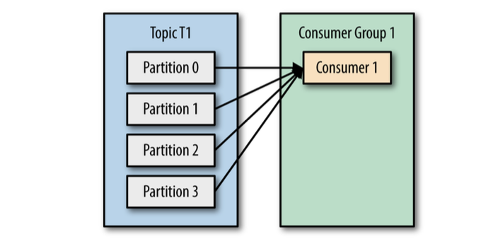
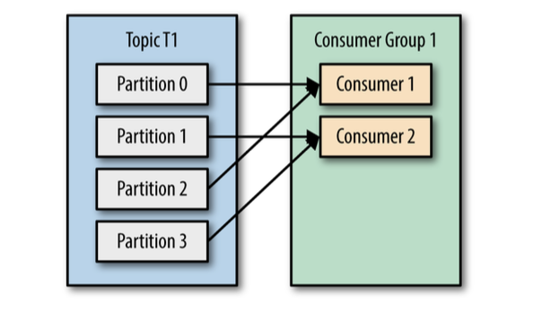
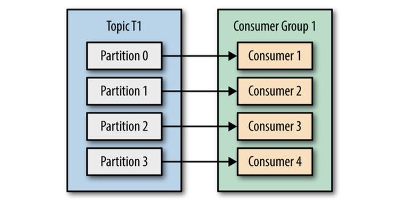
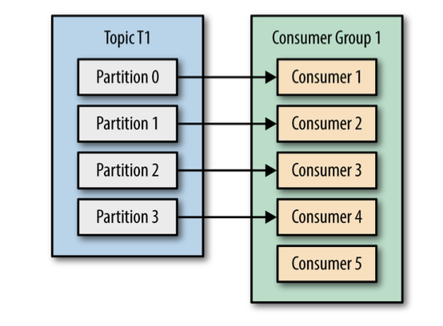
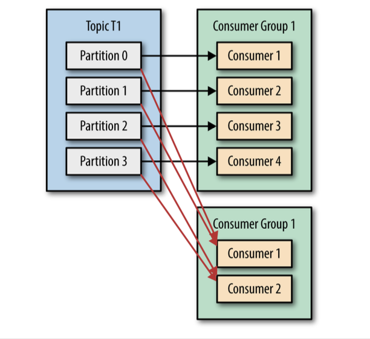
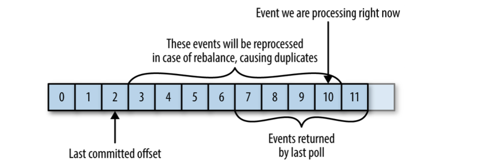
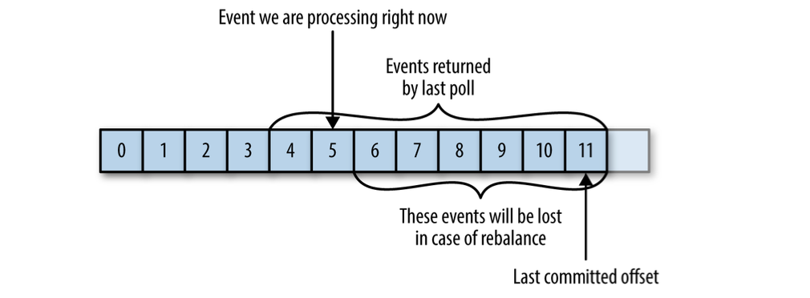

# Chapter 4

## Kafka Consumers: Reading Data from Kafka

### Kafka Consumer Concepts

#### Consumers and Consumer Groups

Kafka consumers are typically part of a **consumer group**.

When multiple consumers are subscribed to a topic and belong the same consumer group,
each consumer in the group will receive messages from a different subset of the
partitions in the topic.

Of we had number of consumers equal to the number of partitions, each consumer would
read messages in parallel from exactly one partition.

If we add more consumers than partitions, some consumers will be idle and get no messages
at all.

The main way we scale data consumption from a Kafka topic is by adding more consumers to a consumer group.

In addition to adding consumers in order to scale a single application, it is very common to have multiple
applications that need to read data from the same topic.

In those cases, we want each application to get all the messages, rather than just a subset.

To make sure an application gets all the messages in a topic, ensure the application has its own consumer group.

Summary:

- you create a new consumer group for each application that needs all the messages from one or more topics.
- you add consumers to an existing consumer group to scale the reading and processing of messages from the topics.

#### Consumer Groups and Partition Rebalance

When we add a new consumer to the group, it starts consuming messages from partitions previously consumed by another
consumer. (the same thing happens when a consumer shuts down or crashes)

Reassignment of partitions to consumers also happen when the topics the consumer group is consuming are modified (e.g.,
if an administrator adds new partitions).

Moving partition ownership from one consumer to another is called a **rebalance**.

During a rebalance, consumers can’t consume messages, so a rebalance is basically a short window of unavailability
of the entire consumer group.
In addition, when partitions are moved from one consumer to another, the consumer loses
its current state; if it was caching any data, it will need to refresh its caches - slowing down the application until
the consumer sets up its state again.

The consumers maintain membership in a consumer group and ownership of the partitions assigned to them
is by sending **heartbeat** messages to a Kafka broker designated as the **group coordinator**.

> Heartbeat are sent when the consumer pulls and when it commits records it has consumed.

If the consumer stops sending heartbeats for long enough, its session will time out and the group coordinator will
consider it dead and trigger a rebalance.

### Creating a Kafka Consumer

Java code: [Main.java](./java/src/main/java/kafka_consumer/Main.java)

Go code: [main.go](./go/main.go)

#### Subscribing to Topics

Subscribe to a topic possible with regular expressions.

#### The Poll Loop

The poll loop does a lot more than just get data.

> The first time you call `poll()` with a new consumer, it is responsible for finding the `GroupCoordinator`, joining
> the consumer group, and receiving a partition assignment.
>
> If a rebalance is triggered, it will be handled inside the poll loop as well. And of course the heartbeats that keep
> consumers alive are sent from within the poll loop.

One consumer per thread is the rule.

#### Configuring Consumers

- `fetch.min.bytes` - minimum amount of data that it wants to receive from the broker when fetching records.
  > reduces the load on both the consumer and the broker as they have to handle fewer back-and-forth messages in cases
  > where the topics don’t have much new activity

- `fetch.max.wait.ms` - tell Kafka to wait until it has enough data to send before responding to the consumer.
- `max.partition.fetch.bytes` - maximum amount of data the server should return for each partition.
- `session.timeout.ms` - how long between heartbeats before a consumer is kicked out of the group.
- `auto.offset.reset` - what to do when there is no initial offset in Kafka or if the current offset does not exist
  anymore on the server (e.g., because that data has been deleted):
  > Options:
  > - `latest` - automatically reset the offset to the latest offset
  > - `earliest` - automatically reset the offset to the earliest (oldest) offset
- `enable.auto.commit` - automatically commit offsets periodically.
- `partition.assignment.strategy` - how to distribute partitions among consumer instances.
  > Options:
  > - `range` - assigns partitions to consumers in such a way that each consumer gets a contiguous range of partitions.
  > - `roundrobin` - assigns partitions to consumers in a round-robin fashion.
  > - own implementation of `PartitionAssignor` interface
- `client.id` - identify messages sent from the client. It is used in logging and metrics, and for quotas.
- `max.poll.records` - maximum number of records returned in a single call to `poll()`.
- `receive.buffer.bytes`, `send.buffer.bytes` - size of the TCP send and receive buffers used by the sockets when
  writing and reading data.

### Commits and Offsets

We have a way of tracking which records were read by a consumer of the group.

We call the action of updating the current position in the partition a **commit**.

> How does a consumer commit an offset?
>
> It produces a message to Kafka, to a special `__consumer_offsets` topics, with
> a committed offset for each partition.

If the committed offset is smaller than the offset of the last message the client processed, the messages between the
last processed offset and the committed offset will be processed twice.

If the committed offset is larger than the offset of the last message the client actually processed, all messages
between the last processed offset and the committed offset will be missed by the consumer group.

#### Automatic Commit

The easiest way to commit offsets is to allow the consumer to do it for you.

Consider that, by default, automatic commits occur every five seconds.
Suppose that we are three seconds after the most recent commit and a rebalance is triggered.
After the rebalancing, all consumers will start consuming from the last offset committed.

> In this case, the offset is three seconds old, so all the events that arrived in those three seconds
> will be processed twice.

Automatic commits are convenient, but they don’t give developers enough control to avoid duplicate messages.

#### Commit Current Offset

By setting `auto.commit.offset=false`, offsets will only be committed when the application explicitly chooses to do so.

It is important to remember that commit need to be called after the consumer has processed all the messages in the
batch it received from the last poll.

One drawback of manual commits is that the application is blocked until the broker responds to the commit request.

Another option is to commit asynchronously, by providing a callback to the `commitAsync()` method.
> Async commits don't have retries such as the sync commits do.
>
> In the case of a rebalance, this will cause more duplicates.
>
> Because the commit is asynchronous, the consumer will continue to process messages from the last poll, and if
> some of the commits are lost, the consumer will reprocess those messages.

#### Combining Synchronous and Asynchronous Commits

Normally, occasional failures to commit without retrying are not a huge problem because if the problem is temporary, the
following commit will be successful.

But if we know that this is the last commit before we close the consumer, or before
a rebalance, we want to make extra sure that the commit succeeds.

Therefore, a common pattern is to combine `commitAsync()` with `commitSync()` just before shutdown.

#### Commit Specified Offset

The `commitSync()` and `commitAsync()` methods allow us to specify the offset we want to commit.

#### Rebalance Listeners

The consumer API allows you to run your own code when partitions are added or removed from the consumer.

You do this by passing a `ConsumerRebalanceListener` when calling the `subscribe()` method.

#### Consuming Records with Specific Offsets

If you want to start reading all messages from the beginning of the partition, or you want to skip all the way to the
end of the partition and start consuming only new messages, there are APIs specifically for that:

- `seek()` - to seek to a specific offset
- `seekToBeginning()` - to seek to the beginning of the partition
- `seekToEnd()` - to seek to the end of the partition

There are many different ways to implement exactly-once semantics by storing offsets and data in an external store, but
all of them will need to use the `ConsumerRebalanceListener` and `seek()` to make sure offsets are stored in time and
that the consumer starts reading messages from the correct location.

#### But How Do We Exit?

When you decide to exit the poll loop, you will need another thread to call `consumer.wakeup()`.

If you are running the consumer loop in the main thread, this can be done from `ShutdownHook`.

### Deserializers

Can write custom deserializers by implementing the `org.apache.kafka.common.serialization.Deserializer` interface.

### Standalone Consumer: Why and How to Use a Consumer Without a Group

Sometimes you know you have a single consumer that always needs to read data from all the partitions in a topic, or from
a specific partition in a topic.

In this case, there is no reason for groups or rebalances - just assign the
consumer-specific topic and/or partitions, consume messages, and commit offsets on occasion.

When you know exactly which partitions the consumer should read, you don’t subscribe to a topic—instead, you assign
yourself a few partitions.

> A consumer can either subscribe to topics, or assign itself partitions manually, but not both.

